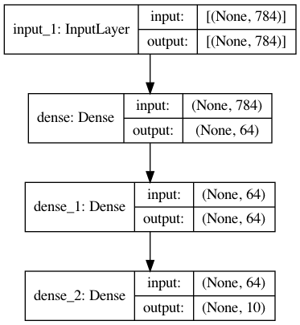

---
jupyter:
  jupytext:
    formats: ipynb,md
    text_representation:
      extension: .md
      format_name: markdown
      format_version: '1.3'
      jupytext_version: 1.19.1
  kernelspec:
    display_name: Python 3 (ipykernel)
    language: python
    name: python3
---

<!-- #region editable=true slideshow={"slide_type": ""} -->
# PyTorch intro exercises

## 1. Build a simple sequential model

* A model to classify clinical variables into a number possible outcomes
* Can you build a sequential model to reproduce the graph shown in the figure? 
* Choose whatever activations you want, wherever possible
* How many outcomes/classes are we predicting?

<center></center>
<!-- #endregion -->

```python
import torch.nn as nn
#Add your model here
model = ...
...
print(model)
```

## 2. Build a better XOR classifier

Given the model seen at lecture, how do we make a better classifier (higher accuracy)?

* More layers? More neurons?
* Generate more data?
* More epochs?
* Different batch size?
* Different optimizer?
* It's up to you! Let's see who does best on validation

Only for Tuesday's session:

* Different activations?
* Add Dropout? How large?


Plotting and training helper functions:

```python
torchmetrics.Accuracy
```

```python editable=true slideshow={"slide_type": ""}
from typing import Optional
import plotly.graph_objects as go
from plotly.subplots import make_subplots
import plotly.io as pio
pio.renderers.default = "iframe"

import torch
import torch.nn as nn
from torch.utils.data import TensorDataset, DataLoader
import torchmetrics

class LivePlot():
    def __init__(self, left_label="Loss", right_label="Accuracy"):
        self.fig = go.FigureWidget(
            make_subplots(specs=[[{"secondary_y": True}]])
        )
        self.fig.update_yaxes(title_text=left_label,  secondary_y=False)
        self.fig.update_yaxes(title_text=right_label, secondary_y=True)

        self.plot_indices = {}
        self.trace_secondary = {}
        display(self.fig)
        self.limits = [0, 0]
        self.current_x = 0

    def report(self, name: str, value: float, secondary_y: bool = False):
        try:
            plot_index = self.plot_indices[name]
        except KeyError:
            plot_index = len(self.fig.data)
            self.fig.add_scatter(
                y=[], x=[], name=name,
                secondary_y=secondary_y
            )
            self.plot_indices[name] = plot_index
            self.trace_secondary[name] = secondary_y
        self.fig.data[plot_index].y += (value,)
        self.fig.data[plot_index].x += (self.current_x,)

    def increment(self, n_ticks: int):
        self.limits[1] += n_ticks
        self.fig.update_layout(xaxis_range=self.limits)

    def set_limit(self, n_ticks: int):
        self.limits[1] = n_ticks
        self.fig.update_layout(xaxis_range=self.limits)

    def tick(self, n_ticks: Optional[int] = None):
        if n_ticks is None:
            n_ticks = 1
        self.current_x += n_ticks

def train(*,
          model: torch.nn.Module, 
          train_loader: DataLoader, 
          dev_loader: DataLoader, 
          optimizer: torch.optim.Optimizer, 
          criterion: torch.nn.Module, 
          max_epochs: int,
          metric: Optional[torchmetrics.metric] = None,
          device: Optional[torch.device] = None,  
          liveplot: Optional[LivePlot]=None):
    if device is None:
        device = torch.device('cuda') if torch.cuda.is_available() else torch.device('cpu')

    model.to(device)

    for epoch in range(max_epochs):
        training_loss_acc = 0
        training_examples = 0
        model.train()
        
        for i, batch in enumerate(train_loader):
            optimizer.zero_grad()
            
            x_batch, y_batch = batch
            x_batch = x_batch.to(device)  
            y_hat = model(x_batch)

            loss = criterion(y_hat, y_batch.to(device))
            loss.backward()

            optimizer.step()
            training_loss_acc += loss.item()
            training_examples += x_batch.size(0)
        
        model.eval()
        with torch.no_grad():
            dev_loss_acc = 0
            dev_examples = 0
            dev_accuracy = 0
            for i, batch in enumerate(dev_loader):
                x_batch, y_batch = batch
                x_batch = x_batch.to(device)
                y_hat = model(x_batch)
                dev_loss_acc += criterion(y_hat, y_batch.to(device)).item()
                dev_examples += x_batch.size(0)
                if metric:
                    dev_accuracy += metric(torch.argmax(y_hat, -1), y_batch)
        
        if liveplot is not None:
            liveplot.tick() # Update the liveplot time
            liveplot.report("Training loss", training_loss_acc / training_examples)
            liveplot.report("Development loss", dev_loss_acc / dev_examples)
            if metric:
                liveplot.report("Development accuracy", dev_accuracy / (i+1), secondary_y=True)
```

Data generation step:

```python editable=true slideshow={"slide_type": ""}
import numpy as np
# Generate XOR data
data = np.random.random((10000, 3)) - 0.5
labels = np.zeros((10000))

labels[np.where(np.logical_xor(np.logical_xor(data[:,0] > 0, data[:,1] > 0), data[:,2] > 0))] = 1

#let's print some data and the corresponding label to check that they match the table above
for x in range(3):
    print("{0: .2f} xor {1: .2f} xor {2: .2f} equals {3:}".format(data[x,0], data[x,1], data[x,2], labels[x]))
```


The baseline network to improve:

```python editable=true slideshow={"slide_type": ""}
class MLP(torch.nn.Module):
    def __init__(self, input_dim, output_dim, hidden_dim):
        super().__init__()
        self.layers = nn.Sequential(
            nn.Linear(input_dim, hidden_dim),
            nn.Tanh(),
            nn.Linear(hidden_dim, output_dim),
        )
    def forward(self, x):
        y_hat = self.layers(x)
        return y_hat

# model from MLP class
model = MLP(input_dim=3, output_dim=2, hidden_dim=3)
epochs = 20

# define optimizer and loss function
learning_rate = 1e-3
weight_decay = 1e-5
optimizer = torch.optim.SGD(model.parameters(), lr=learning_rate, weight_decay=weight_decay)
criterion = nn.CrossEntropyLoss()
accuracy = torchmetrics.Accuracy(task='multiclass', num_classes=2, top_k=1)

# convert numpy arrays to torch tensors
tdata = torch.Tensor(data)
tlabels = torch.Tensor(labels).long()
dataset = TensorDataset(tdata, tlabels)

# split the data randomly
total_samples = data.shape[0]
train_samples = int(total_samples * 0.9)
train_set, dev_set = torch.utils.data.random_split(dataset, [train_samples, total_samples-train_samples])

# shuffle data at training time
train_loader = DataLoader(train_set, batch_size=32, shuffle=True)
dev_loader = DataLoader(dev_set, batch_size=32)

# Setup plot
liveplot = LivePlot()
liveplot.increment(epochs)

train(model=model, 
      train_loader=train_loader, 
      dev_loader=dev_loader, 
      optimizer=optimizer, 
      criterion=criterion,
      metric=accuracy,
      max_epochs=epochs, 
      liveplot=liveplot,
      device=torch.device('cuda') if torch.cuda.is_available() else torch.device('cpu'))
```

```python
#Add your code here
```

## 3. Build a regression model

* Take the Boston housing dataset (http://lib.stat.cmu.edu/datasets/boston)
* Records a set of variables for a set of houses in Boston, including among others:
    * CRIM     per capita crime rate by town
    * ZN       proportion of residential land zoned for lots over 25,000 sq.ft.
    * INDUS    proportion of non-retail business acres per town
    * CHAS     Charles River dummy variable (= 1 if tract bounds river; 0 otherwise)
    * NOX      nitric oxides concentration (parts per 10 million)
    * RM       average number of rooms per dwelling
* Can we use these variables to predict the value of a house (in tens of thousands of dollars)?


Download the data:

```python
!mkdir -p data
!wget -P ./data/ https://github.com/selva86/datasets/raw/refs/heads/master/BostonHousing.csv
```

```python
!ls data/
```

Load the data with pandas:

```python
import torch
import torch.nn as nn
from sklearn.preprocessing import StandardScaler # hint

data = pd.read_csv("data/BostonHousing.csv")
print(data.head())
data = np.array(data)
print(f"Data shape is: {data.shape}")

train_samples = int(data.shape[0] * 0.9)
train_x = data[:train_samples, :13]
train_y = data[:train_samples, 13:]

dev_x = data[train_samples:, :13]
dev_y = data[train_samples:, 13:]

train_set = TensorDataset(torch.Tensor(train_x), torch.Tensor(train_y))
dev_set = TensorDataset(torch.Tensor(dev_x), torch.Tensor(dev_y))

# shuffle data at training time
train_loader = DataLoader(train_set, batch_size=32, shuffle=True)
dev_loader = DataLoader(dev_set, batch_size=32)
```

```python
class MLP(torch.nn.Module):
    def __init__(self, input_dim, output_dim, hidden_dim):
        super().__init__()
        self.layers = nn.Sequential(
            nn.Linear(input_dim, hidden_dim),
            nn.Tanh(),
            nn.Linear(hidden_dim, output_dim),
        )
    def forward(self, x):
        y_hat = self.layers(x)
        return y_hat

# model from MLP class
model = ...
epochs = ...

# define optimizer and loss function
optimizer = ...
# https://docs.pytorch.org/docs/stable/nn.html#loss-functions
criterion = ...

# Setup plot
liveplot = LivePlot()
liveplot.increment(epochs)

train(model=model, 
      train_loader=train_loader, 
      dev_loader=dev_loader, 
      optimizer=optimizer, 
      criterion=criterion, 
      max_epochs=epochs, 
      liveplot=liveplot,
      device=torch.device('cuda') if torch.cuda.is_available() else torch.device('cpu'))
```

## 4. The IMDB movie review sentiment dataset

Another pre-package toy dataset from Keras. Contains 25k reviews for a movies in IMDB, you want to predict whether the review is positive or negative.

> each review is encoded as a list of word indexes (integers). For convenience, words are indexed by overall frequency in the dataset, so that for instance the integer "3" encodes the 3rd most frequent word in the data. This allows for quick filtering operations such as: "only consider the top 10,000 most common words, but eliminate the top 20 most common words".

https://keras.io/api/datasets/imdb/


Load the dataset, set a couple of important parameters (max_features, maxlen). Also pad all reviews with less than 200 words so that they have all the same length.

```python editable=true slideshow={"slide_type": ""}
# import datasets
from torchtext.datasets import IMDB

train_iter = IMDB(split='train')

def tokenize(label, line):
    return line.split()

tokens = []
for label, line in train_iter:
    tokens += tokenize(label, line)

```

Since the dataset is pre-processed so that each word is represented by an integer, we have to build a reverse dictionary if we want to actually read some of the reviews:


How do we build a predictor for this task?

```python
model = Sequential()
...
```
