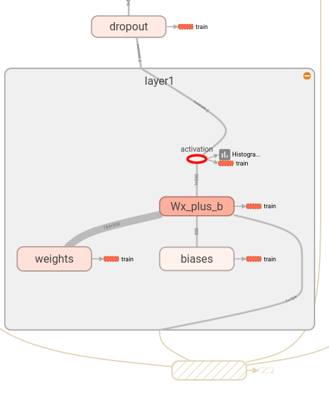
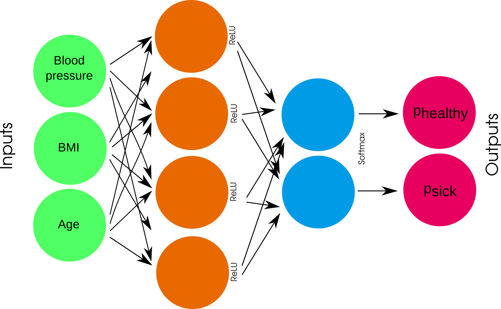
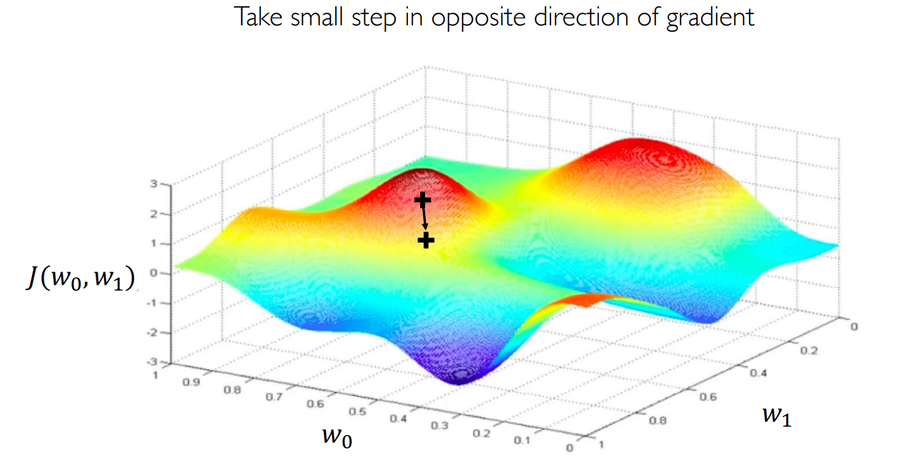
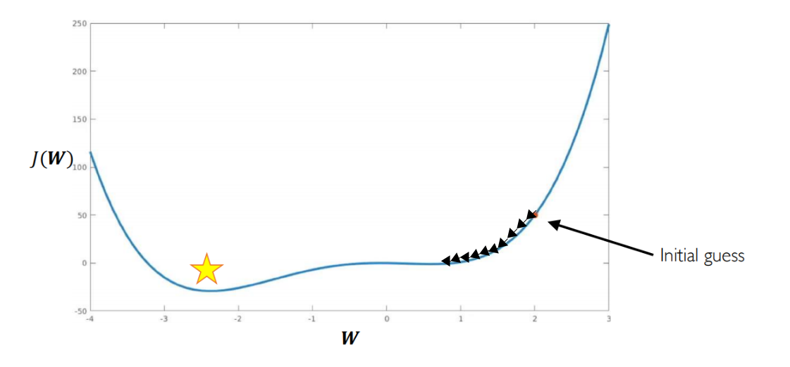
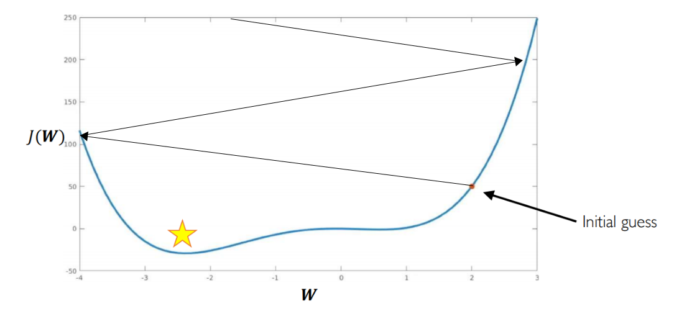
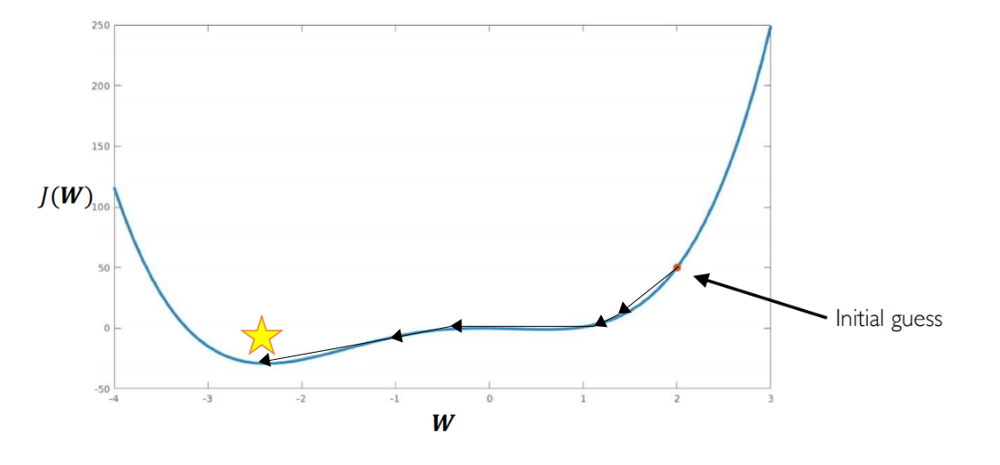
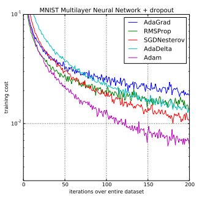
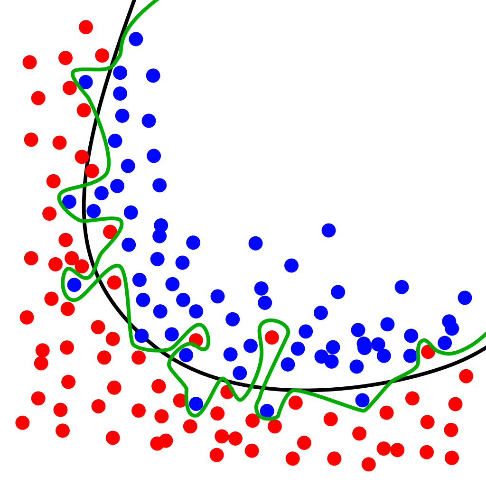
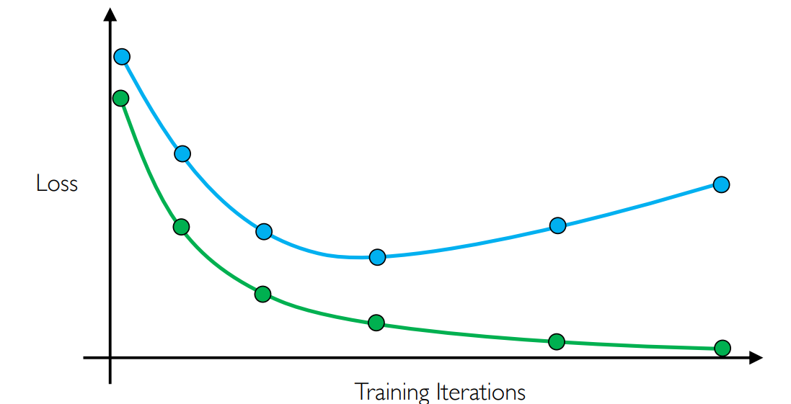
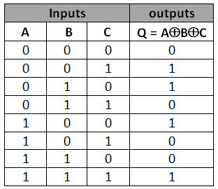

<!-- #region cell_style="center" slideshow={"slide_type": "slide"} editable=true -->
# Programming and training Neural Networks with PyTorch


<center></center>
<!-- #endregion -->

<!-- #region slideshow={"slide_type": "slide"} editable=true -->
## Introduction

* PyTorch is an end-to-end open source platform for ML 
* Allows to easily build and deploy ML powered applications.
* Not only Neural Networks


<!-- #endregion -->

<!-- #region slideshow={"slide_type": "slide"} editable=true -->
# What is PyTorch?

* PyTorch is an "optimized tensor library for deep learning"
* Scientific computing, general ML, Neural Networks
* C++/python (we use the latter)
* Easy to implement complex architectures with few lines of code
<!-- #endregion -->

<!-- #region slideshow={"slide_type": "slide"} editable=true -->
## Docs: https://docs.pytorch.org/docs

* Installation instructions (you should be already set up!)
* Tutorials from the groud up
* Reference API
  * Models and Layers
  * Data handling
  * Helper functionalities (utils)

<!-- #endregion -->

<!-- #region slideshow={"slide_type": "slide"} editable=true -->
## Other ML/DL libraries

* Tensorflow
* Keras*
* JAX
* PyTorch Lightning*
* ...
* Most concepts translate across libraries with minor differences
<!-- #endregion -->

<!-- #region slideshow={"slide_type": "slide"} editable=true -->
# Basic terminology

* A dataset in supervised learning is made of a number of (features, label) pairs
* Example, a dataset of diabetic patients is made of:
    * Features: information describing each patient (weight, height, blood pressure...)
    * Labels: whether each patient is diabetic or not (glucose levels higher or lower than...)
* Each (features, label) pair is also called a _sample_ or _example_. Basically a data point
* Features are also sometimes called _inputs_ when referred to something you feed to a NN
* Labels are compared to the NN's _outputs_ to see how well the network is doing compared to the truth
<!-- #endregion -->

<!-- #region slideshow={"slide_type": "slide"} editable=true -->
## What is a tensor

The main variables in PyTorch are tensors:

> A tensor is often thought of as a generalized matrix. That is, it could be a 1-D matrix (a vector), a 3-D matrix (something like a cube of numbers), even a 0-D matrix (a single number), or a higher dimensional structure that is harder to visualize. The dimension of the tensor is called its rank.
>
> Src: https://www.kaggle.com/discussions/getting-started/159424


<!-- #endregion -->

<!-- #region slideshow={"slide_type": "slide"} editable=true -->
## PyTorch operates on tensors

> Tensors are a specialized data structure that are very similar to arrays and matrices. In PyTorch, we use tensors to encode the inputs and outputs of a model, as well as the model’s parameters.
> 
> Tensors are similar to NumPy’s ndarrays, except that tensors can run on GPUs or other hardware accelerators.
>
> Src: https://docs.pytorch.org/tutorials/beginner/basics/tensorqs_tutorial.html
<!-- #endregion -->

<!-- #region slideshow={"slide_type": "slide"} editable=true -->
## The first step is to build a graph of operations

* NNs are defined in PyTorch as graphs through which the data flows until the final result is produced
* Before we can do any operation on our data (images, etc) we need to build the graph of tensor operations
* When we have a full graph built from input to output, we can run our data (training or testing) through it.

> (PyTorch implements) Over 1200 tensor operations, including arithmetic, linear algebra, matrix manipulation (transposing, indexing, slicing), sampling and more (...)

<!-- #endregion -->

<!-- #region slideshow={"slide_type": "slide"} editable=true -->
## Tensors and data are *not* the same thing

* Tensors are, rather, a symbolic representation of the data
* Think about the function $g = f(x)$: as long as we do not assign a value to $x$, we will not have a fully computed $g$
* In this case, $g$ is the output tensor, $x$ the input tensor, $f$ the tensor operation (a Neural Network?)

<!-- #endregion -->

<!-- #region slideshow={"slide_type": "slide"} editable=true -->
## Example

* We have a set of color images of size $1000x1000$ pixels (1 megapixel) that we want to use on our NN 
* We define tensors with shape $(n, 1000, 1000, 3)$
    * $n$ is the number of images that we are presenting to our network in one go (a "batch")
    * $1000x1000$: image pixels
    * $3$ is the number of channels (RGB)
    * Grayscale images tensors would have shape $(n, 1000, 1000, 1)$
<!-- #endregion -->

<!-- #region slideshow={"slide_type": "slide"} editable=true -->
## One thing to remember when operating on tensors

The dimensions between tensors coming out of the $i$-th node and those going into the $(i+1)$-th node *must* match:

* If each sample in our dataset is made of 10 features, the first (input) layer must accept a tensor of shape $(n, 10)$
* If the first layer in our NN outputs a 3D tensor, the second layer must accept a 3D tensor as input
* Check the documentation to make sure what input-output shapes are allowed ([example](https://docs.pytorch.org/docs/stable/generated/torch.nn.Conv1d.html))
<!-- #endregion -->

<!-- #region slideshow={"slide_type": "slide"} editable=true -->
## Here's how a NN layer might look like in PyTorch:

* 7 samples in batch
* 784 inputs
* 500 outputs

<center></center>

<!-- #endregion -->

<!-- #region slideshow={"slide_type": "slide"} editable=true -->
# Building and training models with PyTorch
<!-- #endregion -->

<!-- #region slideshow={"slide_type": "-"} editable=true -->

```python
import torch
import torch.nn as nn


#Multi-layer perceptron (one hidden layer)
model = nn.Sequential()
model.append(nn.Linear(3, 3))
model.append(nn.Sigmoid())
model.append(nn.Linear(3, 1))
model.append(nn.Sigmoid())

#Gradient descent algorithm, Mean Squared Error as Loss function
loss = nn.MSELoss()
optimizer = torch.optim.SGD(model.parameters(), lr=0.01)

dataset = ... # define dataset. More on this later

for features, label in dataset:
    optimizer.zero_grad()
    prediction = model(features)
    loss = loss_fn(prediction, label)
    loss.backward()
    optimizer.step()
...
```
<!-- #endregion -->

What does each bit do?

<!-- #region cell_style="center" slideshow={"slide_type": "slide"} editable=true -->
## A neural network in PyTorch is called a Model

The simplest kind of model is of the Sequential kind:
<!-- #endregion -->

```python editable=true slideshow={"slide_type": ""}
import torch
import torch.nn as nn
import torch.optim as optim

model = nn.Sequential()
print(list(model.parameters()))
```

<!-- #region slideshow={"slide_type": ""} editable=true -->
This is an "empty" model, with no layers, no inputs or outputs are defined either.
<!-- #endregion -->

<!-- #region editable=true slideshow={"slide_type": "slide"} -->
## A neural network in PyTorch is called a Model

Adding layer is easy. Let's say we have data for participants to a clinical study. For participant we have recorded: blood pressure, BMI and age.

The participants have been diagnosed as healthy or sick, these will be our labels.

We could define a simple NN that predicts if a participant is healthy or sick as follows:
<!-- #endregion -->

```python editable=true slideshow={"slide_type": ""}
model = nn.Sequential()
model.append(nn.Linear(3, 4))
model.append(nn.ReLU())
model.append(nn.Linear(4, 2))
model.append(nn.Softmax())
```

<!-- #region slideshow={"slide_type": "fragment"} editable=true -->

A "Dense" layer is a fully connected layer as the ones we have seen in Multi-layer Perceptrons.
The above is equal to having this network:

<center></center>

<!-- #endregion -->

<!-- #region slideshow={"slide_type": "slide"} editable=true -->
## A neural network in PyTorch is called a Model

If we want to see the layers in the Model this far, we can just call:
<!-- #endregion -->

```python editable=true slideshow={"slide_type": ""}
list(model.parameters())
```

<!-- #region slideshow={"slide_type": "-"} editable=true -->
Notice the number of parameters, can you tell why there are this many?
<!-- #endregion -->

<!-- #region slideshow={"slide_type": "slide"} editable=true -->
Using "model.append()" keeps stacking layers on top of what we have:
<!-- #endregion -->

```python editable=true slideshow={"slide_type": ""}
model.append(nn.Linear(2, 2))
model
```

<!-- #region slideshow={"slide_type": "slide"} -->
One can also declare the model in one go, by passing a list of layers to Sequential() like so:
<!-- #endregion -->

```python
model = nn.Sequential(
    nn.Linear(3, 4),
    nn.ReLU(),
    nn.Linear(4, 2),
    nn.Sigmoid()
)

model
```

<!-- #region editable=true slideshow={"slide_type": ""} -->
# Lab 1

* Can you write code to build a simple NN model?
* Open the `exercises` jupyter notebook
<!-- #endregion -->

<!-- #region slideshow={"slide_type": "slide"} editable=true -->
# PyTorch layers (https://docs.pytorch.org/docs/stable/nn.html)

Common layers (we will cover most of these!)

* Trainable
    * <font color='red'>Linear (fully connected/MLP)</font>
    * <font color='red'>Conv1D (2D/3D)</font>
    * <font color='red'>Recurrent: LSTM/GRU/Bidirectional</font>
    * <font color='red'>Embedding</font>
    * <font color='red'>Lambda (apply your own function)</font>

* Non-trainable
    * <font color='red'>Dropout</font>
    * <font color='red'>Flatten</font>
    * BatchNormalization
    * <font color='red'>MaxPooling1D (2D/3D)</font>
    * Merge (add/subtract/concatenate)
    * <font color='red'>Activation (Softmax/ReLU/Sigmoid/...)</font>

<!-- #endregion -->

<!-- #region slideshow={"slide_type": "slide"} editable=true -->
# Losses and Optimizers

Once we have defined a model we need to at least define:

* a Loss function (calculate the prediction error against a set of labels)
* an Optimizer (the algorithm that finds the minimum loss possible).
<!-- #endregion -->

```python
loss = nn.MSELoss()
optimizer = optim.SGD(model.parameters(), lr=0.01)
```

<!-- #region slideshow={"slide_type": "slide"} editable=true -->
## Losses (https://docs.pytorch.org/docs/stable/nn.html#loss-functions)

These are the functions used to evaluate and train the neural network. Different losses are suited for different problems.

Loss for classification problems:

* Categorical Crossentropy

Loss to compare distributions:

* KL Divergence

Common losses for regression problems:

* Mean Squared Error
* Mean Absolute Error

A loss function is also called a `criterion` in pytorch code
<!-- #endregion -->

<!-- #region slideshow={"slide_type": "slide"} editable=true -->
## Metrics (https://lightning.ai/docs/torchmetrics/stable/)

Common metrics for classification:

* Accuracy
* Precision/Recall
* AUC

Common metrics for regression:

* Mean Squared Error
* Mean Absolute Error
<!-- #endregion -->

<!-- #region slideshow={"slide_type": "slide"} editable=true -->
## Metrics (https://lightning.ai/docs/torchmetrics/stable/)

* While a Loss function can tell us how the training is going, these measures are not always intuitive
* We sometimes what to have measures such as:
    * accuracy (how often do we get the classification right?)
    * AUC
    * Correlation coefficients
    * ...
<!-- #endregion -->

```python
from torch import tensor
from torchmetrics.classification import BinaryAccuracy

target = tensor([0, 1, 0, 1, 0, 1])
preds  = tensor([0, 0, 1, 1, 0, 1])

metric = BinaryAccuracy()
metric(preds, target)
```

<!-- #region cell_style="split" slideshow={"slide_type": "slide"} editable=true -->
## Optimizers (https://docs.pytorch.org/docs/stable/optim.html)

* They are algorithms for gradient descent
* A few to choose from:
    * SGD (Stochastic Gradient Descent)
    * RMSprop (Root Mean Square propagation)
    * Adadelta (Adaptive delta)
    * Adam (Adaptive Moment estimation)

<!-- #endregion -->

<!-- #region cell_style="split" slideshow={"slide_type": "skip"} editable=true -->


<!-- #endregion -->

<!-- #region cell_style="split" slideshow={"slide_type": "slide"} editable=true -->
# A refresher on Gradient Descent 

We have seen how gradient descent works:

For each epoch:

* Get predicted $y$ ($ŷ$) for all $N$ samples
* Calculate error (loss)
* Calculate all gradients (backprop)
* Apply gradients to weights
    
Pros/cons:

* Stable procedure
* Guarantees lower error at next step
* Will get stuck at local minimum
<!-- #endregion -->

<!-- #region cell_style="split" slideshow={"slide_type": "-"} editable=true -->
<br>

<!-- #endregion -->

<!-- #region cell_style="split" slideshow={"slide_type": "slide"} editable=true -->
## Stochastic Gradient Descent
For each epoch:

* Divide data in batch blocks of size $n < N$
* For each of the $N/n$ blocks:
    * Get predicted $y$ for $n$ samples
    * Calculate partial loss
    * Calculate gradients (backprop)
    * Apply gradients to weights

Pros/cons:

* Noisy gradients
* Error will still go down overall
* Less likely to get stuck at local minimum
<!-- #endregion -->

<!-- #region cell_style="split" slideshow={"slide_type": "-"} editable=true -->
<br>
<br>
<br>
<br>

<!-- #endregion -->

<!-- #region slideshow={"slide_type": "slide"} editable=true -->
# Learning rates

We need to choose a learning rate to multiply to our gradient. If it is too small, we risk taking too long to get to a minimum
<center></center>
<!-- #endregion -->

<!-- #region hideOutput=true slideshow={"slide_type": "slide"} editable=true -->
## Learning rates

If it is too large, the network risks becoming unstable, explode

<center></center>

Let's test different optimization strategies on Tensorflow playground: http://playground.tensorflow.org
<!-- #endregion -->

<!-- #region cell_style="split" slideshow={"slide_type": "slide"} editable=true -->
## Learning rates

Luckily there are algorithms to address these issues:

* Increase descent speed when past gradients agree with current, slow down otherwise (momentum)
* Annealing (decrease learning rate with passing time)
* Different learning rates for different parameters
* Adaptive learning rate based on gradient
<!-- #endregion -->

<!-- #region cell_style="split" slideshow={"slide_type": "-"} editable=true -->
<br>
<br>
<br>
<br>

<!-- #endregion -->

<!-- #region slideshow={"slide_type": "slide"} editable=true -->
# Common Optimizers

* They implement algorithms for gradient descent
* A few to choose from:
    * SGD (stochastic gradient descent)
        * One learning rate, fixed
        * Old, but works well with Nesterov momentum
    * RMSprop
        * One learning rate per parameter
        * Adaptive learning rate (divide by squared mean of past gradients)
    * Adadelta (adaptive learning rate)
        * Similar to RMSprop, no need to set initial learning rate
    * Adam (Adaptive moment estimation)
        * Combines pros from RMSprop, Adadelta, works well with most problems

<!-- #endregion -->

<!-- #region cell_style="center" slideshow={"slide_type": "slide"} editable=true -->
## Common Optimizers
<br>
<br>
<center></center>
<div style="text-align: right">("Adam: A Method for Stochastic Optimization", 2015)</div>
<!-- #endregion -->

<!-- #region slideshow={"slide_type": "slide"} editable=true -->
# Training the model

* We are almost ready to train the model, I swear
* Training is done in a loop over your data
* For each sample (features, label):
   * Predict: `prediction = model(features)`
   * Assess error: `loss = criterion(prediction, label)`
   * Backpropagate error, calculate gradients: `loss.backward()`
   * Take a step along the gradient direction: `optimizer.step()`
<!-- #endregion -->

<!-- #region editable=true slideshow={"slide_type": ""} -->
```python
for batch in dataset:
    features, labels = batch
    optimizer.zero_grad()
    prediction = model(features)
    loss = criterion(prediction, label)
    loss.backward()
    optimizer.step()
```
<!-- #endregion -->

<!-- #region editable=true slideshow={"slide_type": "slide"} -->
## Training the model, more in detail

In reality, there are a few more things to keep track of. Here is a more complete version of a training loop:
<!-- #endregion -->

<!-- #region editable=true slideshow={"slide_type": ""} -->
```python
# device: are we training on CPU or GPU?
device = None
if device is None:
    device = torch.device('cuda') if torch.cuda.is_available() else torch.device('cpu')
# send the model to whatever device we're using
model.to(device)
for epoch in range(max_epochs):
    # put model in "training mode"
    model.train()
    # training loop, one epoch
    for i, batch in enumerate(train_loader):
        optimizer.zero_grad()
        x_batch, y_batch = batch
        # send data to whatever device we're using
        x_batch = x_batch.to(device)  
        y_hat = model(x_batch)
        loss = criterion(y_hat, y_batch.to(device))
        loss.backward()
        optimizer.step()
```
<!-- #endregion -->

<!-- #region slideshow={"slide_type": "slide"} editable=true -->
## Training the model, more in detail

* Let's not forget the actual data!
* First, we define a `Dataset` as a set of tensor features and labels
* Then, we define a `DataLoader` to process the `Dataset` before handing it to the network
* We can also split our data into two or more parts that will be used for different purposes
<!-- #endregion -->

<!-- #region editable=true slideshow={"slide_type": ""} -->
```python
train_data = Dataset(...)
validation_data = Dataset(...)

train_dataloader = DataLoader(train_data, ...)
val_dataloader = DataLoader(validation_data, ...)

for epoch in range(max_epochs):
    ...
    for features, label in train_dataloader:
        ... # train your model

    model.eval() # put the model in validation mode
    with torch.no_grad(): # avoids computing stuff not needed at validation time
        for val_batch in val_dataloader:
            ... # evaluate your model
```
<!-- #endregion -->

<!-- #region slideshow={"slide_type": "slide"} editable=true -->
# What is this validation thing? Do I really need it?

* Yes, yes you do
* Helps understanding if the model is learning anything useful
* Take some of your labelled data, set it aside, call it **validation set** and don't train on it
* Also called a **development set**
* Evaluate model on validation set at the end of each epoch, see if model works on unseen data
* If it works well on training set but not on validation set, you're overfitting


<!-- #endregion -->

<!-- #region slideshow={"slide_type": "slide"} editable=true -->
## What is this validation thing? Do I really need it?

* If it works well on training set but not on validation set, you're overfitting
* Validation (or development) data is used to adapt hyperparameters, select best models
* Validation (or development) data is **NOT** testing data (more on this later)
* Let's try this on Tensorflow playground: http://playground.tensorflow.org


<!-- #endregion -->

<!-- #region slideshow={"slide_type": "slide"} editable=true -->
# Ok, can we PLEASE train a NN now?

* Let's generate some artificial data, see what happens
* Classification dataset, 2 classes
* Let's say 10,000 samples, three features per sample
* Random data
<!-- #endregion -->

```python
import numpy as np

# Generate dummy data
data = np.random.random((10000, 3))
labels = np.random.randint(2, size=(10000))

#let's print the first sample (three floats) and its corresponding label:
print(np.hstack((data[0:10,:], labels[..., None][0:10])))
```

<!-- #region slideshow={"slide_type": "slide"} editable=true -->
## We have the data. Now we make the model, train it

* Batch size is 32, 10 epochs
* Take 10% of the data, reserve it for validation
<!-- #endregion -->

```python
from torch.utils.data import TensorDataset, DataLoader
import torchmetrics

device = None
if device is None:
    device = torch.device('cuda') if torch.cuda.is_available() else torch.device('cpu')

max_epochs = 10
# convert the data and labels to tensors
tdata = torch.Tensor(data)
tlabels = torch.Tensor(labels).long()

model = nn.Sequential(
    nn.Linear(3, 3),
    nn.Sigmoid(),
    nn.Linear(3, 2),
)

model.to(device)

criterion = nn.CrossEntropyLoss()
metric = BinaryAccuracy()
optimizer = optim.Adam(model.parameters())

dataset = TensorDataset(tdata, tlabels)
# split the data randomly
train_set, dev_set = torch.utils.data.random_split(dataset, [9000, 1000])

# shuffle data at training time
train_loader = DataLoader(train_set, batch_size=32, shuffle=True)
dev_loader = DataLoader(dev_set, batch_size=32)
metric = torchmetrics.Accuracy(task='multiclass', num_classes=2, top_k=1)

for epoch in range(max_epochs):
    training_loss_acc = 0
    training_examples = 0
    model.train()
    for i, batch in enumerate(train_loader):
        optimizer.zero_grad()
        x_batch, y_batch = batch
        x_batch = x_batch.to(device)
        y_hat = model(x_batch)

        loss = criterion(y_hat, y_batch.to(device))
        loss.backward()
        optimizer.step()
        training_loss_acc += loss.item()
        training_examples += x_batch.size(0)

    # training done for this epoch, validate:
    model.eval()
    with torch.no_grad():
        dev_loss = 0
        dev_acc = 0
        dev_examples = 0
        for i, batch in enumerate(dev_loader):
            x_batch, y_batch = batch
            x_batch = x_batch.to(device)
            y_hat = model(x_batch)
            dev_loss += criterion(y_hat, y_batch.to(device)).item()
            dev_examples += x_batch.size(0)
            dev_acc += metric(torch.argmax(y_hat, -1), y_batch)
        print(f"Train loss: {training_loss_acc/training_examples}, dev loss: {dev_loss/dev_examples}, dev acc: {dev_acc.item() / (i+1):.2f}")

        
```

<!-- #region slideshow={"slide_type": "slide"} editable=true -->
## Let's visualize our training curves

* Plots loss and accuracy for train and validation sets separately

<!-- #endregion -->

```python
from typing import Optional
import plotly.graph_objects as go
from plotly.subplots import make_subplots
import plotly.io as pio
pio.renderers.default = "iframe"

class LivePlot():
    def __init__(self, left_label="Loss", right_label="Accuracy"):
        self.fig = go.FigureWidget(
            make_subplots(specs=[[{"secondary_y": True}]])
        )
        self.fig.update_yaxes(title_text=left_label,  secondary_y=False)
        self.fig.update_yaxes(title_text=right_label, secondary_y=True)

        self.plot_indices = {}
        self.trace_secondary = {}
        display(self.fig)
        self.limits = [0, 0]
        self.current_x = 0

    def report(self, name: str, value: float, secondary_y: bool = False):
        try:
            plot_index = self.plot_indices[name]
        except KeyError:
            plot_index = len(self.fig.data)
            self.fig.add_scatter(
                y=[], x=[], name=name,
                secondary_y=secondary_y
            )
            self.plot_indices[name] = plot_index
            self.trace_secondary[name] = secondary_y
        self.fig.data[plot_index].y += (value,)
        self.fig.data[plot_index].x += (self.current_x,)

    def increment(self, n_ticks: int):
        self.limits[1] += n_ticks
        self.fig.update_layout(xaxis_range=self.limits)

    def set_limit(self, n_ticks: int):
        self.limits[1] = n_ticks
        self.fig.update_layout(xaxis_range=self.limits)

    def tick(self, n_ticks: Optional[int] = None):
        if n_ticks is None:
            n_ticks = 1
        self.current_x += n_ticks

```

<!-- #region editable=true slideshow={"slide_type": "slide"} -->
## Cleaning up the code a bit

We move the training loop into its own function:
<!-- #endregion -->

```python
def train(*,
          model: torch.nn.Module, 
          train_loader: DataLoader, 
          dev_loader: DataLoader, 
          optimizer: torch.optim.Optimizer, 
          criterion: torch.nn.Module, 
          max_epochs: int,
          device: Optional[torch.device] = None,  
          liveplot: Optional[LivePlot]=None):
    if device is None:
        device = torch.device('cuda') if torch.cuda.is_available() else torch.device('cpu')

    model.to(device)
    metric = torchmetrics.Accuracy(task='multiclass', num_classes=2, top_k=1)
    for epoch in range(max_epochs):
        training_loss_acc = 0
        training_examples = 0
        model.train()
        
        for i, batch in enumerate(train_loader):
            optimizer.zero_grad()
            
            x_batch, y_batch = batch
            x_batch = x_batch.to(device)  
            y_hat = model(x_batch)

            loss = criterion(y_hat, y_batch.to(device))
            loss.backward()

            optimizer.step()
            training_loss_acc += loss.item()
            training_examples += x_batch.size(0)
        
        model.eval()
        with torch.no_grad():
            dev_loss_acc = 0
            dev_examples = 0
            dev_accuracy = 0
            for i, batch in enumerate(dev_loader):
                x_batch, y_batch = batch
                x_batch = x_batch.to(device)
                y_hat = model(x_batch)
                dev_loss_acc += criterion(y_hat, y_batch.to(device)).item()
                dev_examples += x_batch.size(0)
                dev_accuracy += metric(torch.argmax(y_hat, -1), y_batch)
        
        if liveplot is not None:
            liveplot.tick() # Update the liveplot time
            liveplot.report("Training loss", training_loss_acc / training_examples)
            liveplot.report("Development loss", dev_loss_acc / dev_examples)
            liveplot.report("Development accuracy", dev_accuracy / (i+1), secondary_y=True)
```

<!-- #region editable=true slideshow={"slide_type": "slide"} -->
## Cleaning up the code a bit

Then, we make the model into a `torch.nn.Module` class:
<!-- #endregion -->

```python
class MLP(torch.nn.Module):
    def __init__(self, input_dim, output_dim, hidden_dim):
        super().__init__()
        self.layers = nn.Sequential(
            nn.Linear(input_dim, hidden_dim),
            nn.Tanh(),
            nn.Linear(hidden_dim, output_dim),
        )
    def forward(self, x):
        y_hat = self.layers(x)
        return y_hat
```

<!-- #region slideshow={"slide_type": "slide"} editable=true -->
## Let's train and visualize our training curves

* Plots loss and accuracy for train and validation sets separately
* Did the model learn anything? Why?
<!-- #endregion -->

```python
# Setup plot
liveplot = LivePlot()

# model from MLP class
model = MLP(input_dim=3, output_dim=2, hidden_dim=3)

learning_rate = 1e-3
optimizer = torch.optim.SGD(model.parameters(), lr=learning_rate)
criterion = nn.CrossEntropyLoss()
epochs = 20
liveplot.increment(20)
train(model=model, train_loader=train_loader, dev_loader=dev_loader, optimizer=optimizer, criterion=criterion, max_epochs=epochs, liveplot=liveplot)
```

<!-- #region slideshow={"slide_type": "slide"} editable=true -->
# Do it again, but with data that actually means something

* A XOR function is not linear
* A perceptron is not able to separate XOR classes
* A MLP should be able to



<!-- #endregion -->

<!-- #region cell_style="center" slideshow={"slide_type": "slide"} editable=true -->
## Do it again, but with data that actually means something

Let's generate data that is not just binary, but behaves like it:

* A positive (+) input behaves like a 1
* A negative (-) input behaves like a 0
* -0.5 $\oplus$ 0.2 $\oplus$ -0.1 => 1
<!-- #endregion -->

```python editable=true slideshow={"slide_type": ""}
# Generate XOR data
xor_data = np.random.random((10000, 3)) - 0.5
xor_labels = np.zeros((10000))

xor_labels[np.where(np.logical_xor(np.logical_xor(xor_data[:,0] > 0, xor_data[:,1] > 0), xor_data[:,2] > 0))] = 1

#let's print some data and the corresponding label to check that they match the table above
for x in range(3):
    print("{0: .2f} xor {1: .2f} xor {2: .2f} equals {3:}".format(xor_data[x,0], xor_data[x,1], xor_data[x,2], xor_labels[x]))
```

<!-- #region editable=true slideshow={"slide_type": "slide"} -->
## Can we classify the labels with a linear method?
<!-- #endregion -->

```python editable=true slideshow={"slide_type": ""}
from sklearn.decomposition import PCA
import matplotlib.pyplot as plt

pca = PCA(n_components=2)
transformed = pca.fit_transform(xor_data)
plt.scatter(transformed[:,0], transformed[:,1], c=xor_labels)
```

<!-- #region slideshow={"slide_type": "slide"} editable=true -->
## Let's fit a NN model to the data:
<!-- #endregion -->

```python
dataset = TensorDataset(torch.tensor(xor_data, dtype=torch.float32), 
                        torch.tensor(xor_labels, dtype=torch.long))
percentage_dev = 0.1
n_dev_samples = int(len(dataset)*0.1)
# split the data randomly
train_set, dev_set = torch.utils.data.random_split(dataset, [len(dataset)-n_dev_samples, n_dev_samples])

# shuffle data at training time
train_loader = DataLoader(train_set, batch_size=32, shuffle=True)
dev_loader = DataLoader(dev_set, batch_size=32)

# Setup plot
liveplot = LivePlot()

# model from MLP class
model = MLP(input_dim=3, output_dim=2, hidden_dim=3)

learning_rate = 1e-3
optimizer = torch.optim.SGD(model.parameters(), lr=learning_rate)
criterion = nn.CrossEntropyLoss()
max_epochs = 200
liveplot.increment(max_epochs)
train(model=model, train_loader=train_loader, dev_loader=dev_loader, optimizer=optimizer, criterion=criterion, max_epochs=max_epochs, liveplot=liveplot)
```

<!-- #region slideshow={"slide_type": "slide"} editable=true -->
## XOR data: results

* Better than random!
* Notice the difference between train and validation curves
<!-- #endregion -->

<!-- #region slideshow={"slide_type": "slide"} editable=true -->
# Exercise: can you do better?

* Check the exercise notebook!
<!-- #endregion -->

```python
class MLP(torch.nn.Module):
    def __init__(self, input_dim, output_dim, hidden_dim):
        super().__init__()
        self.layers = nn.Sequential(
            nn.Linear(input_dim, hidden_dim),
            nn.Tanh(),
            nn.Linear(hidden_dim, output_dim),
        )
    def forward(self, x):
        y_hat = self.layers(x)
        return y_hat

# Setup plot
liveplot = LivePlot()

# model from MLP class
model = MLP(input_dim=3, output_dim=2, hidden_dim=16)

learning_rate = 1e-3
optimizer = torch.optim.SGD(model.parameters(), lr=learning_rate)
criterion = nn.CrossEntropyLoss()

max_epochs = 20
liveplot.increment(max_epochs)
train(model=model, train_loader=train_loader, dev_loader=dev_loader, optimizer=optimizer, criterion=criterion, max_epochs=max_epochs, liveplot=liveplot)
```
