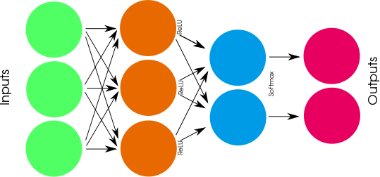
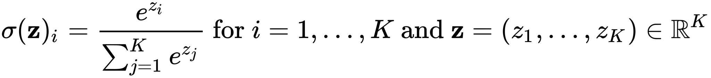
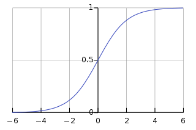
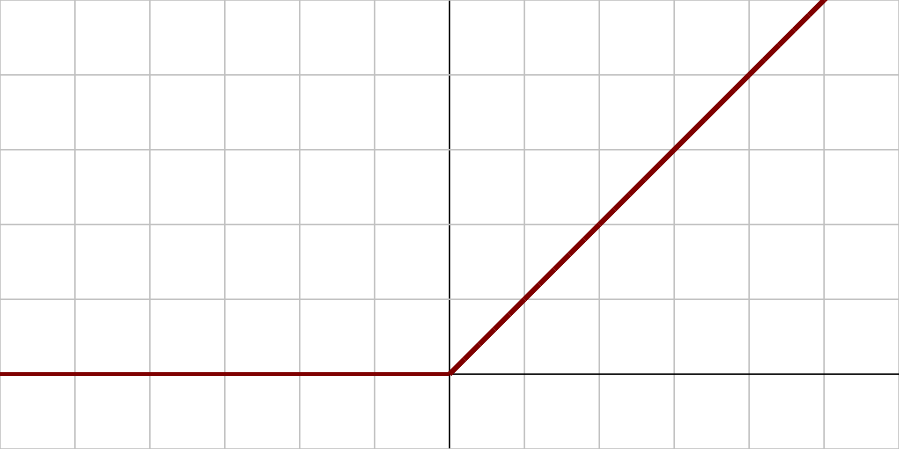
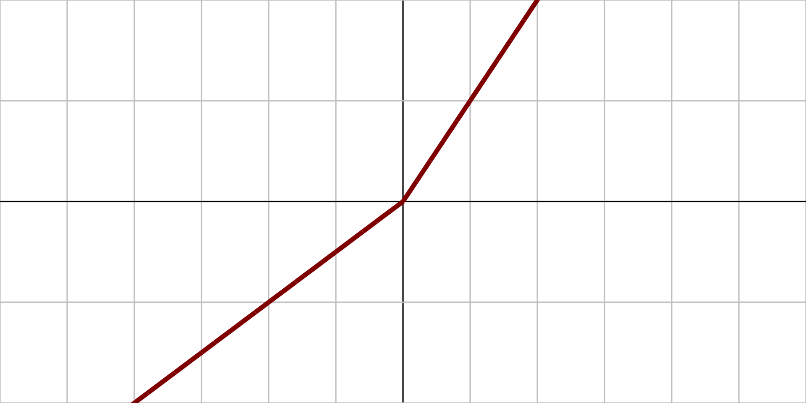
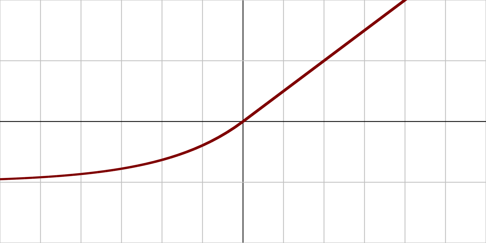
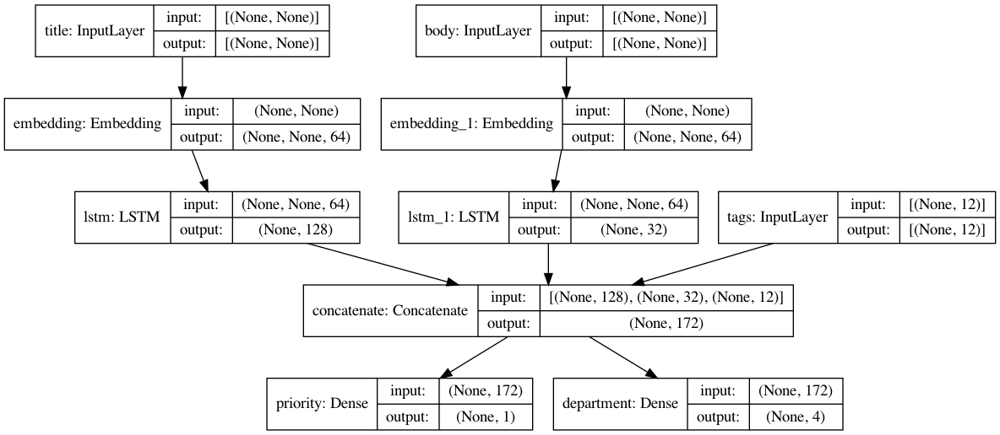

---
jupyter:
  jupytext:
    formats: ipynb,md
    text_representation:
      extension: .md
      format_name: markdown
      format_version: '1.3'
      jupytext_version: 1.19.1
  kernelspec:
    display_name: Python 3 (ipykernel)
    language: python
    name: python3
---

<!-- #region cell_style="center" slideshow={"slide_type": "slide"} -->
# Intro to programming and training Neural Networks with PyTorch, part 2


<center></center>
<!-- #endregion -->

<!-- #region slideshow={"slide_type": "slide"} -->
## Summary of first part
<!-- #endregion -->

<!-- #region slideshow={"slide_type": "slide"} -->
## Terminology

* A dataset in supervised learning is made of a number of (features, label) pairs
* Example, a dataset of diabetic patients is made of:
    * Features: information describing each patient (weight, height, blood pressure...)
    * Labels: whether each patient is diabetic or not (glucose levels higher or lower than...)
* Each (features, label) pair is also called a _sample_ or _example_. Basically a data point
* Features are also sometimes called _inputs_ when referred to something you feed to a NN
* Labels are compared to the NN's _outputs_ to see how well the network is doing compared to the truth
<!-- #endregion -->

<!-- #region slideshow={"slide_type": "slide"} -->
## Docs: https://docs.pytorch.org/docs

* PyTorch is an "optimized tensor library for deep learning"
* Scientific computing, general ML, Neural Networks
* C++/python (we use the latter)
* Easy to implement complex architectures with few lines of code
<!-- #endregion -->

<!-- #region slideshow={"slide_type": "slide"} -->
## Here's how a NN layer might look like in PyTorch:

* 7 samples in batch
* 784 inputs
* 500 outputs

<center></center>
<!-- #endregion -->

<!-- #region cell_style="center" slideshow={"slide_type": "slide"} -->
## A neural network in PyTorch is called a Model

The simplest kind of model is of the Sequential kind:
<!-- #endregion -->

```python cell_style="center" slideshow={"slide_type": "-"}
import torch
import torch.nn as nn
import torch.optim as optim

model = nn.Sequential()
```

<!-- #region slideshow={"slide_type": "slide"} -->
This is an "empty" model, with no layers, no inputs or outputs are defined either.

Adding layer is easy:
<!-- #endregion -->

```python cell_style="center" slideshow={"slide_type": "-"}
model = nn.Sequential()
model.append(nn.Linear(3, 4))
model.append(nn.ReLU())
model.append(nn.Linear(4, 2))
model.append(nn.Softmax())
```

<!-- #region slideshow={"slide_type": "-"} editable=true -->
A "Dense" layer is a fully connected layer as the ones we have seen in Multi-layer Perceptrons.
The above is equal to having this network:

<center></center>
<!-- #endregion -->

<!-- #region slideshow={"slide_type": "slide"} -->
If we want to see the layers in the Model this far, we can just call:
<!-- #endregion -->

```python slideshow={"slide_type": "-"}
list(model.parameters())
```

<!-- #region slideshow={"slide_type": "slide"} editable=true -->
## Part 2, more layers (https://docs.pytorch.org/docs/stable/nn.html)

Common layers (we will cover most of these!)

* Trainable
    * <font color='red'>Linear (fully connected/MLP)</font>
    * <font color='red'>Conv1D (2D/3D)</font>
    * <font color='red'>Recurrent: LSTM/GRU/Bidirectional</font>
    * <font color='red'>Embedding</font>
    * <font color='red'>Lambda (apply your own function)</font>

* Non-trainable
    * <font color='red'>Dropout</font>
    * <font color='red'>Flatten</font>
    * BatchNormalization
    * MaxPooling1D (2D/3D)
    * Merge (add/subtract/concatenate)
    * <font color='red'>Activation (Softmax/ReLU/Sigmoid/...)</font>
<!-- #endregion -->

<!-- #region slideshow={"slide_type": "slide"} -->
## Dropout is a regularization layer

* It's applied to a previous layer's output
* Takes those outputs and randomly sets them to 0 with probability p
* Other outputs are scaled up so that the mean intensity of the outputs doesn't change
* if p = 0.5: `model.append(nn.Dropout(p=0.5))`
<!-- #endregion -->

```python slideshow={"slide_type": "-"}
input = torch.randn(16)

dropout_layer = nn.Dropout(p=0.5)

output = dropout_layer(input)

print("Before:", input, sep="\n")
print("After:", output, sep="\n")
```

<!-- #region slideshow={"slide_type": "slide"} -->
## Dropout is a regularization layer

* Applying the same input twice will give different results
* Means that it is harder for the network to memorize patterns
* Helps curb overfitting
* Especially used with Linear() layers which are prone to overfitting
* Active only at training time
<!-- #endregion -->

```python slideshow={"slide_type": "-"}
print("Input:", input, sep="\n")
dropout_layer.train()
output = dropout_layer(input)

print("Output (train time):", output, sep="\n")

dropout_layer.eval()
output = dropout_layer(input)
print("Output (validation time):", output, sep="\n")
```

<!-- #region slideshow={"slide_type": "slide"} -->
## Custom layers

* It's not mandatory to use predefined pyTorch layers
* You can implement your own tensor function
* Just make sure the function is differentiable
<!-- #endregion -->

```python slideshow={"slide_type": "-"}
def sum_two_tensors(inputs):
    x, y = inputs
    sum_of_tensors = x + y
    return sum_of_tensors

input_tensor_1 = torch.arange(0, 9, dtype=torch.float, requires_grad=True)
input_tensor_2 = torch.arange(1, 10, dtype=torch.float, requires_grad=True)

lambda_out = sum_two_tensors([input_tensor_1, input_tensor_2])

desired_out = torch.ones(9)
criterion = nn.MSELoss()

loss = criterion(lambda_out, desired_out)
loss.backward()
```

```python
def argmax_of_two_tensors(inputs):
    x, y = inputs
    z = torch.stack(inputs)
    argmax_of_two_tensors = torch.argmax(z, 0)
    return argmax_of_two_tensors

input_tensor_1 = torch.arange(0, 9, dtype=torch.float, requires_grad=True)
input_tensor_2 = torch.arange(1, 10, dtype=torch.float, requires_grad=True)

lambda_out = argmax_of_two_tensors([input_tensor_1, input_tensor_2])
print(lambda_out)
criterion = nn.MSELoss()

loss = criterion(lambda_out, desired_out)
loss.backward()
```

<!-- #region slideshow={"slide_type": "slide"} -->
## Activations (https://docs.pytorch.org/docs/stable/nn.functional.html#non-linear-activation-functions)

Activation functions for regression or inner layers:
* Sigmoid
* Tanh
* ReLU
* LeakyReLU
* Linear (None)

THE activation function for classification (output layer only):
* Softmax (ouputs probabilities for each class)
* But Softmax is usually calculated inside the Loss function
<!-- #endregion -->

<!-- #region slideshow={"slide_type": "slide"} -->
## Softmax

It's an activation function applied to a output vector z with K elements (one per class) and outputs a probability distribution over the classes:

<table><tr>
<td></td>
<td></td>
</tr></table>

What makes softmax your favorite activation:

* K outputs sums to 1
* K probabilities proportional to the exponentials of the input numbers
* No negative outputs
* Monotonically increasing output with increasing input

Softmax is usually only used to activate the last layer of a NN
<!-- #endregion -->

<!-- #region slideshow={"slide_type": "slide"} -->
## ReLU vs. old-school logistic functions

* Historically, sigmoid and tanh were the most used activation functions
* Easy derivative
* Bound outputs (ex: from 0 to 1)
* They look like this:


<!-- #endregion -->

<!-- #region slideshow={"slide_type": "slide"} -->
## ReLU vs. old-school logistic functions

* Problems arise when we are at large $|x|$
* The derivative in that area becomes small (saturation)
* Remember what the chain rule said?


<!-- #endregion -->

<!-- #region slideshow={"slide_type": "slide"} -->
## ReLU vs. old-school logistic functions

* When we have $n$ layers, we go through $n$ activation functions
* At layer $n$ the derivative is proportional to:
$$\begin{eqnarray} 
\frac{\partial L(w,b|x)}{\partial w_{ln}} & \propto &  \frac{\partial a_{ln}}{\partial z_{ln}}
\end{eqnarray}$$
* At layer 1 the derivative is proportional to:
$$\begin{eqnarray} 
\frac{\partial L(w,b|x)}{\partial w_{l1}} & \propto &  \frac{\partial a_{ln}}{\partial z_{ln}} \times \frac{\partial a_{n-1}}{\partial z_{ln-1}} \times \frac{\partial a_{ln-2}}{\partial z_{ln-2}} \ldots \times \frac{\partial a_{l1}}{\partial z_{l1}}
\end{eqnarray}$$
* It is the product of many numbers $< 1$
* Gradient becomes smaller and smaller for the initial layers
* Gradient vanishing problem

<!---  -->
<!-- #endregion -->

<!-- #region slideshow={"slide_type": "slide"} -->
## ReLU is the first activation to address the issue

<center></center>

Used in "internal" layers, usually not at last layer

Pros:
* Easy derivative (1 for x > 0, 0 elsewhere)
* Derivative doesn't saturate for x > 0: alleviates gradient vanishing
* Non-linear

Cons:
* Non-derivable at 0
* Dead neurons if x << 0 for all data instances
* Potential gradient explosion
* Let's try this on Tensorflow playground: http://playground.tensorflow.org
<!-- #endregion -->

<!-- #region cell_style="split" slideshow={"slide_type": "slide"} -->
## Other ReLU-like activations

LeakyReLU/PReLU
* y = $\alpha$x at x < 0
* In PReLU $\alpha$ is learned

<center></center>

<!-- #endregion -->

<!-- #region cell_style="split" -->
## <font color="white">Other</font>

ELU
* Derivable at 0
* Non-zero at x < 0

<center></center>
<!-- #endregion -->

```python slideshow={"slide_type": "slide"}
from IPython.display import IFrame 
IFrame('https://polarisation.github.io/tfjs-activation-functions/', width=860, height=470) 
```

<!-- #region slideshow={"slide_type": "slide"} -->
## Setting activations in PyTorch

We can add activations as separate layers:
<!-- #endregion -->

```python slideshow={"slide_type": "-"}
model = nn.Sequential()
model.append(nn.Linear(3, 4))
model.append(nn.ReLU())
model.append(nn.Linear(4, 2))
model.append(nn.Softmax())
```

<!-- #region slideshow={"slide_type": "slide"} -->
## Even more layers

* `Linear` is the classic FFNN where all nodes between layers are connected
* Most of the other layers seen today are not trainable
* What other layers are trainable then?
<!-- #endregion -->

<!-- #region slideshow={"slide_type": "slide"} -->
## Convolutional layers

* Used where the _spatial_ relationship between inputs is significant
* Classic example: imaging
* Different types: 1D, 2D, 3D

```python
import pytorch.nn as nn

m = nn.Conv1d(16, 33, 3, stride=2)
```
<!-- #endregion -->

<!-- #region slideshow={"slide_type": "slide"} -->
## Convolutional layers

</img>

[(source)](https://en.wikipedia.org/wiki/Convolutional_neural_network)
<!-- #endregion -->

<!-- #region slideshow={"slide_type": "slide"} -->
## Recurrent layers

* Used when the _temporal_ relationship between inputs is significant
* Examples: audio, text
* Different types: LSTM, GRU...

```python
rnn = nn.LSTM(input_size, hidden_size, num_layers=1)
gru = nn.GRU(input_size, hidden_size, num_layers=1)
```
<!-- #endregion -->

<!-- #region slideshow={"slide_type": "slide"} -->
## Recurrent layers

</img>

<!-- #endregion -->

<!-- #region slideshow={"slide_type": "slide"} -->
## Embedding layers

* Used to transform a discrete input into a vector
* Example: text input is made of words, how do we translate that into NN inputs?
* "cat" -> `[0.1, 0.003, 1.2 ..., 0]`
* It's a lookup table that returns a specific vector of floats for each word

```python
nn.Embedding(num_embeddings, embedding_dim)
```
<!-- #endregion -->

<!-- #region slideshow={"slide_type": "slide"} -->
## Embedding layers

* Example: map amino acid names to 2D space
* Which amino acids are most similar to tryptophan (W)?

</img>
<!-- #endregion -->

<!-- #region slideshow={"slide_type": "slide"} -->
## Functional models in PyTorch

* Sequential() is quite simple, but limited
* What if we want to have multiple input/output layers?
* What if we want a model that is not just a linear sequence of layers?


<!-- #endregion -->

<!-- #region editable=true slideshow={"slide_type": "slide"} -->
# Functional models in Pytorch

* Same MLP as before, but layers are applied as functions
<!-- #endregion -->

```python editable=true slideshow={"slide_type": ""}
class MLP(torch.nn.Module):
    def __init__(self, input_dim, output_dim, hidden_dim):
        super().__init__()
        self.h1 = torch.nn.Linear(input_dim, hidden_dim)
        self.h2 = torch.nn.Linear(hidden_dim, output_dim)

    def forward(self, x):
        z = self.h1(x)
        a = torch.tanh(z)
        y_hat = self.h2(a)
        return y_hat
```

<!-- #region editable=true slideshow={"slide_type": "slide"} -->
# Functional models in Pytorch

* Now with multiple inputs and outputs
<!-- #endregion -->

```python editable=true slideshow={"slide_type": ""}
class ComplexModel(nn.Module):
    def __init__(self, num_words=100, embed_dim=64, lstm_dim1=128, lstm_dim2=32, tags_dim=12, output_dim1=1, output_dim2=4):
        super().__init__()
        self.embed1 = nn.Embedding(num_words, embed_dim)
        self.embed2 = nn.Embedding(num_words, embed_dim)

        self.lstm1 = nn.LSTM(embed_dim, lstm_dim1)
        self.lstm2 = nn.LSTM(embed_dim, lstm_dim2)

        self.out1 = nn.Linear(lstm_dim1+lstm_dim2+tags_dim, output_dim1)
        self.out2 = nn.Linear(lstm_dim1+lstm_dim2+tags_dim, output_dim2)

    def forward(self, x):
        e1_out = self.embed1(x[0])
        e2_out = self.embed1(x[1])
        tag_in = x[2]

        l1_out = self.lstm1(e1_out)
        l2_out = self.lstm2(e2_out)
        
        cat_out = torch.cat([l1_out, l2_out, tag_in])
        
        prio_out = self.out1(cat_out)
        dept_out = self.out2(cat_out)
        return prio_out, dept_out

model = ComplexModel()
```

<!-- #region slideshow={"slide_type": "slide"} editable=true -->
## Exercise 2/3 (reprise)

* Remember the XOR classifier? Or the Boston housing dataset?
* Can you apply some of the things we have learned today on the models from yesterday?
* Do they help?
<!-- #endregion -->

<!-- #region slideshow={"slide_type": "slide"} editable=true -->
## Exercise 4 (optional)

Classifying IMDB reviews into positive or negative.

Check the exercises notebook!
<!-- #endregion -->
