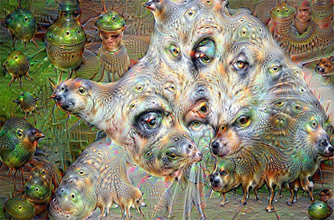
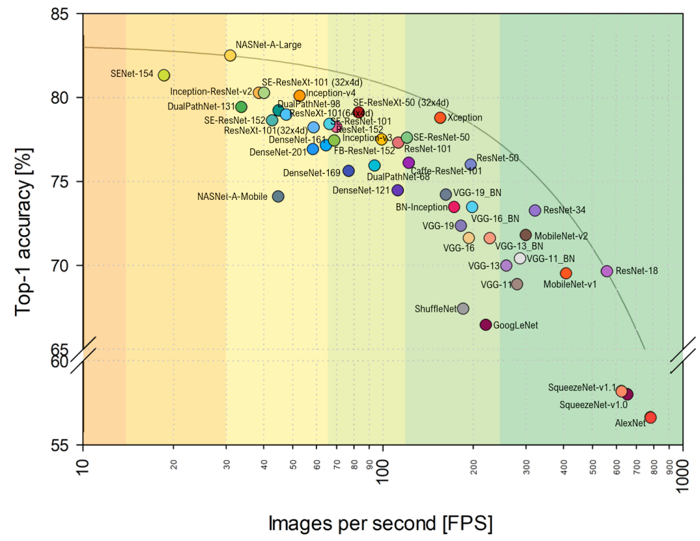

## CNNs for computer vision

{fig-align="center" style="max-height:600px;"}

::: {.notes}
Some of the material from this lecture comes from online courses of Charles Ollion and Olivier Grisel - Master Datascience Paris Saclay. CC-By 4.0 license.
:::

## CNN for image classification

CNN = **Convolutional Neural Networks** (or ConvNets)

{fig-align="center" width="90%"}

::: {.notes}
LeCun, Y., Bottou, L., Bengio, Y., and Haffner, P. (1998). LeNet: gradient-based learning applied to document recognition.
:::

## Outline

- Convolutions
- Convolutions in Neural Networks
  - Motivations
  - Layers
- Architectures
  - Classic CNN Architecture
  - AlexNet
  - VGG16
  - ResNet

## Convolution

- A mathematical operation that combines two functions to form a third function.
- The feature map (or input data) and the kernel are combined to form a transformed feature map.
- Often interpreted as a filter: the kernel filters the feature map for certain information (edges, etc.)

{fig-align="center" width="50%"}

The mathematical definition of the convolution of two functions $f$ and $x$ over a range $t$:

$$y(t) = f \otimes x = \int_{-\infty}^{\infty} f(k) \cdot x(t-k)\, \mathrm{d}k$$

::: {.notes}
Source: https://developer.nvidia.com/discover/convolution
:::

## Convolution as feature detector

Convolutional filters can be interpreted as feature detectors:

- The input (feature map) is filtered for a certain feature (the kernel).
- The output is large if the feature is detected in the image.

{fig-align="center" width="60%"}

::: {.notes}
The kernel can be interpreted as a feature detector where a detected feature results in large outputs (white) and small outputs if no feature is present (black).
:::

## Image kernels demo

<iframe src="https://setosa.io/ev/image-kernels/" width="100%" height="600"></iframe>

::: {.notes}
Interactive demo of image kernels from setosa.io.
:::

## Convolution in a neural network

{fig-align="center" width="40%"}

- $x$ is a $3 \times 3$ chunk (yellow area) of the image (green array)
- Each output neuron is parametrized with the $3 \times 3$ weight matrix $\mathbf{w}$ (small numbers)

The activation is obtained by sliding the $3 \times 3$ window and computing:

$$z(x) = \mathrm{relu}(\mathbf{w}^T x + b)$$

## Motivations

Standard Dense Layer for an image input:

```python
import torch
import torch.nn as nn

# x: image batch of shape (N, 3, 480, 640)
x = torch.randn(1, 3, 480, 640)
y = nn.Flatten()(x)
# shape of y is: (N, 3 * 480 * 640)
z = nn.Linear(3 * 480 * 640, 1000)(y)
```

. . .

$$640 \times 480 \times 3 \times 1000 + 1000 = 922\,\text{M}$$

. . .

- No spatial organization of the input
- Dense layers are never used directly on large images
- Most standard solution is to use **convolution layers**

## Motivations

### Local connectivity

- A neuron depends only on a few local input neurons
- Translation invariance

### Comparison to Fully connected

- Parameter sharing: reduce overfitting
- Make use of spatial structure: strong prior for vision!

### Animal Vision Analogy

- *Hubel & Wiesel, Receptive fields of single neurones in the cat's striate cortex (1959)*

## Channels

Colored image = tensor of shape (height, width, channels)

Convolutions are usually computed for each channel, and summed:

{fig-align="center" width="40%"}

$$(k \star im^{color}) = \sum\limits_{c=0}^2 k^c \star im^c$$

## Multiple convolutions

{fig-align="center" width="40%"}

## Multiple convolutions

{fig-align="center" width="40%"}

## Multiple convolutions

{fig-align="center" width="40%"}

## Multiple convolutions

{fig-align="center" width="40%"}

## Multiple convolutions

{fig-align="center" width="40%"}

- Kernel size aka receptive field (usually 1, 3, 5, 7, 11)
- Output dimension: `length - kernel_size + 1`

## Strides

- Strides: increment step size for the convolution operator
- Reduces the size of the output map

{fig-align="center" width="25%"}

::: {.notes}
Convolution visualization by V. Dumoulin https://github.com/vdumoulin/conv_arithmetic
:::

## Padding

- Padding: artificially fill borders of image
- Useful to keep spatial dimension constant across filters
- Useful with strides and large receptive fields
- Usually: fill with 0s

{fig-align="center" width="25%"}

## Shapes of convolution layers

:::: {.columns}

::: {.column width="60%"}

**Kernel** or **Filter** shape: $(F, F, C^i, C^o)$

- $F \times F$ kernel size
- $C^i$ input channels
- $C^o$ output channels

Number of parameters: $(F \times F \times C^i + 1) \times C^o$

:::

::: {.column width="40%"}
{width="40%"}
:::

::::

## Shapes of convolution layers

**Activations** or **Feature maps** shape:

- Input: $\left(W^i, H^i, C^i\right)$
- Output: $\left(W^o, H^o, C^o\right)$

$$W^o = (W^i - F + 2P) / S + 1$$

## Convolution demo

<iframe src="https://cs231n.github.io/assets/conv-demo/index.html" width="100%" height="600"></iframe>

$$W^o = (W^i - F + 2P) / S + 1$$

## Pooling

- Spatial dimension reduction
- Local invariance
- No parameters: max or average of $2 \times 2$ units

{fig-align="center" width="60%"}

## Pooling

- Spatial dimension reduction
- Local invariance
- No parameters: max or average of $2 \times 2$ units

{fig-align="center" width="40%"}

## In PyTorch: MLP

#### Fully Connected Network: Multilayer Perceptron

```python
import torch.nn as nn

mlp = nn.Sequential(
    nn.Flatten(),                # (N, 1, 28, 28) -> (N, 784)
    nn.Linear(28 * 28, 256),
    nn.ReLU(),
    nn.Linear(256, 10),          # logits; use CrossEntropyLoss
)
```

## In PyTorch: ConvNet

#### Convolutional Network

```python
import torch.nn as nn

convnet = nn.Sequential(
    nn.Conv2d(in_channels=1, out_channels=32, kernel_size=5, padding=2),
    nn.ReLU(),
    nn.MaxPool2d(kernel_size=2, stride=2),
    nn.Conv2d(in_channels=32, out_channels=64, kernel_size=3, padding=1),
    nn.ReLU(),
    nn.MaxPool2d(kernel_size=2, stride=2),
    nn.Flatten(),
    nn.Linear(64 * 7 * 7, 256),
    nn.ReLU(),
    nn.Linear(256, 10),          # logits; use CrossEntropyLoss
)
```

**2D spatial organization of features preserved until Flatten.**

## Feature visualization

{fig-align="center" width="80%"}

## DeepDream

{fig-align="center" width="80%"}

## DeepDream

{fig-align="center" width="80%"}

# Architectures

## Classic ConvNet Architecture

### Input

### Conv blocks

- Convolution + activation (relu)
- Convolution + activation (relu)
- ...
- Maxpooling 2x2

### Output

- Fully connected layers
- Softmax

## AlexNet

{fig-align="center" width="60%"}

Input: 227x227x3 image. First conv layer: kernel 11x11x3x96 stride 4

- Kernel shape: `(11,11,3,96)`
- Output shape: `(55,55,96)`
- Number of parameters: `34,944`
- Equivalent MLP parameters: `43.7 × 10⁹`

::: {.notes}
Simplified version of Krizhevsky, Alex, Sutskever, and Hinton. "Imagenet classification with deep convolutional neural networks." NIPS 2012
:::

## AlexNet {.smaller}

```text
INPUT:     [227x227x3]
CONV1:     [55x55x96]   96 11x11 filters at stride 4, pad 0
MAX POOL1: [27x27x96]      3x3   filters at stride 2
CONV2:     [27x27x256] 256 5x5   filters at stride 1, pad 2
MAX POOL2: [13x13x256]     3x3   filters at stride 2
CONV3:     [13x13x384] 384 3x3   filters at stride 1, pad 1
CONV4:     [13x13x384] 384 3x3   filters at stride 1, pad 1
CONV5:     [13x13x256] 256 3x3   filters at stride 1, pad 1
MAX POOL3: [6x6x256]       3x3   filters at stride 2
FC6:       [4096]      4096 neurons
FC7:       [4096]      4096 neurons
FC8:       [1000]      1000 neurons (softmax logits)

Total params: 28,054,497
Trainable params: 28,054,497
Non-trainable params: 0
```

## VGG16

{fig-align="center" width="90%"}

::: {.notes}
Simonyan, Karen, and Zisserman. "Very deep convolutional networks for large-scale image recognition." (2014)
:::

## VGG in PyTorch {.smaller}

```python
import torch.nn as nn

def conv_block(in_c, out_c, n):
    layers = []
    for i in range(n):
        layers += [nn.Conv2d(in_c if i == 0 else out_c, out_c, kernel_size=3, padding=1),
                   nn.ReLU(inplace=True)]
    layers.append(nn.MaxPool2d(kernel_size=2, stride=2))
    return layers

vgg16 = nn.Sequential(
    *conv_block(3,   64, 2),
    *conv_block(64,  128, 2),
    *conv_block(128, 256, 3),
    *conv_block(256, 512, 3),
    *conv_block(512, 512, 3),
    nn.Flatten(),
    nn.Linear(512 * 7 * 7, 4096), nn.ReLU(inplace=True), nn.Dropout(0.5),
    nn.Linear(4096, 4096),        nn.ReLU(inplace=True), nn.Dropout(0.5),
    nn.Linear(4096, 1000),        # logits; use CrossEntropyLoss
)

# Or just use the torchvision implementation:
# from torchvision.models import vgg16
# model = vgg16(weights="IMAGENET1K_V1")
```

## Memory and Parameters {.smaller}

```text
           Activation maps          Parameters
INPUT:     [224x224x3]   = 150K     0
CONV3-64:  [224x224x64]  = 3.2M     (3x3x3)x64    =       1,728
CONV3-64:  [224x224x64]  = 3.2M     (3x3x64)x64   =      36,864
POOL2:     [112x112x64]  = 800K     0
CONV3-128: [112x112x128] = 1.6M     (3x3x64)x128  =      73,728
CONV3-128: [112x112x128] = 1.6M     (3x3x128)x128 =     147,456
POOL2:     [56x56x128]   = 400K     0
CONV3-256: [56x56x256]   = 800K     (3x3x128)x256 =     294,912
CONV3-256: [56x56x256]   = 800K     (3x3x256)x256 =     589,824
CONV3-256: [56x56x256]   = 800K     (3x3x256)x256 =     589,824
POOL2:     [28x28x256]   = 200K     0
CONV3-512: [28x28x512]   = 400K     (3x3x256)x512 =   1,179,648
CONV3-512: [28x28x512]   = 400K     (3x3x512)x512 =   2,359,296
CONV3-512: [28x28x512]   = 400K     (3x3x512)x512 =   2,359,296
POOL2:     [14x14x512]   = 100K     0
CONV3-512: [14x14x512]   = 100K     (3x3x512)x512 =   2,359,296
CONV3-512: [14x14x512]   = 100K     (3x3x512)x512 =   2,359,296
CONV3-512: [14x14x512]   = 100K     (3x3x512)x512 =   2,359,296
POOL2:     [7x7x512]     =  25K     0
FC:        [1x1x4096]    = 4096     7x7x512x4096  = 102,760,448
FC:        [1x1x4096]    = 4096     4096x4096     =  16,777,216
FC:        [1x1x1000]    = 1000     4096x1000     =   4,096,000

TOTAL activations: 24M x 4 bytes ~=  93MB / image (x2 for backward)
TOTAL parameters: 138M x 4 bytes ~= 552MB (x2 for plain SGD, x4 for Adam)
```

## ResNet

:::: {.columns}

::: {.column width="50%"}

Even deeper models:

**34, 50, 101, 152 layers**

::: {.notes}
He, Kaiming, et al. "Deep residual learning for image recognition." CVPR. 2016.
:::

:::

::: {.column width="50%"}
{fig-align="center" height="500px"}
:::

::::

## ResNet — residual blocks

:::: {.columns}

::: {.column width="50%"}

A block learns the residual w.r.t. identity

{fig-align="center" width="60%"}

- Good optimization properties

:::

::: {.column width="50%"}
{fig-align="center" height="500px"}
:::

::::

## ResNet vs. VGG

:::: {.columns}

::: {.column width="50%"}

ResNet50 compared to VGG:

- Superior accuracy in all vision tasks
  - **5.25%** top-5 error vs. 7.1%
- Less parameters
  - **25M** vs. 138M
- Computational complexity
  - **3.8B Flops** vs. 15.3B Flops
- Fully Convolutional until the last layer

:::

::: {.column width="50%"}
{fig-align="center" height="500px"}
:::

::::

## Benchmarks

{fig-align="center" width="55%"}

::: {.notes}
S. Bianco, R. Cadene, L. Celona, and P. Napoletano, "Benchmark analysis of representative deep neural network architectures," IEEE Access, vol. 6, 2018.
:::

## Summary

- Convolutions exploit **local connectivity** and **parameter sharing** to scale to images
- Stacking conv + pooling layers builds a hierarchy of features
- Classic architectures (LeNet, AlexNet, VGG, ResNet) progressively grew **deeper** with **fewer parameters per layer**
- Residual connections unlocked very deep models with strong optimization behavior

::: {.notes}
Next lecture: going beyond classification — localisation, detection, and segmentation.
:::
