## CNNs for computer vision

{fig-align="center" style="max-height:600px;"}

::: {.notes}
Some of the material from this lecture comes from online courses of Charles Ollion and Olivier Grisel - Master Datascience Paris Saclay. CC-By 4.0 license.
:::

## Beyond image classification

Classification answers *"what is in this image?"* — but real-world vision asks more:

- **Where** is the object? *(localisation)*
- **How many** objects, and which class is each one? *(detection)*
- **Which pixels** belong to which object? *(segmentation)*

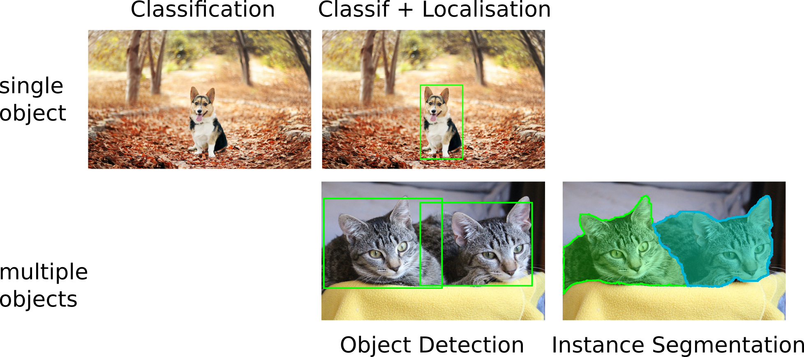{fig-align="center" width="80%"}

## From classification to dense prediction

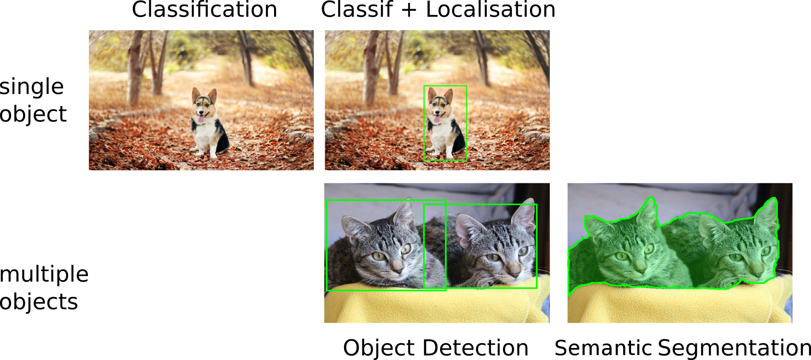{fig-align="center" width="90%"}

- Same backbone (CNN/ViT) — but with **task-specific heads**
- The pretrained classifier is the starting point in (almost) every modern approach

## Outline

- Localisation as regression
- Detection algorithms (YOLO, RetinaNet, Faster R-CNN)
- Fully convolutional networks → **U-Net**
- Losses and transfer learning for segmentation
- Instance segmentation (Mask R-CNN) and what came after

## Localisation

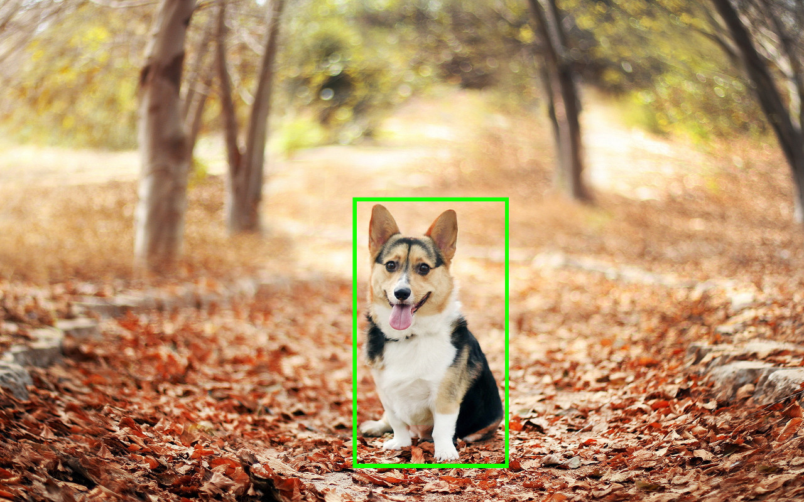{fig-align="center" width="35%"}

- Single object per image
- Predict coordinates of a bounding box `(x, y, w, h)`
- Evaluate via Intersection over Union (IoU)

## Localisation as regression

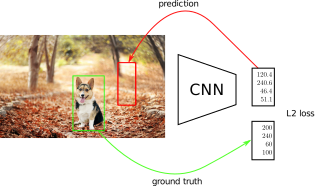{fig-align="center" width="60%"}

## Classification + Localisation

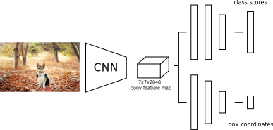{fig-align="center" width="75%"}

- Use a pre-trained CNN on ImageNet (e.g. ResNet)
- The "localisation head" is trained separately with regression
- At test time, use both heads

$C$ classes, $4$ output dimensions ($1$ box)

**Predict exactly $N$ objects:** predict $(N \times 4)$ coordinates and $(N \times K)$ class scores

## Object detection

We don't know in advance the number of objects in the image. Object detection relies on *object proposal* and *object classification*:

- **Object proposal:** find regions of interest (RoIs) in the image
- **Object classification:** classify the object in these regions

### Two main families

- **Single-Stage**: a grid in the image where each cell is a proposal (SSD, YOLO, RetinaNet)
- **Two-Stage**: region proposal then classification (Faster-RCNN)

## YOLO (You Only Look Once)

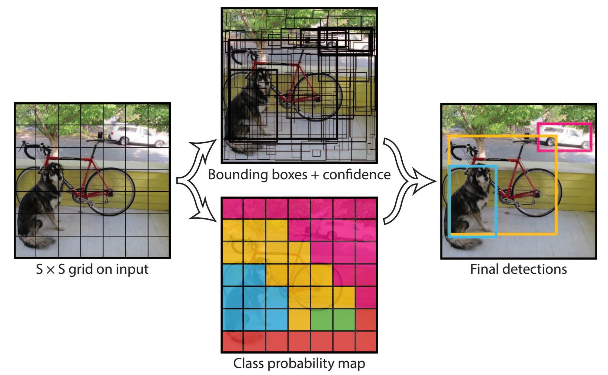{fig-align="center" width="50%"}

For each cell of the $S \times S$ grid predict:

- $B$ **boxes** and **confidence scores** $C$ ($5 \times B$ values) + **classes** $c$
- Final detections: $C_j \cdot \mathrm{prob}(c) > \text{threshold}$

. . .

- One CNN, one forward pass — **real-time** detection
- Globally processes the entire image at once

::: {.notes}
Redmon et al. "You only look once: Unified, real-time object detection." CVPR 2016. The single-shot grid is still the conceptual core, even if modern YOLO versions add anchor-free heads, FPN, decoupled heads, etc.
:::

## YOLO today

The original YOLO concept is now a **mature production library** maintained by Ultralytics.

```python
from ultralytics import YOLO

model = YOLO("yolo11n.pt")          # COCO-pretrained, ~3 MB
results = model.predict("img.jpg")   # detection
results = model.predict("img.jpg", task="segment")  # instance segmentation
```

- Current generation: **YOLOv11** (2024) — anchor-free, decoupled heads, FPN
- One package covers detection, instance segmentation, pose estimation, OBB, tracking
- Real-time on CPU for the small variants; GPU for bigger ones

## RetinaNet

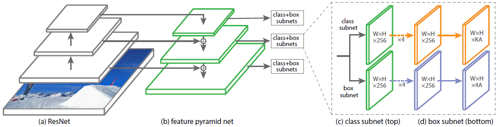{fig-align="center" width="90%"}

Single stage detector with:

- Multiple scales through a *Feature Pyramid Network*
- More than 100K boxes proposed
- Focal loss to manage imbalance between background and real objects

See [this post](https://towardsdatascience.com/review-retinanet-focal-loss-object-detection-38fba6afabe4) for more information.

::: {.notes}
Lin, Tsung-Yi, et al. "Focal loss for dense object detection." ICCV 2017.
:::

## Box Proposals

Instead of using a predefined set of box proposals, find them on the image:

- **Selective Search** — from pixels (not learnt)
- **Faster R-CNN** — Region Proposal Network (RPN)

**Crop-and-resize** operator (**RoI-Pooling**):

- Input: convolutional map + $N$ regions of interest
- Output: tensor of $N \times 7 \times 7 \times \text{depth}$ boxes
- Allows the gradient to propagate only on interesting regions, and efficient computation

## Faster R-CNN

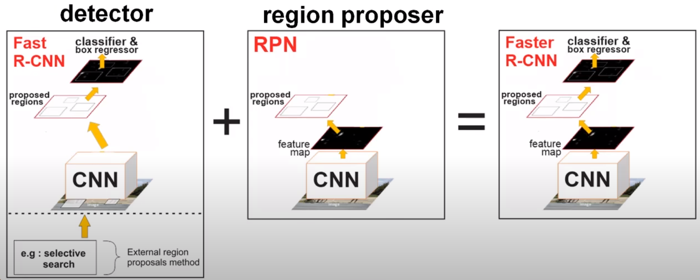{fig-align="center" width="70%"}

- Replace **Selective Search** with **RPN**, train jointly
- Region proposal is translation invariant, compared to YOLO

::: {.notes}
Ren, Shaoqing, et al. "Faster r-cnn: Towards real-time object detection with region proposal networks." NIPS 2015
:::

## Segmentation

Output a class map for each pixel (here: dog vs background).

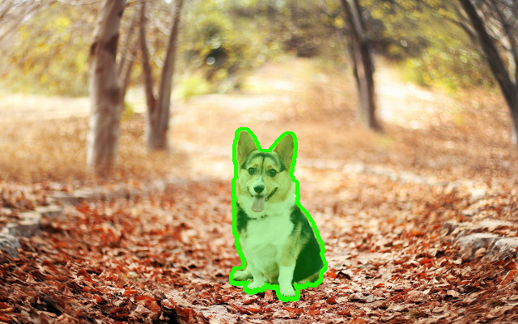{fig-align="center" width="45%"}

- **Instance segmentation**: specify each object instance as well (two dogs have different instances)
- This can be done through **object detection** + **segmentation**

## Convolutionize

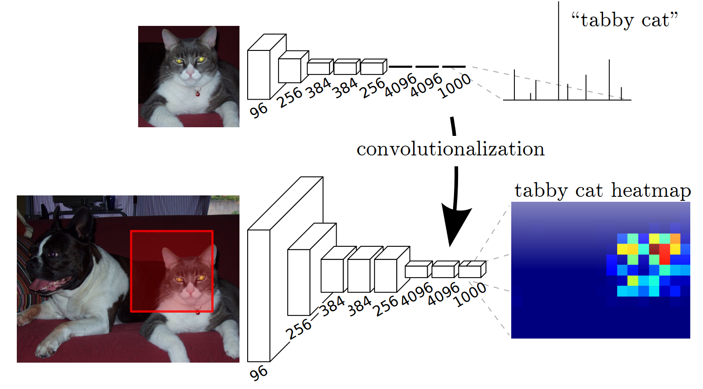{fig-align="center" width="65%"}

- Slide the network with an input of `(224, 224)` over a larger image. Output of varying spatial size
- **Convolutionize**: change Dense `(4096, 1000)` to $1 \times 1$ Convolution, with `4096, 1000` input and output channels
- Gives a coarse **segmentation** (no extra supervision)

::: {.notes}
Long, Jonathan, et al. "Fully convolutional networks for semantic segmentation." CVPR 2015
:::

## Fully Convolutional Network

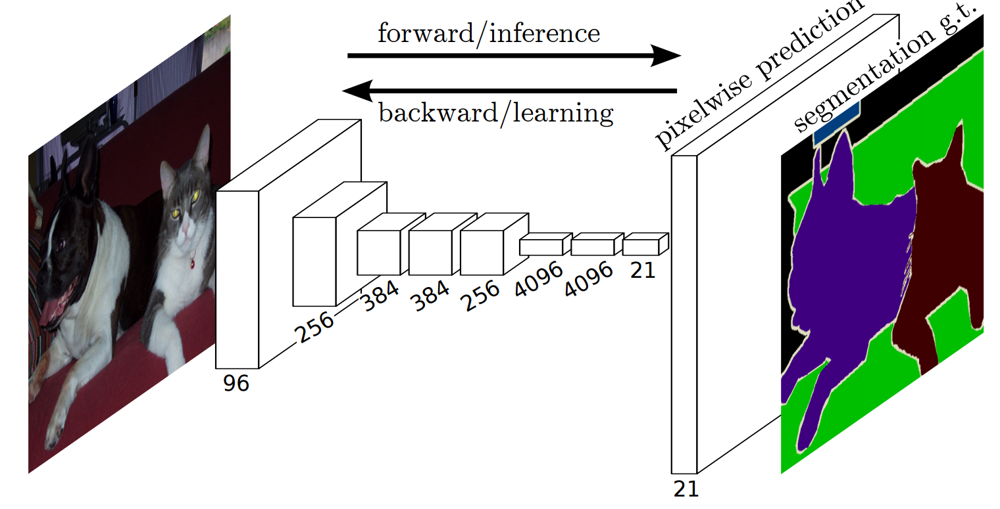{fig-align="center" width="65%"}

- Predict / backpropagate for every output pixel
- Aggregate maps from several convolutions at different scales for more robust results

::: {.notes}
Long, Jonathan, et al. "Fully convolutional networks for semantic segmentation." CVPR 2015
:::

## Deconvolution

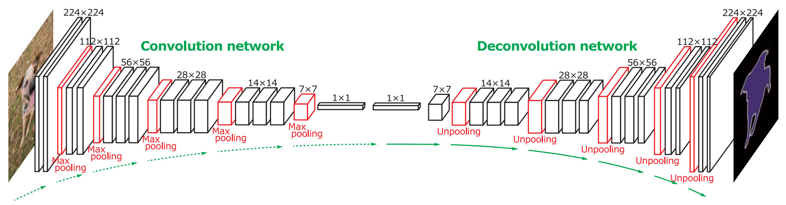{fig-align="center" width="80%"}

"Deconvolution": transposed convolutions

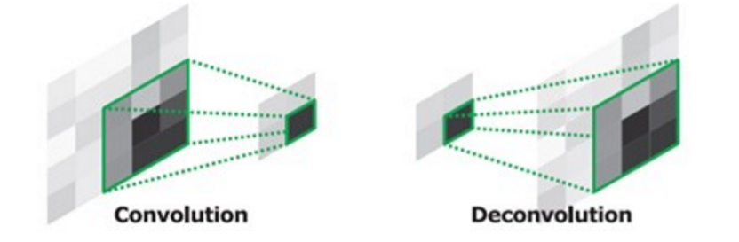{fig-align="center" width="45%"}

::: {.notes}
Noh, Hyeonwoo, et al. "Learning deconvolution network for semantic segmentation." ICCV 2015
:::

## U-Net

{fig-align="center" width="65%"}

- Symmetric **encoder–decoder** with **skip connections** that concatenate features from the contracting path to the expanding path
- Trains well on **small datasets** with heavy augmentation
- Fully convolutional → arbitrary input sizes at inference
- The default architecture for **biomedical and microscopy** segmentation — directly relevant to the lab

::: {.notes}
Ronneberger, Fischer, Brox. "U-Net: Convolutional Networks for Biomedical Image Segmentation." MICCAI 2015. Skip connections concatenate (not add, as in ResNet) to preserve spatial detail through the bottleneck.
:::

## Segmentation losses

Segmentation = per-pixel classification, but with a strong **class-imbalance** problem (background dominates).

- **Cross-entropy** (per pixel) — the default, but biased toward the majority class
- **Dice loss** — directly optimizes overlap with the ground-truth mask:

$$\mathcal{L}_{\text{Dice}} = 1 - \frac{2 \, |P \cap G|}{|P| + |G|}$$

- **Focal loss** — down-weights easy pixels, focuses on hard ones (same idea as RetinaNet, applied per-pixel)

. . .

In practice for biomedical/microscopy: train with **BCE + Dice** (sum of the two) for stable convergence on imbalanced masks.

## Transfer learning for segmentation

Same recipe as classification: **pretrained encoder + task-specific decoder**.

```python
import segmentation_models_pytorch as smp

model = smp.Unet(
    encoder_name="resnet34",       # any timm/torchvision backbone
    encoder_weights="imagenet",    # ImageNet-pretrained
    in_channels=1,                  # grayscale microscopy
    classes=5,                      # number of mask channels
)
```

- Decoder is randomly initialized; encoder starts from ImageNet weights
- Works even when the input domain (microscopy, satellite, MRI) differs from ImageNet
- Same library exposes **U-Net, FPN, DeepLabV3+, MA-Net**, etc. — swap one string

## Mask R-CNN

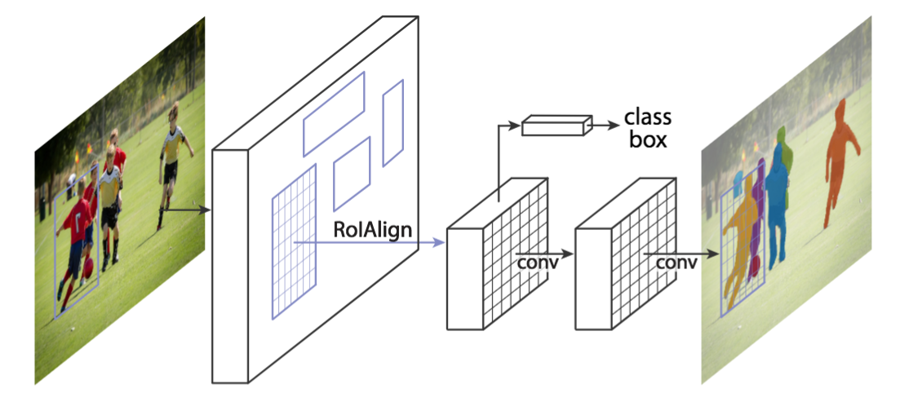{fig-align="center" width="60%"}

Faster R-CNN architecture with a third, binary mask head.

::: {.notes}
K. He et al. Mask Region-based Convolutional Network (Mask R-CNN) NIPS 2017
:::

## Mask R-CNN — Results

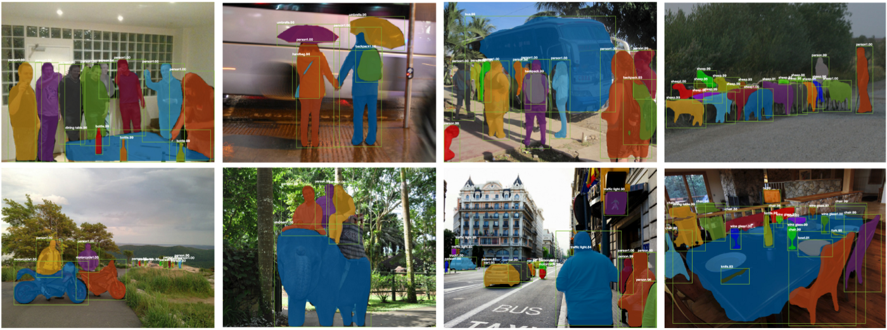{fig-align="center" width="90%"}

- Mask results are still coarse (low mask resolution)
- Excellent instance generalization

::: {.notes}
K. He et al. Mask R-CNN. NIPS 2017
:::

## What came after Mask R-CNN

| Year | Model         | Key idea                                                |
|------|---------------|---------------------------------------------------------|
| 2020 | **DETR**      | Transformer detection, end-to-end, no anchors / no NMS  |
| 2022 | **Mask2Former** | Unified semantic / instance / panoptic segmentation     |
| 2023 | **SAM**       | Promptable segmentation — *"click and get a mask"*      |
| 2024 | **SAM 2**     | SAM extended to **video** with temporal consistency     |

. . .

**Foundation models for segmentation** (SAM 2, Grounding DINO, …) — pretrained on billions of masks, often **zero-shot** for new domains. Covered in **Friday's self-supervised lecture**.

## Summary

- **Localisation**: regression heads on a CNN backbone for $(x, y, w, h)$
- **Detection**: single-stage (YOLO, RetinaNet) vs. two-stage (Faster R-CNN); modern YOLO is a one-line `pip install`
- **Segmentation**: encoder–decoder with skip connections — **U-Net** is the workhorse for biomedical imaging
- **Train it right**: pretrained encoder + BCE + Dice loss + augmentation
- **Instance segmentation**: Mask R-CNN, then DETR / Mask2Former
- **2026 reality**: foundation models (SAM 2, Grounding DINO) often give zero-shot masks — covered Friday

::: {.notes}
Next: hands-on segmentation lab on biological images, where U-Net + Dice loss is the natural baseline.
:::
