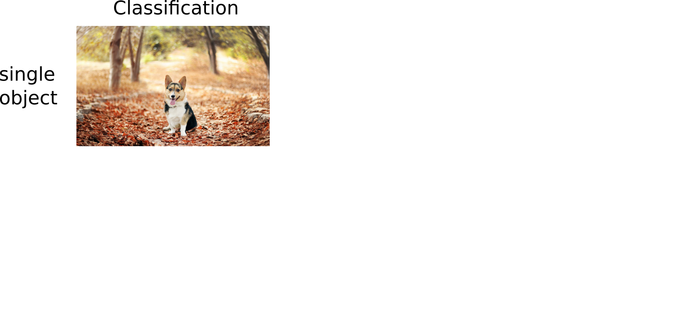
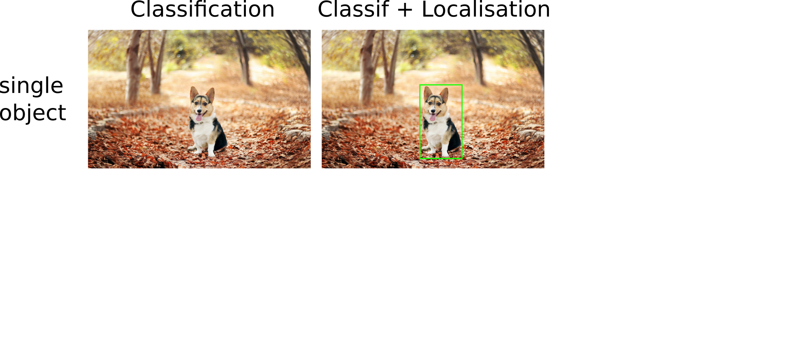
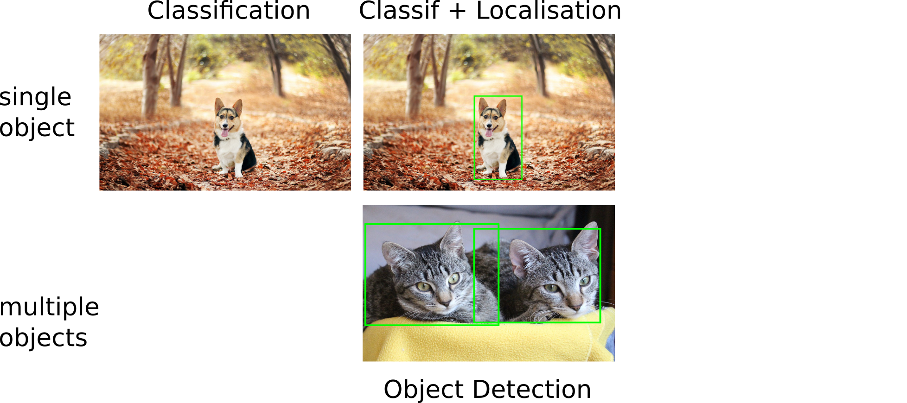
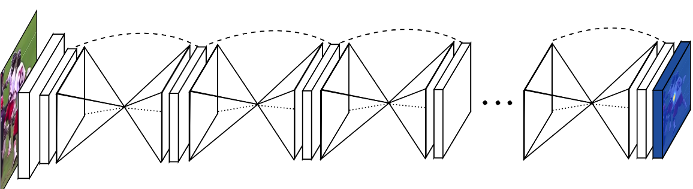
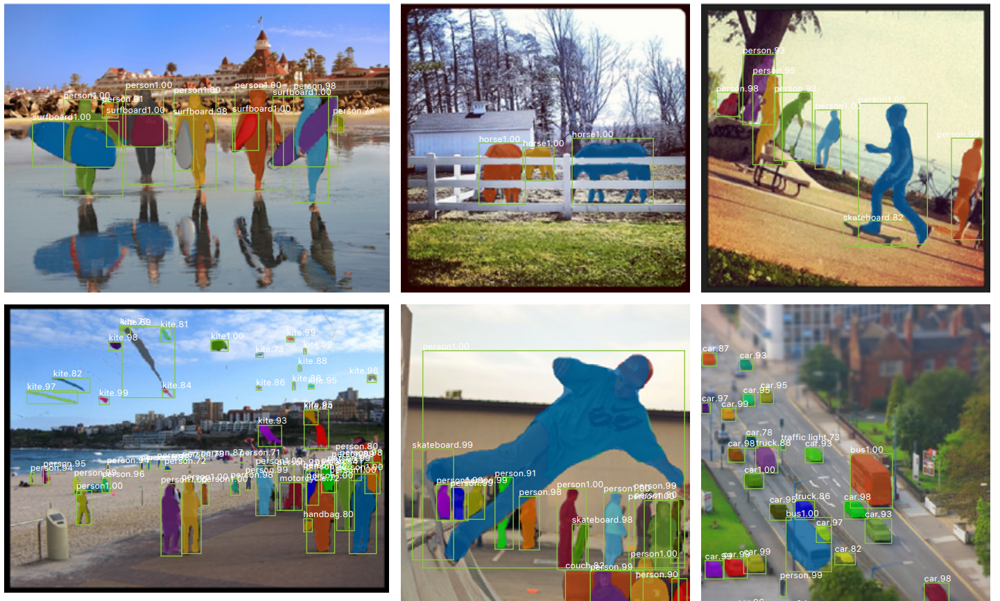

## CNNs for computer vision

{fig-align="center" style="max-height:600px;"}

::: {.notes}
Some of the material from this lecture comes from online courses of Charles Ollion and Olivier Grisel - Master Datascience Paris Saclay. CC-By 4.0 license.
:::

## Beyond Image Classification

### CNNs

- Previous lecture: image classification

### Limitations

- Mostly on centered images
- Only a single object per image
- Not enough for many real world vision tasks

## Beyond Image Classification

{fig-align="center" width="90%"}

## Beyond Image Classification

{fig-align="center" width="90%"}

## Beyond Image Classification

{fig-align="center" width="90%"}

## Beyond Image Classification

{fig-align="center" width="90%"}

## Beyond Image Classification

{fig-align="center" width="90%"}

## Outline

- Simple Localisation as regression
- Detection Algorithms
- Fully Convolutional Networks
- Semantic & Instance Segmentation

## Localisation

{fig-align="center" width="35%"}

- Single object per image
- Predict coordinates of a bounding box `(x, y, w, h)`
- Evaluate via Intersection over Union (IoU)

## Localisation as regression

{fig-align="center" width="60%"}

## Classification + Localisation

{fig-align="center" width="75%"}

- Use a pre-trained CNN on ImageNet (e.g. ResNet)
- The "localisation head" is trained separately with regression
- At test time, use both heads

$C$ classes, $4$ output dimensions ($1$ box)

**Predict exactly $N$ objects:** predict $(N \times 4)$ coordinates and $(N \times K)$ class scores

## Object detection

We don't know in advance the number of objects in the image. Object detection relies on *object proposal* and *object classification*:

- **Object proposal:** find regions of interest (RoIs) in the image
- **Object classification:** classify the object in these regions

### Two main families

- **Single-Stage**: a grid in the image where each cell is a proposal (SSD, YOLO, RetinaNet)
- **Two-Stage**: region proposal then classification (Faster-RCNN)

## YOLO (You Only Look Once)

{fig-align="center" width="60%"}

For each cell of the $S \times S$ grid predict:

- $B$ **boxes** and **confidence scores** $C$ ($5 \times B$ values) + **classes** $c$
- Final detections: $C_j \cdot \mathrm{prob}(c) > \text{threshold}$

::: {.notes}
Redmon, Joseph, et al. "You only look once: Unified, real-time object detection." CVPR (2016)
:::

## YOLO — features

{fig-align="center" width="60%"}

YOLO features:

- Computationally very fast, can be used in real time
- Globally processes the entire image once with a single CNN

::: {.notes}
Redmon, Joseph, et al. "You only look once: Unified, real-time object detection." CVPR (2016)
:::

## RetinaNet

{fig-align="center" width="90%"}

Single stage detector with:

- Multiple scales through a *Feature Pyramid Network*
- More than 100K boxes proposed
- Focal loss to manage imbalance between background and real objects

See [this post](https://towardsdatascience.com/review-retinanet-focal-loss-object-detection-38fba6afabe4) for more information.

::: {.notes}
Lin, Tsung-Yi, et al. "Focal loss for dense object detection." ICCV 2017.
:::

## Box Proposals

Instead of using a predefined set of box proposals, find them on the image:

- **Selective Search** — from pixels (not learnt)
- **Faster R-CNN** — Region Proposal Network (RPN)

**Crop-and-resize** operator (**RoI-Pooling**):

- Input: convolutional map + $N$ regions of interest
- Output: tensor of $N \times 7 \times 7 \times \text{depth}$ boxes
- Allows the gradient to propagate only on interesting regions, and efficient computation

## Faster R-CNN

{fig-align="center" width="70%"}

- Replace **Selective Search** with **RPN**, train jointly
- Region proposal is translation invariant, compared to YOLO

::: {.notes}
Ren, Shaoqing, et al. "Faster r-cnn: Towards real-time object detection with region proposal networks." NIPS 2015
:::

## Segmentation

Output a class map for each pixel (here: dog vs background).

{fig-align="center" width="45%"}

- **Instance segmentation**: specify each object instance as well (two dogs have different instances)
- This can be done through **object detection** + **segmentation**

## Convolutionize

{fig-align="center" width="65%"}

- Slide the network with an input of `(224, 224)` over a larger image. Output of varying spatial size
- **Convolutionize**: change Dense `(4096, 1000)` to $1 \times 1$ Convolution, with `4096, 1000` input and output channels
- Gives a coarse **segmentation** (no extra supervision)

::: {.notes}
Long, Jonathan, et al. "Fully convolutional networks for semantic segmentation." CVPR 2015
:::

## Fully Convolutional Network

{fig-align="center" width="65%"}

- Predict / backpropagate for every output pixel
- Aggregate maps from several convolutions at different scales for more robust results

::: {.notes}
Long, Jonathan, et al. "Fully convolutional networks for semantic segmentation." CVPR 2015
:::

## Deconvolution

{fig-align="center" width="80%"}

"Deconvolution": transposed convolutions

{fig-align="center" width="45%"}

::: {.notes}
Noh, Hyeonwoo, et al. "Learning deconvolution network for semantic segmentation." ICCV 2015
:::

## Skip connections

{fig-align="center" width="80%"}

- **Skip connections** between corresponding convolution and deconvolution layers
- **Sharper masks** by using precise spatial information (early layers)
- **Better object detection** by using semantic information (late layers)

::: {.notes}
Noh, Hyeonwoo, et al. "Learning deconvolution network for semantic segmentation." ICCV 2015
:::

## Hourglass network

{fig-align="center" width="80%"}

- U-Net like architectures repeated sequentially
- Each block refines the segmentation for the following
- Each block has a segmentation loss

::: {.notes}
Newell, Alejandro, et al. "Stacked Hourglass Networks for Human Pose Estimation." ECCV 2016
:::

## Mask R-CNN

{fig-align="center" width="60%"}

Faster R-CNN architecture with a third, binary mask head.

::: {.notes}
K. He et al. Mask Region-based Convolutional Network (Mask R-CNN) NIPS 2017
:::

## Mask R-CNN — Results

{fig-align="center" width="90%"}

- Mask results are still coarse (low mask resolution)
- Excellent instance generalization

::: {.notes}
K. He et al. Mask R-CNN. NIPS 2017
:::

## Mask R-CNN — More results

{fig-align="center" width="85%"}

::: {.notes}
He, Kaiming, et al. "Mask R-CNN." International Conference on Computer Vision (ICCV), 2017.
:::

## Summary

- **Localisation**: regression heads on a CNN backbone for $(x, y, w, h)$
- **Detection**: single-stage (YOLO, RetinaNet) vs. two-stage (Faster R-CNN)
- **Segmentation**: convolutionalize a classifier, add transposed convolutions and skip connections
- **Instance segmentation**: combine detection and segmentation (Mask R-CNN)

::: {.notes}
Next: hands-on segmentation labs.
:::
