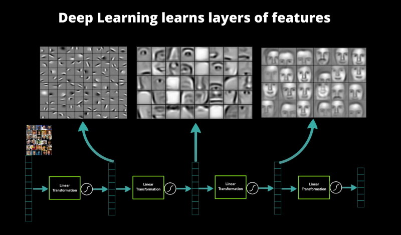
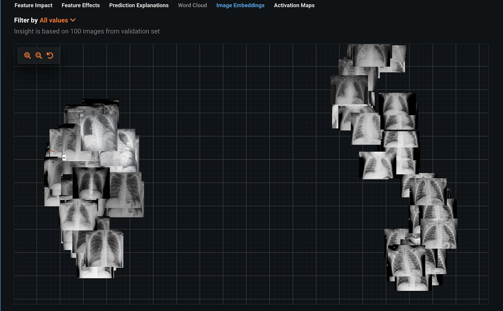
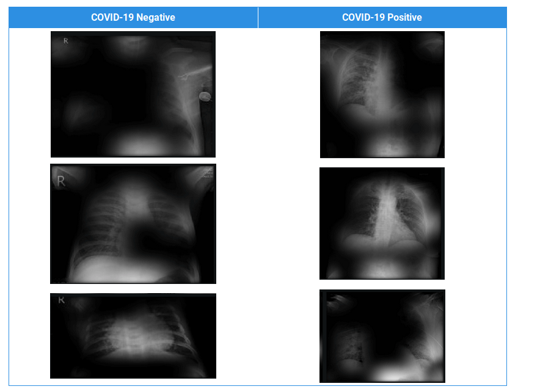
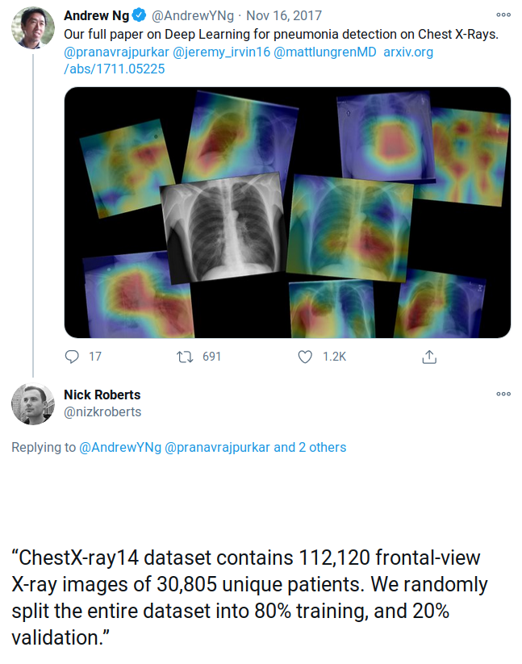
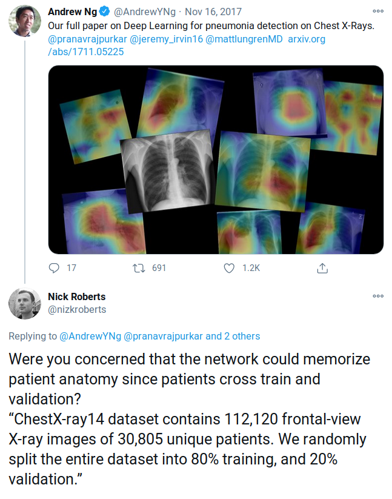
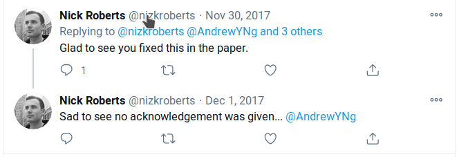
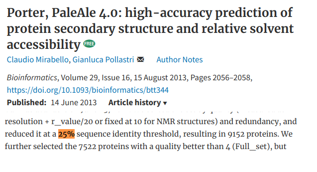
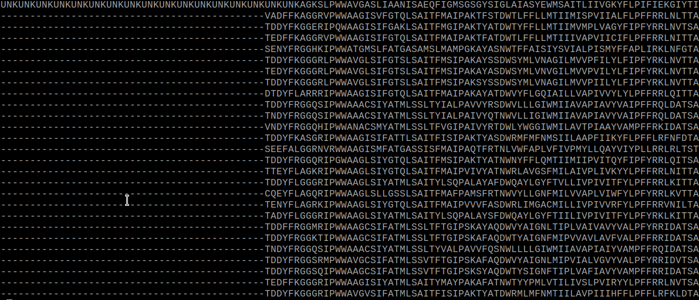
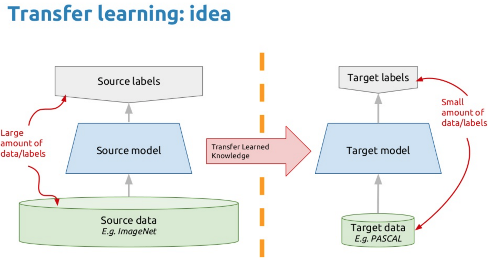

---
jupyter:
  jupytext:
    formats: ipynb,md
    text_representation:
      extension: .md
      format_name: markdown
      format_version: '1.3'
      jupytext_version: 1.19.1
  kernelspec:
    display_name: Python 3 (ipykernel)
    language: python
    name: python3
---

<!-- #region cell_style="center" slideshow={"slide_type": "slide"} editable=true -->
# Good practices of NN/DL project design
## What to do and - more importantly perhaps - not to do
<!-- #endregion -->

<!-- #region cell_style="split" slideshow={"slide_type": "-"} -->
 
<!-- #endregion -->

<!-- #region cell_style="split" slideshow={"slide_type": "-"} editable=true -->
</img>
<!-- #endregion -->

<!-- #region slideshow={"slide_type": "slide"} editable=true -->
# Is my project right for Neural Networks?

* The thought process should not be: “I have some data, why don’t we try neural networks”
* But it should be: “Given the problem, does it make sense to use neural networks?”

    * Do I really need non-linear modelling?
    * What literature is out there for similar problems?
    * How much data will I be able to gather or put my hands on?
    * Are there datasets out there that I can re-use before I collect my data?


<!-- #endregion -->

<!-- #region slideshow={"slide_type": "slide"} editable=true -->
## Do I really need non-linear modelling?

* Sometimes linear methods perform just as well if not better
* Less risk of catastrophic overfitting
* Faster to code, optimize, run, debug
* Use linear modelling as a baseline before you move to non-linear methods?
<!-- #endregion -->

<!-- #region cell_style="split" slideshow={"slide_type": "slide"} editable=true -->
## Real-life example

Question from group leader: "I tried deep learning on my data and it didn't perform better than this other simpler method"

* Classifying gene expression samples
* Thousands features
* 1000 samples
* 2 classes
* NN looked like this:
<!-- #endregion -->

```python
import torch.nn as nn
import numpy as np

model = nn.Sequential(
    nn.Linear(5000, 1000),
    nn.ReLU(),
    nn.Linear(1000, 2),
    nn.Sigmoid()
)

list([p.shape for p in model.parameters()])
```

<!-- #region slideshow={"slide_type": "slide"} editable=true -->
## Parameters (weights) vs. samples

* A 2-hidden layer FFNN can perfectly store $O(Q^2)$ samples with $Q$ hidden nodes ([ref](https://ieeexplore.ieee.org/stamp/stamp.jsp?tp=&arnumber=1189626))
* If the number of parameters is many times higher than the number of samples a NN will never work
* Ideally, we are looking for the inverse: way more samples than parameters
* Some rules of thumb out there:
    * Definitely bad if number of weights > number of samples
    * 10x as many labelled samples as there are weights
    * A few thousand samples per class
    * Just try it and downscale/regularize until you're not overfitting anymore (or until you have a linear model)
<!-- #endregion -->

<!-- #region slideshow={"slide_type": "slide"} editable=true -->
## And even if I have enough data for a NN...

... is Deep Learning the right choice?

* The tasks were Deep Learning shine are those that require feature extraction:
    * Imaging -> edge/object detection
    * Audio/text -> sound/word/sentence detection
    * Protein structure prediction -> mutation patterns/local structure/global structure

* Deep Learning makes feature extraction automatic and seem to work best when there is a hierarchy to these features
* Is your data made that way? 
    * Does it have an order (spatial/temporal)? 
    * Are smaller patterns going to form higher-order patterns?
* All these different types of layers need to be there for a reason

<!-- #endregion -->

<!-- #region slideshow={"slide_type": "slide"} editable=true -->
</img>

source: [datarobot](https://www.datarobot.com/blog/a-primer-on-deep-learning/)
<!-- #endregion -->

<!-- #region slideshow={"slide_type": "slide"} editable=true -->
## And even when both these conditions have been met

... you need a few more things:

* Domain knowledge is not enough
* Sometimes people with NN/DL knowledge and no domain knowledge end up being the right ones for the job (see Alphafold)
* You also need lots of patience and time, these things rarely work out of the box
<!-- #endregion -->

<!-- #region slideshow={"slide_type": "slide"} editable=true -->
## A few more things to keep in mind

* You need extensive knowledge of your data:
    * Split the data in a rigorous way to avoid introducing biases
    * Check for _information leakage_ before you get overly optimistic results
    * Make sure that there are no errors in your data

And therein lies the main issue:
* Some think that DL is about having a model magically fixing your data
* Reality: your network will be as good as your data at best
<!-- #endregion -->

<!-- #region slideshow={"slide_type": "slide"} editable=true -->
# Neural Nets are very good at detecting patterns and they will use this against you

### (a.k.a. target leakage)
<!-- #endregion -->

<!-- #region slideshow={"slide_type": "slide"} editable=true -->
## Target leakage

* Making a predictor when you know the answers is not as easy as it seems
* Need to remove any revealing info you would not have access to in real scenario
* Classic example: predict yearly salary of employee
    * But one of the features is "monthly income"
<!-- #endregion -->

<!-- #region slideshow={"slide_type": "slide"} editable=true -->
## Example: detecting COVID-19 from chest scans 
(https://www.datarobot.com/blog/identifying-leakage-in-computer-vision-on-medical-images/)

* COVIDx dataset
* Training set: chest X-rays of 66 positive COVID results, 120 random non-COVID examples
* 2-class classifier based on ResNet50 Featurizer
* Perfect validation results! Great!

<!-- #endregion -->

<!-- #region slideshow={"slide_type": "slide"} editable=true -->
## Example: detecting COVID-19 from chest scans 

Inspecting dataset with image embeddings tells another story: can anyone tell what's wrong?

</img>
[(source)](https://www.datarobot.com/blog/identifying-leakage-in-computer-vision-on-medical-images/)
<!-- #endregion -->

<!-- #region slideshow={"slide_type": "slide"} editable=true -->
## Example: detecting COVID-19 from chest scans 

Let's look at activations map and see more in detail

* Get final layer's output after activation (ReLU) and plot back on input

</img>
[(source)](https://www.datarobot.com/blog/identifying-leakage-in-computer-vision-on-medical-images/)
<!-- #endregion -->

<!-- #region editable=true slideshow={"slide_type": ""} -->
## Example: normalizing inputs on train/validation/test data

* If you normalize on validation data as well you are getting information you wouldn't have in a real scenario
<!-- #endregion -->

<!-- #region slideshow={"slide_type": "slide"} editable=true -->
# Lab: looking for target leakage in a text dataset (~1 h.)

Jupyter notebook (download from canvas module page)

Visualize the layers of a NN for Natural Language Processing:

* Can you tell if there is target leakage of some kind?
* Propose solutions to curb the issue

<!-- #endregion -->

<!-- #region slideshow={"slide_type": "slide"} editable=true -->
# Know your train/validation/test sets

* A _train set_ is a set of samples used to tune the NN weights
* A _validation set_ is a set used to tune the NN hyperparameters:
    * Type of model (maybe not even a NN)
    * Number of layers
    * Number of neurons per layer
    * Type of layers
    * Optimizer
    * Validation set results are NOT the ones that will get published
    * Doesn't matter if you cross-validate
* A _test set_ is a secluded set of samples that are used only once to test the final model
    * Give an idea of how well the model generalizes to unseen data (results go on paper)
<!-- #endregion -->

<!-- #region cell_style="split" slideshow={"slide_type": "slide"} editable=true -->
## Beware of similar samples across sets


<!-- #endregion -->

<!-- #region cell_style="split" slideshow={"slide_type": "-"} editable=true -->

(2F08 “Fear of Flying”)
<!-- #endregion -->

<!-- #region slideshow={"slide_type": "slide"} editable=true -->
## Knowing what each set does is half the battle

Train, validation and test sets cannot be too similar to each other, or you will not be able to tell if the network is generalizing or just memorizing

* _How_ different they should be depends on what you're trying to achieve
* Come up with a similarity measure
* At the very least remove duplicate samples
* You would be surprised how often scientists mess this up


<!-- #endregion -->

<!-- #region cell_style="split" slideshow={"slide_type": "slide"} editable=true -->
## Another imaging example


<!-- #endregion -->

<!-- #region cell_style="split" slideshow={"slide_type": "-"} editable=true -->
## Another imaging example


<!-- #endregion -->

<!-- #region cell_style="split" slideshow={"slide_type": "-"} editable=true -->
## Another imaging example


<!-- #endregion -->

<!-- #region slideshow={"slide_type": "slide"} editable=true -->
## Sad ending :(


<!-- #endregion -->

<!-- #region slideshow={"slide_type": "slide"} editable=true -->
## Another example, protein structure prediction

* For some reason most researchers try to split train/validation/test by sequence similarity
* If two proteins have <25% identical amino acids, they are deemed different enough
* But protein families/superfamilies contain many proteins that share no detectable sequence similarity
* Sequence similarity is not the right metric!
<!-- #endregion -->

<!-- #region slideshow={"slide_type": "fragment"} editable=true -->

<!-- #endregion -->

<!-- #region slideshow={"slide_type": "slide"} editable=true -->
# Lab: splitting a protein sequence dataset (~1 h.)

Jupyter notebook:

`good_practices/labs/data_splits//rigorous_train_validation_splitting.ipynb`

Two different strategies will be tested:
* Random split
* Split by alignment score

Which works best? Different groups test different networks on each strategy
<!-- #endregion -->

<!-- #region cell_style="center" slideshow={"slide_type": "skip"} editable=true -->
# Your model is only as good as your data 

Reasons why one of my networks wouldn't work:

* Labels were wrong (label for amino acid n was assigned to amino acid n+1)
* The actual target sequence was missing from the multiple sequence alignment
* Inputs weren't correctly scaled/normalized
* Script to convert 3-letter code amino acid to one letter (LYS -> K) didn't work as expected


<!-- #endregion -->

<!-- #region slideshow={"slide_type": "-"} editable=true -->

<!-- #endregion -->

<!-- #region cell_style="split" slideshow={"slide_type": "skip"} editable=true -->
## NNs are robust

They will "kind of" work even when some labels are incorrect, but it is going to be very tricky to understand if and what is wrong

* Before training:
    * Plot data distributions
    * Test all data preparation scripts
    * Manually look at data files
    * Check labels for mistakes, unbalancedness

* While training:    
    * Look at badly predicted samples
    * Be paranoid when something doesn't work well, even more when it works surpisingly well
<!-- #endregion -->

<!-- #region cell_style="split" editable=true slideshow={"slide_type": ""} -->
<br>
<br>

<!-- #endregion -->

<!-- #region slideshow={"slide_type": "skip"} editable=true -->
# My data is perfect but I don't have enough of it: what now?

Main avenues:
* Find more of it
* Make smaller models
* Cut down insignificant features
* Generate artificial samples: Data augmentation
* Transfer learning (so find more data, again)
* Think outside the (black) box
<!-- #endregion -->

<!-- #region slideshow={"slide_type": "skip"} editable=true -->
## Feature selection

* We are moving away from Deep Learning (automatic feature extraction from raw data)
* Remove highly correlated inputs first, that's easy
* Keep in mind that categorical inputs are more "costly" in terms of parameters
    * E.g. a 10-category input will be encoded as 10 separate inputs (one-hot)
* Feature ablation studies
* Autoencoders to compress inputs?
* Feature importance through other ML methods:
    * Random Forest
    * Logistic regression
<!-- #endregion -->

<!-- #region slideshow={"slide_type": "skip"} editable=true -->
## Feature ablation

* Ablation study (on features):
    * Remove parts of the inputs, see what happens
    * If results improve, remove some other inputs
    * If not, try removing other inputs and so on

* Could be implemented in annealing procedure to speed things up
* As usual, do this only on training data
<!-- #endregion -->

<!-- #region slideshow={"slide_type": "skip"} editable=true -->
## Regularizers

You thought we were done with Keras api explanations, but we ain't

* Regularizers are used to constrain the training so that weights don't get too big (a cause of overfitting)
* L1 regularization (Lasso): 
    * $L_r(x,y) = L(x,y) + \lambda  \sum_{i,j} \lvert w_{i,j}\rvert $
    * Results in sparse weight matrices (many weights to 0)
* L2 regularization (Ridge):
    * $L_r(x,y) = L(x,y) + \lambda  \sum_{i,j} w_{i,j}^2 $
    * Results in smaller weights
    
* Let's have a look on [tensorflow playground](http://playground.tensorflow.org)!
<!-- #endregion -->

```python editable=true slideshow={"slide_type": ""}
def train(data_loader):
    for x, y in data_loader:
        y_hat = model(x)
        loss = criterion(y_hat, y)

        # Adding L1 regularization
        l1_norm = sum(p.abs().sum() for p in model.parameters())
        loss += 0.0001 * l1_norm
```

<!-- #region slideshow={"slide_type": "skip"} editable=true -->
## Data augmentation

* We have already seen it in action during the Convolutional lab
    * If we have few images, we can flip them, rotate them, shift them...
    * Extra instances that the network will benefit from
* Pixel-wise classification was also a form of augmentation!
    * 100 images of size (640x480) suddenly become 100x640x480 labelled samples
* Extreme examples: generative neural networks (see VAE from yesterday)
* Similar things might be done to other kinds of data as well
    * Can you imagine ways to augment the data you work with?
<!-- #endregion -->

<!-- #region slideshow={"slide_type": "skip"} editable=true -->
## Transfer learning

* Say you have a small labelled dataset for a specific problem
* But there are larger datasets out there for similar applications
* Transfer learning means training a large Neural Network on the large set, then use parts of it on the small set

<!-- #endregion -->

<!-- #region slideshow={"slide_type": "skip"} editable=true -->
## Transfer learning

* Train a deep classifier on a large dataset
* The bottom (first) layers of the network learn to extract relevant features
* The top (last) layers learn to classify
* Keep the bottom layers, freeze them (so that the weight can't change anymore)
* Re-initialize the top layers weights randomly
* Retrain the network on the small dataset so that only the top layers weights are now trained
<!-- #endregion -->

<!-- #region slideshow={"slide_type": "skip"} editable=true -->
</img>
[(img source)](https://www.slideshare.net/xavigiro/transfer-learning-d2l4-insightdcu-machine-learning-workshop-2017)
<!-- #endregion -->
