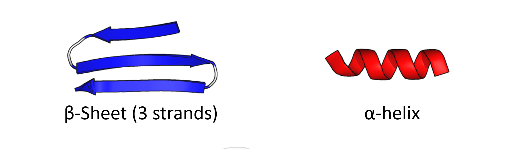

---
jupyter:
  jupytext:
    formats: ipynb,md
    text_representation:
      extension: .md
      format_name: markdown
      format_version: '1.3'
      jupytext_version: 1.19.1
  kernelspec:
    display_name: Python 3 (ipykernel)
    language: python
    name: python3
---

<!-- #region editable=true id="spaKCdatXNU2" -->
# Rigorous splitting of datasets into train and validation
<!-- #endregion -->

<!-- #region editable=true id="D0MvU1NnXNU4" -->
In this lab we will try our hand at protein structure prediction. Given a few thousands protein sequences, for each of the amino acids in the sequences we will try to predict if in the protein structure they will be part of one of three classes:

* $\alpha$-helix
* $\beta$-sheet
* none of the above


So the input to our predictor is a protein sequence string such as this one:

```
>APF29063.1 spike protein [Human coronavirus NL63]
MKLFLILLVLPLASCFFTCNSNANLSMLQLGVPDNSSTIVTGLLPTHWFCANQSTSVYSANGFFYIDVGN
HRSAFALHTGYYDVNQYYIYVTNEIGLNASVTLKICKFGINTTFDFLSNSSSSFDCIVNLLFTEQLGAPL
```

for each letter in the sequence, we want to make a classification in the three classes mentioned above.

I have prepared a dataset where all protein sequences have been pre-split into windows of 31 amino acids. We want to predict the class for the amino acid in the center of the window, like so:


predict("MKLFLILLVLPLASCF<font color="red">F</font>TCNSNANLSMLQLG") -> [p(H), p(S), p(C)]

Of course, a neural network will not accept a string input as it is, so we will have to deal with this by converting each letter in our alphabet into an integer. Then, we will use word embeddings to translate the integers into vectors of floating points.

<!-- #endregion -->

<!-- #region editable=true id="y2Pnjv9aXNU6" -->
## To work on google colab

* Upload this notebook to Colab
* Make sure you save a copy of the notebook to your Drive
* Switch to a GPU Runtime (Runtime > Change Runtime Type > Select T4 GPU)
* Uncomment and run the two cells below:
<!-- #endregion -->

```python editable=true id="XMLQe5yHXNU7"
#from google.colab import output
#output.enable_custom_widget_manager()
```

```python editable=true colab={"base_uri": "https://localhost:8080/"} id="eXY18XtIXNU9" outputId="242323d3-6c6a-4698-875e-8ce302eba2a6"
#!pip install torchmetrics
```

<!-- #region editable=true id="MFFkhnlzXNU-" -->
## Data download

First, let's setup the colab environment, download dataset and other relevant data:
<!-- #endregion -->

```python editable=true colab={"base_uri": "https://localhost:8080/"} id="lbgWbWAzXNVB" outputId="873f71da-dc05-4aad-b0af-b70920094d6e"
!mkdir -p data
!wget -v -O data/dataset_sseq_singleseq.pic.zip -L https://zenodo.org/records/19854710/files/dataset_sseq_singleseq.pkl.zip
!wget -v -O data/trainset_distance_matrix.tsv.zip -L https://zenodo.org/records/19854396/files/trainset_distance_matrix.tsv.zip
!unzip -y data/dataset_sseq_singleseq.pic.zip -d data/
!unzip -y data/trainset_distance_matrix.tsv.zip -d data/
!wget -O data/train_set -L https://github.com/NBISweden/workshop_NN_DL/raw/refs/heads/basics/good_practices/labs/data_splits/data/train_set
!wget -O data/test_set -L https://github.com/NBISweden/workshop_NN_DL/raw/refs/heads/basics/good_practices/labs/data_splits/data/test_set
```

<!-- #region id="3aG_K8QEXNVC" -->
Now let's load libraries and plotting functions:
<!-- #endregion -->

```python editable=true id="sSo9dHhgXNVD"
import pickle
import random
import numpy as np
import pandas as pd
import sys
from scipy.cluster.hierarchy import dendrogram, linkage, fcluster
from scipy.spatial.distance import squareform
from typing import Optional
import plotly.graph_objects as go
from plotly.subplots import make_subplots
import plotly.io as pio

import torch
import torch.nn as nn
from torch.utils.data import Dataset, DataLoader, TensorDataset
import torchmetrics

class LivePlot():
    def __init__(self):
        self.fig = fig = go.FigureWidget()
        self.plot_indices = {}
        display(self.fig)
        self.limits = [0,0]
        self.current_x = 0

    def report(self, name: str, value: float):
        with self.fig.batch_update():
          try:
              plot_index = self.plot_indices[name]
          except KeyError:
              plot_index = len(self.plot_indices)
              self.fig.add_scatter(y=[], x=[], name=name)
              self.plot_indices[name] = plot_index
          self.fig.data[plot_index].name = name        # ← force-sync the name
          self.fig.data[plot_index].y += (value,)
          self.fig.data[plot_index].x += (self.current_x,)

    def increment(self, n_ticks: int):
        "Increment the currently displayed limits with these many ticks"
        self.limits[1] += n_ticks
        self.fig.update_layout(xaxis_range=self.limits)

    def set_limit(self, n_ticks: int):
        "Update the currently displayed to exactly these many ticsk"
        self.limits[1] = n_ticks
        self.fig.update_layout(xaxis_range=self.limits)

    def tick(self, n_ticks: Optional[int] = None):
        "Update the current time with these many ticks, or 1 tick if no argument is supplied."
        if n_ticks is None:
            n_ticks = 1
        self.current_x += n_ticks

def train(*,
          model: torch.nn.Module,
          train_loader: DataLoader,
          dev_loader: DataLoader,
          optimizer: torch.optim.Optimizer,
          criterion: torch.nn.Module,
          max_epochs: int,
          metric: torchmetrics.metric,
          device: Optional[torch.device] = None,
          liveplot: Optional[LivePlot]=None):
    if device is None:
        device = torch.device('cuda') if torch.cuda.is_available() else torch.device('cpu')

    model.to(device)
    metric = metric.to(device)

    for epoch in range(max_epochs):
        training_loss_acc = 0
        training_examples = 0
        training_accuracy = 0
        model.train()

        for i, batch in enumerate(train_loader):
            optimizer.zero_grad()

            x_batch, y_batch = batch
            x_batch = x_batch.to(device)
            y_hat = model(x_batch)

            loss = criterion(y_hat, y_batch.to(device))
            loss.backward()

            optimizer.step()
            training_loss_acc += loss.item()
            training_examples += x_batch.size(0)
            training_accuracy += metric(torch.argmax(y_hat, -1), y_batch.to(device))
        t_acc = training_accuracy.cpu() / (i+1)
        model.eval()

        with torch.no_grad():
            dev_loss_acc = 0
            dev_examples = 0
            dev_accuracy = 0
            for j, batch in enumerate(dev_loader):
                x_batch, y_batch = batch
                x_batch = x_batch.to(device)
                y_hat = model(x_batch)
                dev_loss_acc += criterion(y_hat, y_batch.to(device)).item()
                dev_examples += x_batch.size(0)

                dev_accuracy += metric(torch.argmax(y_hat, -1), y_batch.to(device))
        d_acc = dev_accuracy.cpu() / (j+1)
        if liveplot is not None:
            liveplot.tick() # Update the liveplot time
            liveplot.report("Training accuracy",  t_acc)
            liveplot.report("Development accuracy", d_acc)
```

<!-- #region editable=true id="CWeycBYIXNVI" -->
Now let's create a model. Modify the code below to try different architectures:
<!-- #endregion -->

```python editable=true id="W-quIwKfXNVI"

class Model(nn.Module):
    def __init__(self, convolutional=False):
        super(Model, self).__init__()
        self.convolutional = convolutional
        embed_size = 64
        bidir_size = 32
        window = 31
        fc_size = 128

        self.embedding = nn.Embedding(21, embed_size)

        if convolutional:
            self.conv1 = nn.Conv1d(embed_size, 32, kernel_size=7)
            self.conv2 = nn.Conv1d(32, 16, kernel_size=5)
            self.conv3 = nn.Conv1d(16, 8, kernel_size=3)
            # window shrinks by (k-1) per conv: 31→25→21→19
            flat_size = (window - 12) * 8
        else:
            self.lstm = nn.LSTM(embed_size, bidir_size,
                                batch_first=True, bidirectional=True)
            flat_size = window * bidir_size * 2

        self.fc1 = nn.Linear(flat_size, fc_size)
        self.fc2 = nn.Linear(fc_size, 3)

    def forward(self, x):
        x = self.embedding(x)                  # (batch, window, embed_size)

        if self.convolutional:
            x = x.permute(0, 2, 1)             # (batch, embed_size, window)
            x = torch.relu(self.conv1(x))
            x = torch.relu(self.conv2(x))
            x = torch.relu(self.conv3(x))
        else:
            x, _ = self.lstm(x)                # (batch, window, bidir_size*2)

        x = x.reshape(x.size(0), -1)           # flatten
        x = self.fc1(x)
        x = self.fc2(x)                        # raw logits
        return x
```

<!-- #region editable=true id="5o-lQiwJXNVJ" -->
Look at the architecture above:
* What does putting the variable "convolutional" to False mean? What happens to the `LSTM` layers when we are using a convolutional architecture?
* Which architecture would be best for this type of dataset in your opinion?
    
<!-- #endregion -->

<!-- #region id="0sSXFbHXXNVJ" -->
Now let's load the dataset as a pickle object:
<!-- #endregion -->

```python editable=true colab={"base_uri": "https://localhost:8080/"} id="fU6HMKLJXNVJ" outputId="bb0444c2-bd56-4b8d-fb6b-cb448751fdb1"
(X,y) = pickle.load(open("data/dataset_sseq_singleseq.pkl",'rb'))
```

<!-- #region editable=true id="PZztctcSXNVJ" -->
Ok, let's start by taking the classical approach of randomly splitting the data in a trainset and a validation set (95%/5% by default, but you can change the ratio as you prefer).
<!-- #endregion -->

```python id="uGpAi7nTXNVK"
epochs = 20
batch_size = 2048
target_list_path = 'data/train_set'

target_list_file = open(target_list_path)
target_list = [t.strip() for t in target_list_file.readlines()]
random.shuffle(target_list)

n_targets = len(target_list)
train_list = target_list[int(n_targets/20):] #95% train
dev_list = target_list[:int(n_targets/20)] #5% validation
```

<!-- #region id="IHXTUFG2XNVK" -->
The data is now converted from a list of np arrays to a tensor set:
<!-- #endregion -->

```python id="oFmpiP1zXNVK"
train_x = np.concatenate([X[target] for target in train_list if target in X], axis=0)
train_y = np.concatenate([y[target] for target in train_list if target in X], axis=0)

dev_x = np.concatenate([X[target] for target in dev_list if target in X], axis=0)
dev_y = np.concatenate([y[target] for target in dev_list if target in X], axis=0)

train_set = TensorDataset(torch.tensor(train_x, dtype=torch.long), torch.tensor(train_y, dtype=torch.long))
dev_set = TensorDataset(torch.tensor(dev_x, dtype=torch.long), torch.tensor(dev_y, dtype=torch.long))

train_loader = DataLoader(
        train_set,
        batch_size=batch_size,
        shuffle=True,
    )

dev_loader = DataLoader(
        dev_set,
        batch_size=batch_size,
        shuffle=False,
    )
```

```python colab={"base_uri": "https://localhost:8080/", "height": 377, "referenced_widgets": ["21f2a04f4deb4d1f9a3d5bc9ca1a47d4"]} id="UmFf4NfNXNVL" outputId="648218a9-f3e9-48e7-dd9e-5346e19188bf"
device = torch.device('cuda') if torch.cuda.is_available() else torch.device('cpu')

# load a new model
model = Model(convolutional=False)

# define optimizer and loss function
learning_rate = 1e-3
weight_decay = 1e-5
optimizer = torch.optim.Adam(model.parameters(), lr=learning_rate, weight_decay=weight_decay)
criterion = nn.CrossEntropyLoss()
accuracy = torchmetrics.Accuracy(task='multiclass', num_classes=3, top_k=1)

# Setup plot
liveplot = LivePlot()
liveplot.increment(epochs)

train(model=model,
      train_loader=train_loader,
      dev_loader=dev_loader,
      optimizer=optimizer,
      criterion=criterion,
      metric=accuracy,
      max_epochs=epochs,
      liveplot=liveplot,
      device=device)
```

<!-- #region editable=true id="avGS3lIjXNVL" -->
* What is the best validation performance that you can extract from your Model?
* What would be the best naïve classifier for this dataset? How does the validation performance of your model compare to it?
* What do you think of randomly splitting the dataset this way? Can you think of a better way of doing it? Can you think of a _worse_ day of doing it?
<!-- #endregion -->

<!-- #region id="Fl0aTwNfXNVL" -->
## Splitting the dataset by sequence similarity
<!-- #endregion -->

<!-- #region editable=true id="cAqnpK91XNVL" -->
I have used HHblits (a software to perform sequence alignments) to find out just how distant the proteins in the dataset are, evolutionarily speaking. This distance goes from 0 (sequences are identical) to 1 (no relationship between the proteins could be detected at all). The distance is basically an inverse measure of how similar the sequences are to each other.

This information is stored in a distance matrix of size NxN, where N is the number of sequences in the dataset. In the code block below I load the distance matrix from the filesystem, then we use the data to perform [linkage clustering](https://docs.scipy.org/doc/scipy/reference/generated/scipy.cluster.hierarchy.linkage.html) and plot a [dendrogram](https://en.wikipedia.org/wiki/Dendrogram) to visualize the clusters.

In the dendrogram below we can see how proteins group together at various distance thresholds.
<!-- #endregion -->

```python editable=true colab={"base_uri": "https://localhost:8080/", "height": 680} id="ZOtFX2TPXNVM" outputId="5f634eae-ab5a-4ba7-fdb0-e51c9c2d765d"
import matplotlib.pyplot as plt
sys.setrecursionlimit(100000) #fixes issue with scipy and recursion limit
plt.rcParams['figure.figsize'] = [12, 8]
plt.rcParams['figure.dpi'] = 100
distance_matrix = pd.read_csv('data/trainset_distance_matrix.tsv', sep='\t')
dists = squareform(distance_matrix)
linkage_matrix = linkage(dists, "single")
dendrogram(linkage_matrix, color_threshold=0.8)
plt.show()
```

<!-- #region id="hmSA02VBXNVM" -->
Below, we choose a threshold to get our cluster based on the distance threshold t. So we "cut" the dendrogram above at the threshold t, and all the proteins that fall under the same branch at that threshold will be put in the same cluster. Feel free to get a feeling of how clusters are formed/split by varying the threshold below:
<!-- #endregion -->

```python colab={"base_uri": "https://localhost:8080/"} id="YAVDsPx2XNVM" outputId="a3ca70f3-6833-4c25-b3c4-19220793e12f"
cluster_assignments = fcluster(linkage_matrix,criterion='distance', t=0.8)
print(len(cluster_assignments), np.max(cluster_assignments))
```

<!-- #region id="wovJr9wFXNVN" -->
Now let's create a training and a validation set based on these clusters in such a way that a cluster of protein is EITHER in train OR in validation. Depending on the threshold we have picked, this could make sure that no proteins in the validation set are too similar to those in the trainset.
<!-- #endregion -->

```python id="y__MBObSXNVN"
target_list_file = open(target_list_path)
target_list = [t.strip() for t in target_list_file.readlines()]

train_list_cluster = []
dev_list_cluster = []
dev_size_limit = int(n_targets/20)

for i in range(1,np.max(cluster_assignments)+1):
    index_this_cluster = np.where(cluster_assignments == i)[0]
    if len(dev_list_cluster) < dev_size_limit: #add all elements in this cluster to either validation or train set
        dev_list_cluster += [target_list[element] for element in index_this_cluster]
    else:
        train_list_cluster += [target_list[element] for element in index_this_cluster]

random.shuffle(train_list_cluster)
```

<!-- #region id="Ow0fYWOsXNVN" -->
Now, let's train a new model with the new datasets and see if we get different results:
<!-- #endregion -->

```python id="bec-u_PMXNVN"
cluster_model = Model(convolutional=False)

cluster_train_x = np.concatenate([X[target] for target in train_list_cluster if target in X], axis=0)
cluster_train_y = np.concatenate([y[target] for target in train_list_cluster if target in X], axis=0)

cluster_dev_x = np.concatenate([X[target] for target in dev_list_cluster if target in X], axis=0)
cluster_dev_y = np.concatenate([y[target] for target in dev_list_cluster if target in X], axis=0)

cluster_train_set = TensorDataset(torch.tensor(cluster_train_x, dtype=torch.long), torch.tensor(cluster_train_y, dtype=torch.long))
cluster_dev_set = TensorDataset(torch.tensor(cluster_dev_x, dtype=torch.long), torch.tensor(cluster_dev_y, dtype=torch.long))

cluster_train_loader = DataLoader(
        cluster_train_set,
        batch_size=batch_size,
        shuffle=True,
    )

cluster_dev_loader = DataLoader(
        cluster_dev_set,
        batch_size=batch_size,
        shuffle=False,
    )
```

<!-- #region id="2MKAMUFmXNVN" -->
Let's plot again the training curves from the first model and compare them to those from the new model.

What are the differences, if any?
<!-- #endregion -->

```python colab={"base_uri": "https://localhost:8080/", "height": 377, "referenced_widgets": ["6a1bf06a3bf64434b87c609fe3a1eddf"]} id="Sbmk-2IFXNVO" outputId="2047018b-283c-47b2-9219-4b69f9ba67d4"
# Setup plot
liveplot = LivePlot()
liveplot.increment(epochs)
optimizer = torch.optim.Adam(cluster_model.parameters(), lr=learning_rate, weight_decay=weight_decay)

train(model=cluster_model,
      train_loader=cluster_train_loader,
      dev_loader=cluster_dev_loader,
      optimizer=optimizer,
      criterion=criterion,
      metric=accuracy,
      max_epochs=epochs,
      liveplot=liveplot,
      device=device)
```

<!-- #region id="RKPZtU6vXNVO" -->
Now let's test the two models on previously unseen data. Which performs best?
<!-- #endregion -->

```python colab={"base_uri": "https://localhost:8080/"} id="6Z7pkeZjXNVO" outputId="1ef308f3-3bb0-4a6c-c0a9-653d1174f00e"
test_list = [t.strip() for t in open("data/test_set").readlines()]
test_x = np.concatenate([X[target] for target in test_list if target in X], axis=0)
test_y = np.concatenate([y[target] for target in test_list if target in X], axis=0)

with torch.no_grad():
    model.eval()
    y_hat = cluster_model(torch.tensor(test_x, dtype=torch.long).to(device))
    acc = accuracy(y_hat, torch.tensor(test_y, dtype=torch.long).to(device))
print(f"Test accuracy: {acc.item()}")
```

<!-- #region id="TuUpouUMXNVP" -->
## If you have extra time and want to play more with the data
<!-- #endregion -->

<!-- #region id="zRaQAe82XNVP" -->
Now let's make things even worse on purpose: whenever a cluster contains more than one sample, let's put half in the training set and half in the validation set. Then let's not shuffle the trainset so that the network sees those samples first.
<!-- #endregion -->

```python id="TJhL4dx0XNVP"
bad_model = Model(convolutional=False)

all_x = np.concatenate([X[target] for target in target_list if target in X], axis=0)
all_y = np.concatenate([y[target] for target in target_list if target in X], axis=0)

random_ix = np.random.choice(np.arange(all_x.shape[0]), all_x.shape[0], replace=False)

train_ix = random_ix[all_x.shape[0]//20:]
dev_ix = random_ix[:all_x.shape[0]//20]
bad_train_set = TensorDataset(torch.tensor(all_x[train_ix], dtype=torch.long), torch.tensor(all_y[train_ix], dtype=torch.long))
bad_dev_set = TensorDataset(torch.tensor(all_x[dev_ix], dtype=torch.long), torch.tensor(all_y[dev_ix], dtype=torch.long))

bad_train_loader = DataLoader(
        bad_train_set,
        batch_size=batch_size,
        shuffle=True,
    )

bad_dev_loader = DataLoader(
        bad_dev_set,
        batch_size=batch_size,
        shuffle=False,
    )

```

```python id="dWmrgSeVXNVP"
# Setup plot
liveplot = LivePlot()
liveplot.increment(epochs)
optimizer = torch.optim.Adam(bad_model.parameters(), lr=learning_rate, weight_decay=weight_decay)

train(model=bad_model, 
      train_loader=bad_train_loader, 
      dev_loader=bad_dev_loader, 
      optimizer=optimizer, 
      criterion=criterion,
      metric=accuracy,
      max_epochs=epochs, 
      liveplot=liveplot,
      device=device)
```
