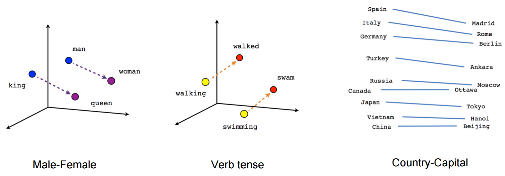

---
jupyter:
  jupytext:
    formats: ipynb,md
    text_representation:
      extension: .md
      format_name: markdown
      format_version: '1.3'
      jupytext_version: 1.19.1
  kernelspec:
    display_name: Python 3 (ipykernel)
    language: python
    name: python3
---

<!-- #region editable=true slideshow={"slide_type": ""} -->
# Target leakage example: classifying text data (tweets)

In this lab, we will load a new dataset from disk, clean it up and prepare it for training. The data here is of text type, as this is a dataset of 3000 tweets. So, we have to deal with short text inputs.

Each tweet has been written by one of two well-known individuals from the world of US politics. Our task is simply to decide who wrote it. Donald or Hillary?


The first question here is: how do we deal with string inputs? We can't multiply a word by a weight, so we need to translate the text input in numbers before we proceed and feed it to our first layer. In this case, there are usually two options. The first is called "one-hot" encoding, where each word in a dictionary is translated to a vectors of ones and zeros. If there are 10 words in our dictionary (for example, the words are "zero", "one", "two" ... "nine"), each vector will contain ten elements, with nine elements set to zero and one set to one:

* "zero" -> [1, 0, 0, 0, 0, 0, 0, 0, 0, 0]
* "one"  -> [0, 1, 0, 0, 0, 0, 0, 0, 0, 0]
* "two"  -> [0, 0, 1, 0, 0, 0, 0, 0, 0, 0]
* ...
* "nine" -> [0, 0, 0, 0, 0, 0, 0, 0, 0, 1]

This is usually ok when dealing with text (or, more generically, "categorical") variables taken from a relatively small dictionary. In the case of tweets, we might be dealing with very a dictionary containing tens of thousands of different terms, so we would have huge inputs of sparse vectors of zeros and ones. This is not ideal.

The second option is to use word embeddings, which translate each word to a vector of floating points with some nice properties, as we can see in the following image:



Check out [this cool page](https://anvaka.github.io/pm/#/galaxy/word2vec-wiki?cx=-17&cy=-237&cz=-613&lx=-0.0575&ly=-0.9661&lz=-0.2401&lw=-0.0756&ml=300&s=1.75&l=1&v=d50_clean) visualizing embeddings calculated on the whole English dictionary for more examples.

Embeddings are done with a special NN layer that is called simply [Embedding](https://docs.pytorch.org/docs/stable/generated/torch.nn.Embedding.html). The Embedding layer is provided with a number of text inputs (in our case, tweets) and learns to map similar words into n-dimensional vectors that are close together in the corresponding n-dimensional space.

In the following piece of code, we will start by loading the dataset with [pandas](https://pandas.pydata.org/docs/getting_started/intro_tutorials/index.html) and preparing it for training.

Notice how before we can use the Embedding layer, we want to map each word to an integer. This is because the input to an Embedding layer is actually a set of integers, where each integer represents a word. The important thing here, is that a given word has to be mapped always to the same integer throughout the whole dataset, so that the Embedding layer can recognise it from different tweets.

In this case, for example, the word "the" will always be mapped to the number 1, the word "question" to the number 2, etc.

* "The question is what to do"      -> [1, 2, 32, 55, 87]
* "I don't understand the question" -> [12, 4, 123, 1, 2]
<!-- #endregion -->

<!-- #region editable=true slideshow={"slide_type": ""} -->
Let's start by defining helper function to plot curves and train the model:
<!-- #endregion -->

```python editable=true slideshow={"slide_type": ""}
import pickle
import random
import sys
from typing import Optional

import matplotlib.pyplot as plt
import plotly.graph_objects as go
from plotly.subplots import make_subplots

import torch
import torch.nn as nn
from torch.utils.data import DataLoader, TensorDataset
import torchmetrics

import numpy as np
import pandas as pd
from scipy.cluster.hierarchy import dendrogram, linkage, fcluster
from scipy.spatial.distance import squareform

class LivePlot():
    def __init__(self):
        self.fig = fig = go.FigureWidget()
        self.plot_indices = {}
        display(self.fig)
        self.limits = [0,0]
        self.current_x = 0

    def report(self, name: str, value: float):
        with self.fig.batch_update():
          try:
              plot_index = self.plot_indices[name]
          except KeyError:
              plot_index = len(self.plot_indices)
              self.fig.add_scatter(y=[], x=[], name=name)
              self.plot_indices[name] = plot_index
          self.fig.data[plot_index].name = name        # ← force-sync the name
          self.fig.data[plot_index].y += (value,)
          self.fig.data[plot_index].x += (self.current_x,)

    def increment(self, n_ticks: int):
        "Increment the currently displayed limits with these many ticks"
        self.limits[1] += n_ticks
        self.fig.update_layout(xaxis_range=self.limits)

    def set_limit(self, n_ticks: int):
        "Update the currently displayed to exactly these many ticsk"
        self.limits[1] = n_ticks
        self.fig.update_layout(xaxis_range=self.limits)

    def tick(self, n_ticks: Optional[int] = None):
        "Update the current time with these many ticks, or 1 tick if no argument is supplied."
        if n_ticks is None:
            n_ticks = 1
        self.current_x += n_ticks

def train(*,
          model: torch.nn.Module,
          train_loader: DataLoader,
          dev_loader: DataLoader,
          optimizer: torch.optim.Optimizer,
          criterion: torch.nn.Module,
          max_epochs: int,
          metric: torchmetrics.metric,
          device: Optional[torch.device] = None,
          liveplot: Optional[LivePlot]=None):
    if device is None:
        device = torch.device('cuda') if torch.cuda.is_available() else torch.device('cpu')

    model.to(device)
    metric = metric.to(device)

    for epoch in range(max_epochs):
        training_loss_acc = 0
        training_examples = 0
        training_accuracy = 0
        model.train()

        for i, batch in enumerate(train_loader):
            optimizer.zero_grad()

            x_batch, y_batch = batch
            x_batch = x_batch.to(device)
            y_hat, _ = model(x_batch)

            loss = criterion(y_hat, y_batch.to(device))
            loss.backward()

            optimizer.step()
            training_loss_acc += loss.item()
            training_examples += x_batch.size(0)
            training_accuracy += metric(torch.argmax(y_hat, -1), y_batch.to(device))
        t_acc = training_accuracy.cpu() / (i+1)
        model.eval()

        with torch.no_grad():
            dev_loss_acc = 0
            dev_examples = 0
            dev_accuracy = 0
            for j, batch in enumerate(dev_loader):
                x_batch, y_batch = batch
                x_batch = x_batch.to(device)
                y_hat, _ = model(x_batch)
                dev_loss_acc += criterion(y_hat, y_batch.to(device)).item()
                dev_examples += x_batch.size(0)

                dev_accuracy += metric(torch.argmax(y_hat, -1), y_batch.to(device))
        d_acc = dev_accuracy.cpu() / (j+1)
        if liveplot is not None:
            liveplot.tick() # Update the liveplot time
            liveplot.report("Training accuracy",  t_acc)
            liveplot.report("Development accuracy", d_acc)
```

Download the dataset (uncomment and run)

```python editable=true slideshow={"slide_type": ""}
!mkdir data/
!wget -P data https://github.com/NBISweden/workshop-neural-nets-and-deep-learning/raw/refs/heads/master/session_goodPracticesDatasetDesign/lab_targetLeakage/data/tweets.csv
```

Now let's load the dataset, which in this case is saved as CSV file, and let's print one tweet:

```python editable=true slideshow={"slide_type": ""}
import pandas as pd

tweet_dataset = pd.read_csv("data/tweets.csv")
```

```python editable=true slideshow={"slide_type": ""}
tweet_dataset.head()
```

```python editable=true slideshow={"slide_type": ""}
tweet_dataset["text"]
```

<!-- #region editable=true slideshow={"slide_type": ""} -->
Then we apply a few basic operations to handle it more easily, for example:

* We add a space after every non-alphanumeric character so that we have, for example "-Hello" -> "- Hello"
* We make all words lower case, so that "Hello" == "hello"
* Lastly, we split each tweet by using space as delimiter, so that we have a list of words for each tweet

Then we assign a unique integer to each unique word in the dataset, so that we can translate each tweet to a list of numbers. But equal numbers will always correspond to equal words across all tweets! Notice how we reserve the integer "0" for "padding". This means that since the longest tweet has 58 words (so a list of 58 integers), we will add a series of "0"s to shorter tweets until they are also represented by a list of 58 integers.

Lastly, we assign to our labels (in this case the author of the tweets) one class between 0 and 1.
<!-- #endregion -->

```python editable=true slideshow={"slide_type": ""}
import numpy as np

#Get rid of all retweets
tweet_dataset = tweet_dataset[tweet_dataset["is_retweet"] == False]

#Remove URLs
tweet_dataset["text"] = tweet_dataset["text"].str.replace(r'http\S+|www.\S+', '', case=False, regex=True)

#Now let's make sure that non-alphanumeric characters are taken as single words
tweet_dataset["text"] = tweet_dataset["text"].str.replace(r'\s*([^a-zA-Z0-9 ])\s*', ' \\1 ', case=False, regex=True)

#remove hashtags
#tweet_dataset["text"] = tweet_dataset["text"].str.replace(r'#[a-zA-Z0-9]*', '', case=False, regex=True)

#remove @ mentions
#tweet_dataset["text"] = tweet_dataset["text"].str.replace(r'@[a-zA-Z0-9]*', '', case=False, regex=True)

#make all words lower case
tweet_dataset["text"] = tweet_dataset["text"].str.lower()

#split the tweets in list of words
tweet_dataset["text"] = tweet_dataset["text"].str.strip()
tweet_dataset["text"] = tweet_dataset["text"].str.split(" ")

#since the neural networks don't really like string inputs,
#we have to convert each word to a unique integer.
integer_dict = {}
integer_dict["padding"] = 0

word_dict = {}
word_dict[0] = "padding"

#assign a unique integer to each unique word
count = 1
for index, row in tweet_dataset.iterrows():
    for element in row["text"]:
        if element not in integer_dict.keys():

            integer_dict[element] = count
            word_dict[count] = element
            count += 1
    
tweet_dataset["numbers"] = tweet_dataset["text"].apply(lambda x:[integer_dict[y] for y in x])

#Let's also assign integer labels 
tweet_dataset.loc[tweet_dataset["handle"] == "realDonaldTrump","label"] = 1
tweet_dataset.loc[tweet_dataset["handle"] == "HillaryClinton","label"] = 0

#The longest tweet has 58 words, this will add padding to shorter tweets
x = pd.DataFrame(tweet_dataset["numbers"].values.tolist()).values
x[np.where(np.isnan(x[:]))] = 0

y = np.array(tweet_dataset["label"])

```

Check the effect that this has had on the first tweet:

```python editable=true slideshow={"slide_type": ""}
tweet_dataset["text"][0]
#x[0]
```

<!-- #region editable=true slideshow={"slide_type": ""} -->
Now, we will see how we can use Embeddings to transform our dictionary of words into a dictionary of float vectors.

First, let's use Embeddings, followed by Dense layers:
<!-- #endregion -->

```python editable=true slideshow={"slide_type": ""}
class Model(nn.Module):
    def __init__(self, vocabulary_size, sequence_length, convolutional=False):
        super(Model, self).__init__()
        self.convolutional = convolutional
        self.vocabulary_size = vocabulary_size
        self.sequence_length = sequence_length
        embed_size = 8
        bidir_size = 4
        fc_size = 16
        n_classes = 2

        self.embedding = nn.Embedding(self.vocabulary_size, embed_size)

        if convolutional:
            self.conv1 = nn.Conv1d(embed_size, 32, kernel_size=7)
            self.conv2 = nn.Conv1d(32, 16, kernel_size=5)
            self.conv3 = nn.Conv1d(16, 8, kernel_size=3)

            flat_size = (self.sequence_length  - 12) * 8
        else:
            self.lstm = nn.LSTM(embed_size, bidir_size,
                                batch_first=True, bidirectional=True)
            flat_size = self.sequence_length  * bidir_size * 2

        self.fc1 = nn.Linear(flat_size, fc_size)
        self.fc2 = nn.Linear(fc_size, n_classes)

    def forward(self, x):
        embeddings = self.embedding(x)                  # (batch, window, embed_size)

        if self.convolutional:
            x = embedding.permute(0, 2, 1)             # (batch, embed_size, window)
            x = torch.relu(self.conv1(x))
            x = torch.relu(self.conv2(x))
            x = torch.relu(self.conv3(x))
        else:
            x, _ = self.lstm(embeddings)                # (batch, window, bidir_size*2)

        x = x.reshape(x.size(0), -1)           # flatten
        x = self.fc1(x)
        x = self.fc2(x)                        # raw logits
        return x, embeddings
```

<!-- #region editable=true slideshow={"slide_type": ""} -->
Split the data, create data loaders:
<!-- #endregion -->

```python editable=true slideshow={"slide_type": ""}
batch_size = 16
# split the data:
n_samples = x.shape[0]
random_ix = np.arange(n_samples) #np.random.choice(np.arange(n_samples), n_samples, replace=False)

train_samples = int(n_samples * 0.9)

# shuffle tweets before splitting into sets
train_ix = random_ix[:train_samples]
train_x = x[train_ix]
train_y = y[train_ix]

dev_ix = random_ix[train_samples:]
dev_x = x[dev_ix]
dev_y = y[dev_ix]

train_set = TensorDataset(torch.tensor(train_x, dtype=torch.long), torch.tensor(train_y, dtype=torch.long))
dev_set = TensorDataset(torch.tensor(dev_x, dtype=torch.long), torch.tensor(dev_y, dtype=torch.long))

train_loader = DataLoader(
        train_set,
        batch_size=batch_size,
        shuffle=True,
    )

dev_loader = DataLoader(
        dev_set,
        batch_size=batch_size,
        shuffle=False,
    )
```

<!-- #region editable=true slideshow={"slide_type": ""} -->
Train the model and plot the training curves:
<!-- #endregion -->

```python editable=true slideshow={"slide_type": ""}
device = torch.device('cuda') if torch.cuda.is_available() else torch.device('cpu')

# load a new model
model = Model(convolutional=False, vocabulary_size=count, sequence_length=train_x.shape[1])

# define optimizer and loss function
epochs = 20
learning_rate = 1e-3
optimizer = torch.optim.Adam(model.parameters(), lr=learning_rate)
criterion = nn.CrossEntropyLoss()
accuracy = torchmetrics.Accuracy(task='multiclass', num_classes=2, top_k=1)

# Setup plot
liveplot = LivePlot()
liveplot.increment(epochs)

train(model=model,
      train_loader=train_loader,
      dev_loader=dev_loader,
      optimizer=optimizer,
      criterion=criterion,
      metric=accuracy,
      max_epochs=epochs,
      liveplot=liveplot,
      device=device)
```

<!-- #region editable=true slideshow={"slide_type": ""} -->
When a model has been trained, you can of course reused to predict future samples. 
That is how you actually use your model when the job is done!

Can you think of a good dataset that you could use to test your model?
<!-- #endregion -->

```python editable=true slideshow={"slide_type": ""}
tweet = "crooked hillary sad"
tweet = tweet.lower()
words = tweet.split(" ")

tweet_integer = np.array([integer_dict[element] for element in words])

tweet_padded = np.zeros(train_x.shape[1])
tweet_padded[:len(tweet_integer)] = tweet_integer

tweet_padded = tweet_padded[np.newaxis, :]
print("Input shape", tweet_padded.shape)
pred, embeddings = model(torch.tensor(tweet_padded, dtype=torch.long))

print("Predicted logits:", pred)
```

<!-- #region editable=true slideshow={"slide_type": ""} -->
How do we convert these predicted values into probabilities?
<!-- #endregion -->

## Questions

* Which type of network works best?
* What could be a better network layer given the nature of this dataset?
* What is the meaning of the "count" variable used in the Embedding layer?
* Why does the last layer have 2 units? Why is the activation of the 'softmax' type?
* Play around with the hyperparameters, is there a way to improve the models?


Now let's visualize the outputs of the embedding layer. We extract the embedding layer from the trained model and we use it to calculate embeddings for every word in our dictionary. Then, we map the 32-dimensional output vector onto 2 dimensions with the help of principal component analysis (PCA).

```python editable=true slideshow={"slide_type": ""}
network_layers = [p for p in model.parameters()]
embedding_layer_w = network_layers[0]
embedding_layer_w = embedding_layer_w.detach().numpy()
print(embedding_layer_w.shape)
```

```python editable=true slideshow={"slide_type": ""}
integer_dict["→"]
```

```python editable=true slideshow={"slide_type": ""}
points_pca[177]
```

```python editable=true slideshow={"slide_type": ""}
from sklearn.decomposition import PCA

n_words = 1000
words = torch.tensor(np.arange(n_words)[None, :])
embedded_words = np.squeeze(model.embedding(words).cpu().detach().numpy())

pca = PCA(n_components=2)
points_pca = pca.fit_transform(embedded_words)

```

```python editable=true slideshow={"slide_type": ""}
import plotly.express as px
fig = px.scatter(x=points_pca[:,0], y=points_pca[:,1], text=[word_dict[i] if i < 1000 else "" for i in range(n_words)], width=2400, height=800)
fig.update_traces(textposition='top center')
fig.show()
```

<!-- #region editable=true slideshow={"slide_type": ""} -->
## Questions: what is wrong (or right) with this dataset?

* Take a few minutes to analyze the word cloud. Can you see what kind of words make the classification easier? If you wanted to make a less biased (and harder to classify) dataset, what would you change? 

* If possible, go back to the dataset generation step and remove words that make the classification task too easy. Then, try and train a new network. Are the results the same as before?

* Why do you think that the "Dense" network (Feed-forward, fully connected) works as well as the LSTM recurrent network on the dataset as it is now?

* Now that we have trained and validated our model, what would you suggest using as test set?
<!-- #endregion -->

Here are a few examples of how the dataset can be manipulated. Try these lines of code (and come up with some others!) by pasting them in the right place the code block where the dataset is loaded (second code cell):

<!-- #region -->
```python
#Get rid of all retweets
tweet_dataset = tweet_dataset[tweet_dataset["is_retweet"] == False]

#Next, let's remove all URLs, since they should not be of any help (unless we actually checked what they link to)
tweet_dataset["text"] = tweet_dataset["text"].str.replace('http\S+|www.\S+', '', case=False)

#remove hashtags
tweet_dataset["text"] = tweet_dataset["text"].str.replace('#[a-zA-Z0-9]*', '', case=False)

#Remove a word
tweet_dataset["text"] = tweet_dataset["text"].str.replace('crooked', '', case=False)

#Remove non-alphanumeric characters
tweet_dataset["text"] = tweet_dataset["text"].str.replace('\s*([^a-zA-Z0-9 ])\s*', '', case=False)

```
<!-- #endregion -->
