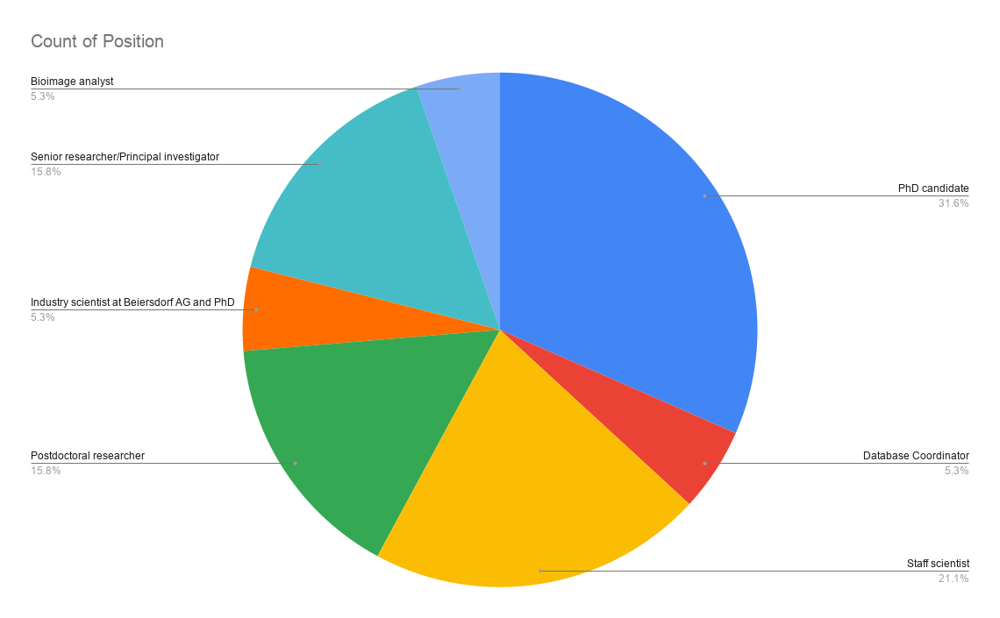
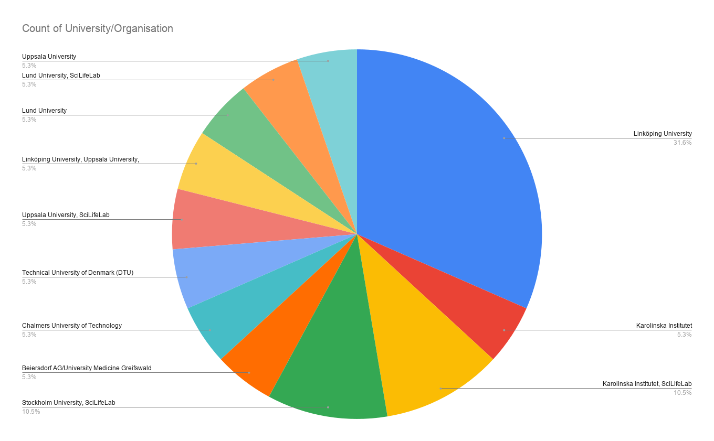
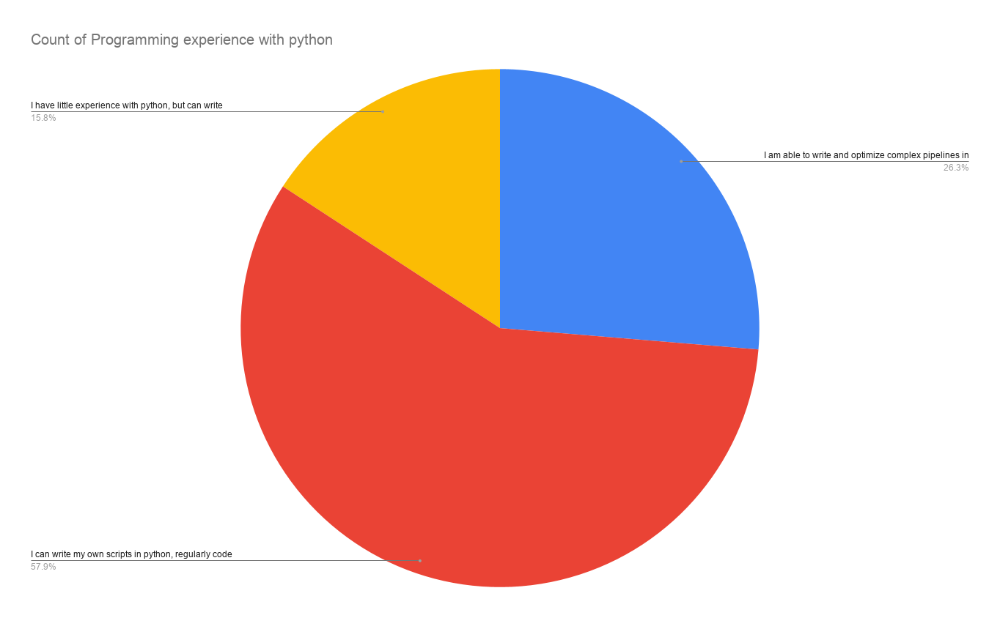
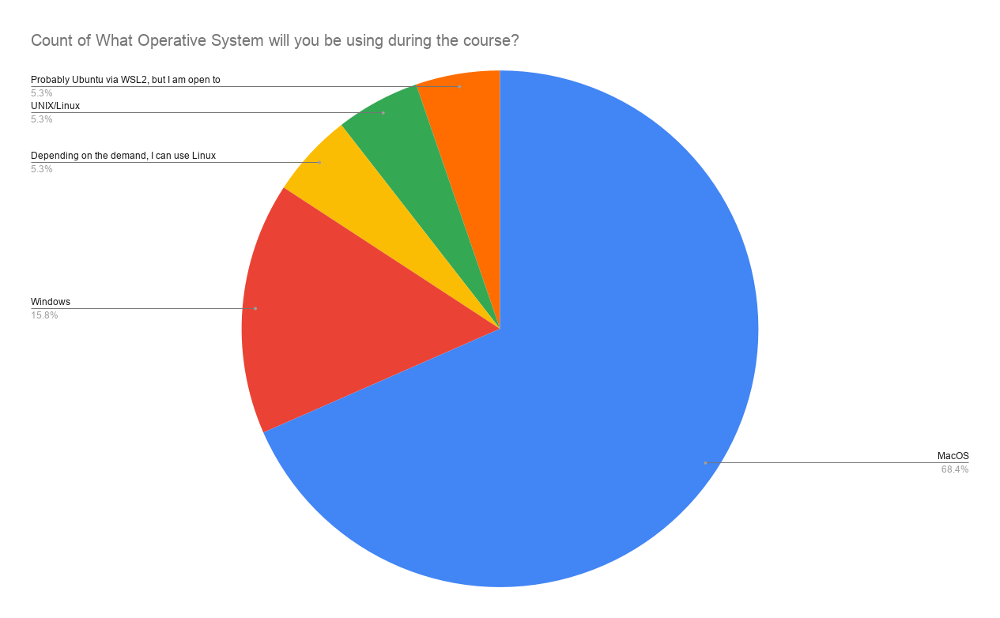

---
jupyter:
  jupytext:
    formats: ipynb,md
    text_representation:
      extension: .md
      format_name: markdown
      format_version: '1.3'
      jupytext_version: 1.19.1
  kernelspec:
    display_name: Python 3 (ipykernel)
    language: python
    name: python3
---

```html hide_input=true slideshow={"slide_type": "skip"}
<style>
table {
    table-layout:fixed;
    width: 50em;
}
td {
  border: 1px solid #999;
}
table p {
  margin: 0;
}
.cap-height p {
  height: 30em;
  overflow: hidden;
}
</style>
```

<!-- #region hide_input=true slideshow={"slide_type": "slide"} -->
# Welcome to the
# NBIS Neural Nets & Deep Learning workshop
<!-- #endregion -->

<!-- #region hide_input=false slideshow={"slide_type": "slide"} -->
## Who are we? 
<!-- #endregion -->

<!-- #region slideshow={"slide_type": "fragment"} -->
<table style="table-layout:fixed;">
    <tr>
        <th> Claudio </th>
        <th> Christophe </th>
        <th> Per </th>
    </tr>
    <tr>
        <td> 
            
        </td>
        <td> 
            
        </td>
        <td> 
           
        </td>
    </tr>
    <tr>
        <th> Erik </th>
        <th> Malin </th>
    </tr>
    <tr>
        <td> 
           
        </td>
        <td> 
           
        </td>
    </tr>
 </table>
<!-- #endregion -->

<!-- #region cell_style="center" hide_input=true slideshow={"slide_type": "slide"} -->
## Who are you?
<!-- #endregion -->

<!-- #region slideshow={"slide_type": "slide"} -->
## Who are you?
<center></center>

<!-- #endregion -->

<!-- #region slideshow={"slide_type": "slide"} -->
## Who are you?
<center></center>

<!-- #endregion -->

<!-- #region cell_style="center" slideshow={"slide_type": "slide"} -->
## Who are you?
<center></center>

<!-- #endregion -->

<!-- #region cell_style="center" slideshow={"slide_type": "slide"} -->
## Who are you?
<center></center>

<!-- #endregion -->

<!-- #region slideshow={"slide_type": "slide"} -->
## In what way do you expect the course will benefit you?
> Participants are motivated by a combination of building **solid theoretical understanding**, gaining **practical implementation skills**, and applying deep learning confidently to their **own domain-specific research**—with an emphasis on bridging the gap between their existing expertise and the growing demands of modern data-driven science.

<!-- #endregion -->

<!-- #region slideshow={"slide_type": "fragment"} -->
<i style='float:right'>(Summary of your answers, or possibly hallucination)</i>
<!-- #endregion -->

<!-- #region slideshow={"slide_type": "skip"} -->
#### Online classroom  
- Course website on UU Canvas/Instructure :   
<font size="5"> [https://uppsala.instructure.com/courses/123489](https://uppsala.instructure.com/courses/123489)</font>
    - schedule with links to lectures and exercises

<center></center>

<!-- #endregion -->

<!-- #region slideshow={"slide_type": "slide"} -->
## Course website 
 <font size="5">https://uppsala.instructure.com/courses/123489</font>
 
 - Learning outcomes
 - Prerequisties/preparations
 - Discussions
 - Schedule / Modules
<!-- #endregion -->

<!-- #region editable=true slideshow={"slide_type": "slide"} -->
# New content this year

<center></center>

* Moving away from Keras, using PyTorch from this year
* Might need to work out some issues
* Thank you in advance for your patience!
<!-- #endregion -->

<!-- #region editable=true slideshow={"slide_type": "slide"} -->
# More practical info

* Attendance sheet
* Dinner, Wednesday 8pm (Stångs Magasin)
* Lunches (12:30)
* Coffee (10:30, 15:00)
* Questions?
<!-- #endregion -->

<!-- #region slideshow={"slide_type": "skip"} editable=true jp-MarkdownHeadingCollapsed=true -->
## Feedback session on Friday

We are counting on your feedback!

* Does the schedule work the way it's laid out?
* What did you think of the lectures and labs?
* Too simple/hard?
* Is there a good balance between theory and practice?
<!-- #endregion -->
