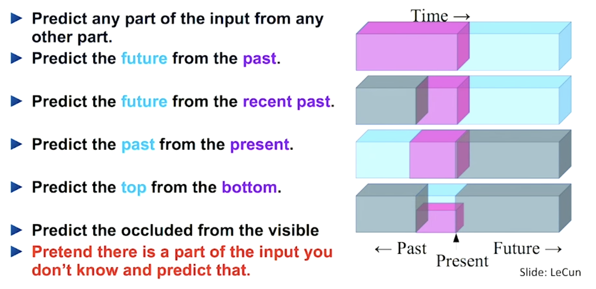

## Overview

- Supervised vs. unsupervised learning
  - Supervised: learn from labeled data
  - Unsupervised: learn from unlabeled data
- Representation learning: the heart of deep learning
- Self-supervised learning: a middle ground
  - Create labels from the data itself
  - Learn useful representations without manual annotation
- Autoencoders: The foundation of self-supervised learning
  - Encoder-decoder architecture

::: {.notes}
Welcome everyone. Today we cover self-supervised learning, a middle-ground between supervised and unsupervised learning. The key idea is to create labels from the data itself, allowing us to learn useful representations without manual annotation. Before we dive into this concept, we'll first review some fundamentals of learning paradigms and representation learning. Then, we'll explore autoencoders, which are a foundational architecture in self-supervised learning.
:::

## Supervised vs. Unsupervised Learning

| Paradigm | Data | Objective |
|---|---|---|
| Supervised | Labeled (x, y) | Learn mapping x → y |
| Unsupervised | Unlabeled x | Learn structure in data |

```{python}
#| echo: false
#| eval: true
from viz.supervised_vs_unsupervised import supervised_vs_unsupervised
supervised_vs_unsupervised()
```

## The power of supervised learning {.smaller}

:::: {.columns}

::: {.column width="50%"}
Most problems we want to solve are supervised. We often want to predict things based on an input. For example:

 - Given an image, predict what it contains (classification)
 - Given a sentence in English, translate it to French (translation)
 - Given an email, predict whether it's spam (classification)

:::

::: {.column width="50%"}

```{python}
#| echo: false
#| eval: true
from viz.supervised_vs_unsupervised import supervised
supervised()
```

:::

::::

::: {.notes}
Most problems we want to solve are supervised, we want to learn a mapping from inputs to outputs. However, supervised learning relies on labeled data, which can be expensive and time-consuming to obtain. In contrast, unsupervised learning can discover structure in data without labels, but is often more useful for exploratory analysis than for solving specific tasks.
:::

## The challenge of supervised learning: labeling


```{python}
#| echo: false
#| eval: true
from viz.supervised_learning_labeling import supervised_learning_labeling
supervised_learning_labeling(width=500)
```

::: {.notes}
The main challenge in supervised learning is obtaining labeled data, which can be expensive and time-consuming to collect and annotate. For certain problems, such as rare disease, we are fundamentally limited in how much labeled data we can get. This motivates the need for methods that can learn from unlabeled data.
:::

## AI subfields

:::: {.columns}
::: {.column width="50%"}
```{python}
#| echo: false
#| eval: true
from viz.ai_visualization import ai_donut
ai_donut([["ai", "ml", "dl"]])
```
:::
::: {.column width="50%"}
:::
::::

::: {.notes}
Deep learning is a subset of machine learning. But what makes deep learning special?
:::

## AI subfields: Representation Learning

:::: {.columns}
::: {.column width="50%"}
```{python}
#| echo: false
#| eval: true
from viz.ai_visualization import ai_donut
ai_donut([["ai", "ml", "dl"]])
```
:::
::: {.column width="50%"}
```{python}
#| echo: false
#| eval: true
from viz.ai_visualization import ai_donut
ai_donut([["ai", "ml", "rl", "dl"]])
```
:::
::::

::: {.notes}
:::

## Data representation is crucial for learning.

```{python}
#| echo: false
#| eval: true
from viz.representation_learning import cartesian_vs_polar
cartesian_vs_polar()
```


::: {.notes}
The way we represent data has a huge impact on how easy a problem is to solve. This toy example illustrates that in a cartesian representation, the classes are hard to easily separate, while in a polar representation they become linearly separable.
:::

## Principal Component Analysis (PCA)

PCA is a method of learning linear representations that capture the most variance in data.

## Visualizing representations with UMAP


## Neural Networks learn representations from data

```{python}
#| echo: false
#| eval: true
from viz.representation_learning import neural_network_representation_learning
neural_network_representation_learning()
```

::: {.notes}
The fundamental idea of neural networks and deep learning is that we learn to map the input data into new representations which are more useful for the downstreams layers (helping them reduce the loss). Each layer learns a transformation of the data into a new space, and the final layers typically use a linear model (e.g. linear or multinomial logistic regression) to make predictions. 
In deep learning, we often talk about *learning signals*, the signal which drives the learning of representations. By crafting the network in different ways, and adjusting what the loss function penalizes we can drive the learning of different representations. For example, in supervised learning, the learning signal is the error between the predicted labels and the true labels. 
:::

## Transfer learning

```{python}
#| echo: false
#| eval: true
from viz.transfer_learning import neural_network_transfer_learning
neural_network_transfer_learning()
```

::: {.notes}
While there are many advantages to deep representation learning, one powerful consequence is that we can transfer the learned representations to new tasks. For example, a model trained on ImageNet learns general features that can be useful for many other vision tasks, even if the new task has limited data. This is known as transfer learning and is a key reason why deep learning has been so successful in practice. 
:::

## Self-supervised learning

What if we can use the data it*self* to drive the learning of representations?

[{fig-align="center" width="80%"}](https://youtu.be/7I0Qt7GALVk?si=-PPdfqhuaDKVJK4k)

::: {.notes}
Transfer learning is promising, but requires large amounts of labeled data to learn useful representations from. Manually annotating data is expensive and time-consuming. Self-supervised learning is a paradigm that allows us to learn useful representations without manual annotation by creating labels from the data itself.
:::

## What is an Autoencoder?

An autoencoder is a neural network trained to:

1. **Encode** input $x$ into a latent representation $z$
2. **Decode** $z$ back to reconstruct $\hat{x} \approx x$

$$\mathcal{L} = \|x - \hat{x}\|^2$$

::: {.notes}
The key insight: the network learns a compressed representation without labels.
:::

## Architecture

```{python}
#| echo: true
import torch
import torch.nn as nn

class Autoencoder(nn.Module):
    def __init__(self, input_dim=784, latent_dim=32):
        super().__init__()
        self.encoder = nn.Sequential(
            nn.Linear(input_dim, 256),
            nn.ReLU(),
            nn.Linear(256, latent_dim),
        )
        self.decoder = nn.Sequential(
            nn.Linear(latent_dim, 256),
            nn.ReLU(),
            nn.Linear(256, input_dim),
            nn.Sigmoid(),
        )

    def forward(self, x):
        z = self.encoder(x)
        return self.decoder(z)
```

## Training

```{python}
#| echo: true
model = Autoencoder()
optimizer = torch.optim.Adam(model.parameters(), lr=1e-3)
criterion = nn.MSELoss()

# Training loop sketch
def train_step(x):
    optimizer.zero_grad()
    x_hat = model(x)
    loss = criterion(x_hat, x)
    loss.backward()
    optimizer.step()
    return loss.item()
```

::: {.notes}
Note that we use the input as both input and target — no labels needed.
:::

## Similarity in Latent Space

How do we measure if two representations are *similar*?

$$\cos\theta = \frac{\vec{a} \cdot \vec{b}}{|\vec{a}||\vec{b}|}$$

- Dot product captures alignment between vectors
- Normalized → cosine similarity ∈ [−1, 1]
- Used widely in contrastive and self-supervised learning

## Visualizing Dot Product

```{python}
#| echo: false
#| eval: true
from viz import show_dot_product
show_dot_product()
```

::: {.notes}
The cosine similarity is essentially the dot product of unit vectors.
When two representations are identical in direction, cosine similarity = 1;
orthogonal = 0; opposite = −1.
:::

## Latent Space Visualization

```{python}
#| echo: true
import matplotlib.pyplot as plt
import numpy as np

# Placeholder: visualize encoded representations
z = np.random.randn(200, 2)
labels = np.random.randint(0, 10, 200)

plt.figure(figsize=(6, 5))
scatter = plt.scatter(z[:, 0], z[:, 1], c=labels, cmap="tab10", s=20)
plt.colorbar(scatter)
plt.title("2D Latent Space")
plt.tight_layout()
plt.show()
```

## Variants

| Variant | Key Idea |
|---|---|
| Denoising AE | Reconstruct clean input from corrupted input |
| Variational AE (VAE) | Learn a probabilistic latent space |
| Sparse AE | Penalize non-zero activations |
| Convolutional AE | Use conv layers for image data |

## Summary

- Autoencoders learn compact representations **without labels**
- Encoder compresses, decoder reconstructs
- Many variants for different tasks
- Foundation for more advanced methods (VAE, MAE, etc.)

::: {.notes}
Next lecture: Variational Autoencoders and the reparameterization trick.
:::
