## Overview

- Representation learning
- Breaking down classification
- Contrastive learning
- Self-supervised learning
- Multimodal learning

::: {.notes}
Welcome everyone. Today we cover self-supervised learning, a middle-ground between supervised and unsupervised learning. The key idea is to create labels from the data itself, allowing us to learn useful representations without manual annotation. Before we dive into this concept, we'll first review some fundamentals of learning paradigms and representation learning. Then, we'll explore autoencoders, which are a foundational architecture in self-supervised learning.
:::


## AI subfields

:::: {.columns}
::: {.column width="50%"}
```{python}
#| echo: false
#| eval: true
from viz.ai_visualization import ai_donut
ai_donut([["ai", "ml", "dl"]])
```
:::
::: {.column width="50%"}
:::
::::

::: {.notes}
Deep learning is a subset of machine learning. But what makes deep learning special?
:::

## AI subfields: Representation Learning

:::: {.columns}
::: {.column width="50%"}
```{python}
#| echo: false
#| eval: true
from viz.ai_visualization import ai_donut
ai_donut([["ai", "ml", "dl"]])
```
:::
::: {.column width="50%"}
```{python}
#| echo: false
#| eval: true
from viz.ai_visualization import ai_donut
ai_donut([["ai", "ml", "rl", "dl"]])
```
:::
::::

::: {.notes}
:::


## Data representation is crucial for learning

```{python}
#| echo: false
#| eval: true
from viz.representation_learning import cartesian_vs_polar
cartesian_vs_polar()
```


::: {.notes}
The way we represent data has a huge impact on how easy a problem is to solve. This toy example illustrates that in a cartesian representation, the classes are hard to easily separate, while in a polar representation they become linearly separable.
:::

## Shallow representations -- Principal Component Analysis (PCA)

```{python}
#| echo: false
#| eval: true
from viz.pca import pca_visualization
pca_visualization(600)
```

## Neural Networks learn representations from data

```{python}
#| echo: false
#| eval: true
from viz.representation_learning import neural_network_representation_learning
neural_network_representation_learning()
```

::: {.notes}
The fundamental idea of neural networks and deep learning is that we learn to map the input data into new representations which are more useful for the downstreams layers (helping them reduce the loss). Each layer learns a transformation of the data into a new space, and the final layers typically use a linear model (e.g. linear or multinomial logistic regression) to make predictions. 
In deep learning, we often talk about *learning signals*, the signal which drives the learning of representations. By crafting the network in different ways, and adjusting what the loss function penalizes we can drive the learning of different representations. For example, in supervised learning, the learning signal is the error between the predicted labels and the true labels. 
:::

## Transfer learning

```{python}
#| echo: false
#| eval: true
from viz.transfer_learning import neural_network_transfer_learning
neural_network_transfer_learning()
```

::: {.notes}
While there are many advantages to deep representation learning, one powerful consequence is that we can transfer the learned representations to new tasks. For example, a model trained on ImageNet learns general features that can be useful for many other vision tasks, even if the new task has limited data. This is known as transfer learning and is a key reason why deep learning has been so successful in practice. 
:::


## The classification head

[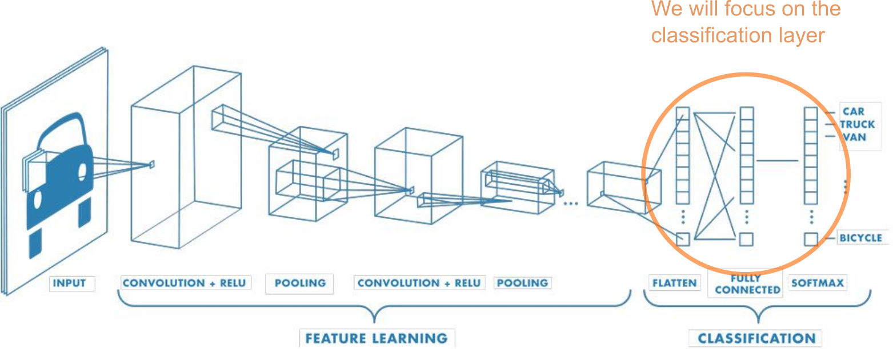{width="80%"}](https://www.mathworks.com/discovery/convolutional-neural-network.html)

The classification head typically has a fully connected layer followed by a softmax. The fully connected layer is what we'll look at here.

## What is the core mechanism of neural networks? {.smaller .center}

$$ \vec{y} = \operatorname{softmax}(W \vec{x} + \vec{\beta}) $$

. . .

$$ \Leftrightarrow $$

$$ 
\vec{y} = 
\operatorname{softmax}(
  \begin{bmatrix}
    \vec{w}_1^\top \\
    \vdots \\
    \vec{w}_n^\top 
  \end{bmatrix} \vec{x} + \vec{\beta})
$$

::: {.center}
A matrix multiplication can be though of as a list of separate dot products. 

**The core mechanism of neural networks is the dot product**
:::

## Properties of the dot product {.smaller}

```{python}
#| echo: false
#| eval: true
from viz import show_dot_product
show_dot_product()
```

$$ \vec{a} \cdot \vec{b} = |\vec{a}||\vec{b}| \cos\theta $$

- Dot product is directly connected to the _angle_ (alignment) between vectors
- Neural Network learns by _aligning_ vectors

::: {.notes}
The cosine similarity is essentially the dot product of unit vectors.
When two representations are identical in direction, cosine similarity = 1;
orthogonal = 0; opposite = −1.
:::

## Graphical representations of neural networks

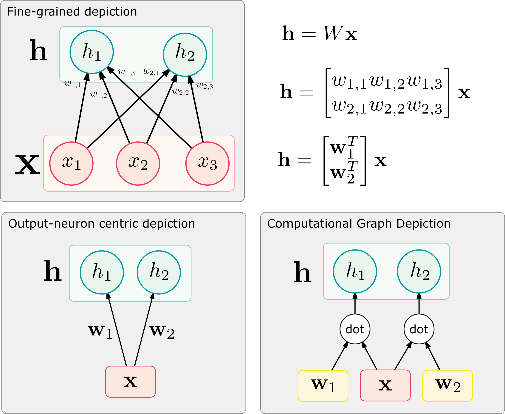{width="80%"}

## Graphically representing softmax

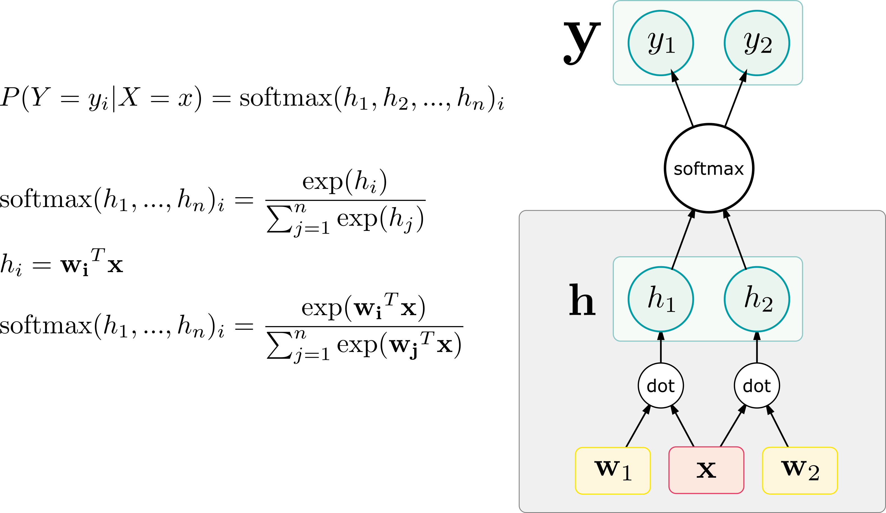

## Graphically representing softmax


:::: {.columns}


::: {.column width="50%"}


:::

::: {.column width="50%"}
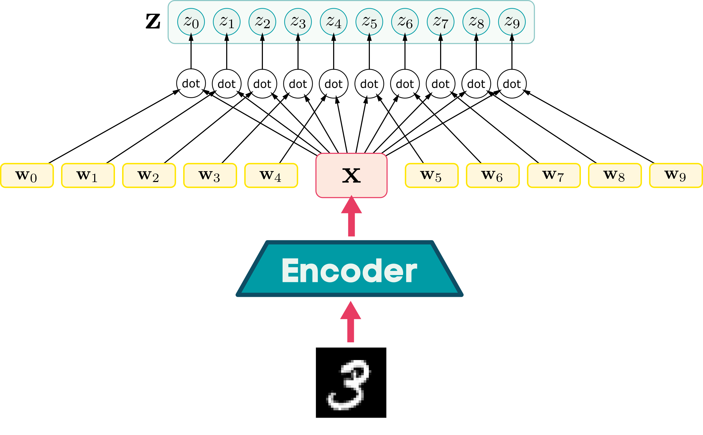

:::

::::

## Softmax angle alignment

:::: {.columns}


::: {.column width="50%"}


:::

::: {.column width="50%"}

```{python}
#| echo: false
#| eval: true
from viz import show_softmax
show_softmax()
```

:::

::::

# Contrastive learning

## Using computed "softmax" weights


:::: {.columns}


::: {.column width="65%"}
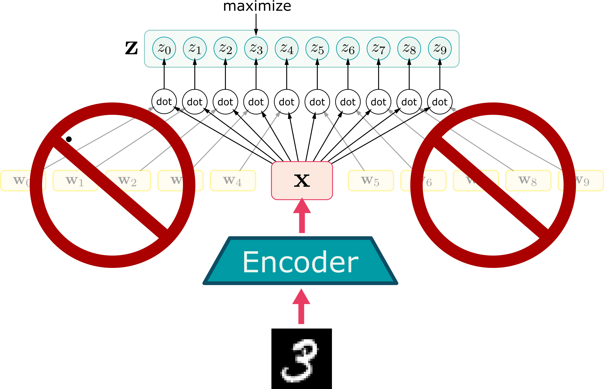
:::

::: {.column width="35%"}
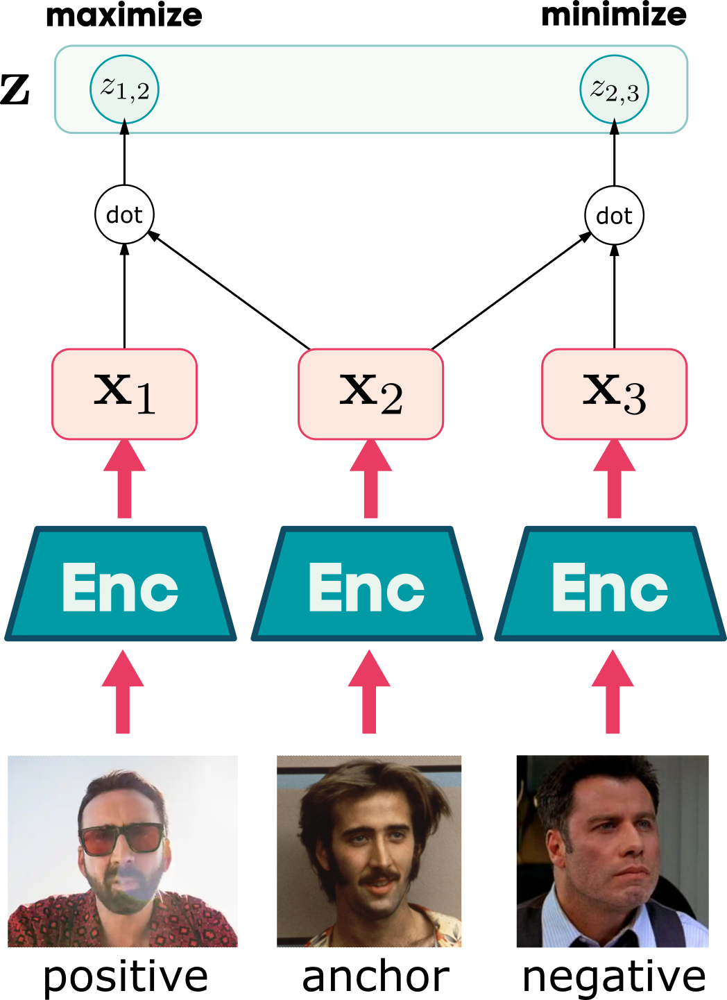{width="80%"}
:::

::::


## Contrastive learning - triplet loss {.smaller}


:::: {.columns}


::: {.column width="40%"}

{width="80%"}

:::

::: {.column width="60%"}

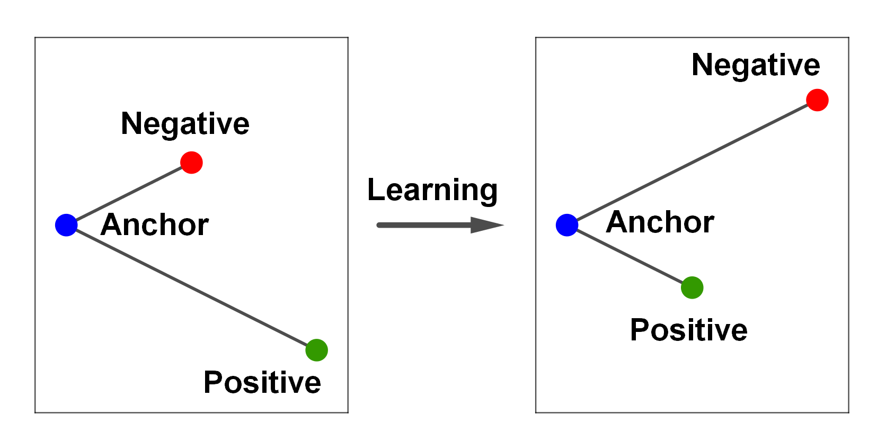

:::

::::

::: {.notes}
The kind of loss used here was used a lot in face identification and  referred to as triplet loss, three different data points are used where two consists of a positive pair which we try to align (maximize the dot product), while the negative pair should have maximum dot product. The idea was that we want to learn a _metric_ over our data points which is semantic. Things which are close together are semantically  similar (images of the same person).

What would happen if we didn't have any negative pairs?
:::

## Contrastive learning

:::: {.columns}


::: {.column width="40%"}

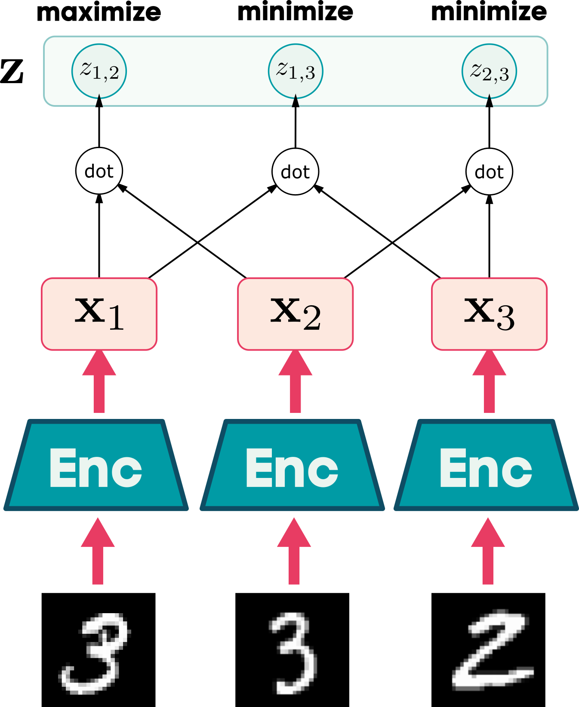

:::

::: {.column width="60%"}

```{python}
#| echo: false
#| eval: true
from viz import show_triplet
show_triplet()
```

:::

::::


## What negative samples? {.smaller}


:::: {.columns}


::: {.column width="40%"}

- How do we select negative samples?
  - Easiest is randomly
  - But very likely to draw "easy" negative samples
  - The model doesn't learn as much contrasting against these

:::

::: {.column width="60%"}


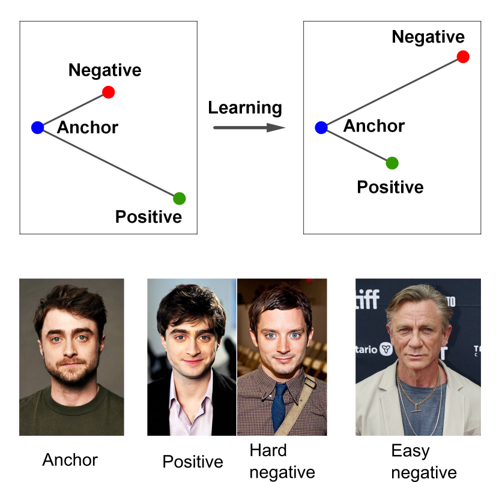{width="60%"}


:::

::::


. . .

Why do we need negative samples?

::: {.notes}
While the idea of triplet loss and non-parametric softmax is to remove the fixed class vectors, the problem is still supervised in the sense that we need to know what data points we should bring together and which ones we should pull apart. Empirically it's not necessarily  better to use contrastive loss like this
:::


## Representation collapse

```{python}
#| echo: false
#| eval: true
from viz import show_representational_collapse
show_representational_collapse(600)
```


## Why contrastive learning

::: {.incremental}
- No need to decide on number of classes beforehand
- We only need to know that some inputs are associated and some are not
- By choosing what examples are negative vs. positive, we design what is learned
:::


## Supervised contrastive learning {.smaller}

:::: {.columns}


::: {.column width="50%"}

```{python}
#| echo: false
#| eval: true
#| fig-cap: Contrastive learning like we've seen here still needs labeled data, just like regular supervised learning
from viz.supervised_vs_unsupervised import supervised
supervised()
```

:::

::: {.column width="50%"}


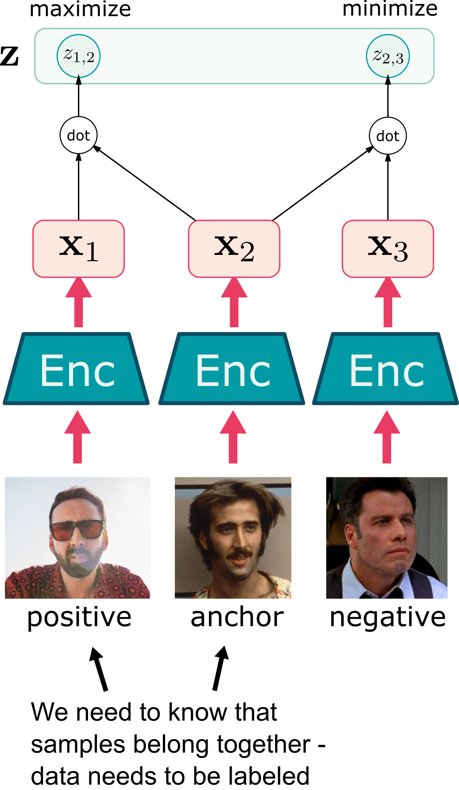{width="60%"}

:::

::::

::: {.notes}
Most problems we want to solve are supervised, we want to learn a mapping from inputs to outputs. However, supervised learning relies on labeled data, which can be expensive and time-consuming to obtain. In contrast, unsupervised learning can discover structure in data without labels, but is often more useful for exploratory analysis than for solving specific tasks.
:::

## The practical meaning of supervised learning -- labeling

```{python}
#| echo: false
#| eval: true
from viz.supervised_learning_labeling import supervised_learning_labeling
supervised_learning_labeling(width=500)
```

::: {.notes}
The main challenge in supervised learning is obtaining labeled data, which can be expensive and time-consuming to collect and annotate. For certain problems, such as rare disease, we are fundamentally limited in how much labeled data we can get. This motivates the need for methods that can learn from unlabeled data.
:::

# Self-supervised learning

## Self-supervised learning

What if we can use the data *itself* to drive the learning of representations?


```{python}
#| echo: false
#| eval: true
#from viz.selfsupervised_principle import selfsupervised_principle_visualization
#selfsupervised_principle_visualization()
```


[{fig-align="center" width="80%"}](https://youtu.be/7I0Qt7GALVk?si=-PPdfqhuaDKVJK4k)

::: {.notes}
Transfer learning is promising, but requires large amounts of labeled data to learn useful representations from. Manually annotating data is expensive and time-consuming. Self-supervised learning is a paradigm that allows us to learn useful representations without manual annotation by creating labels from the data itself.
:::

## Basic selfsupervision -- Autoencoders

An autoencoder is a neural network trained to:

1. **Encode** input $x$ into a latent representation $z$
2. **Decode** $z$ back to reconstruct $\hat{x} \approx x$

$$\mathcal{L} = \|x - \hat{x}\|^2$$


```{python}
#| echo: false
#| eval: true
from viz.autoencoder import autoencoder_visualization
autoencoder_visualization()
```

::: {.notes}
The key insight: the network learns a compressed representation without labels.
:::

<!--
## Architecture {.smaller}

:::: {.columns}

::: {.column width="50%"}

```{python}
#| echo: true
#| eval: false

import torch
import torch.nn as nn

class Autoencoder(nn.Module):
    def __init__(self, 
                 input_dim=784, 
                 latent_dim=32):
        super().__init__()
        self.encoder = nn.Sequential(
            nn.Linear(input_dim, 256),
            nn.ReLU(),
            nn.Linear(256, latent_dim),
        )
        self.decoder = nn.Sequential(
            nn.Linear(latent_dim, 256),
            nn.ReLU(),
            nn.Linear(256, input_dim),
        )

    def forward(self, x):
        z = self.encoder(x)
        return self.decoder(z)
```

:::

::: {.column width="50%"}

```{python}
#| echo: true
#| eval: false
model = Autoencoder()
optimizer = torch.optim.Adam(model.parameters(),
                             lr=1e-3)
criterion = nn.MSELoss()

# Training loop sketch
def train_step(x):
    optimizer.zero_grad()
    x_hat = model(x)
    loss = criterion(x_hat, x)
    loss.backward()
    optimizer.step()
    return loss.item()
```

:::

::::


::: {.notes}
Note that we use the input as both input and target — no labels needed.
:::


## Variants

| Variant | Key Idea |
|---|---|
| Denoising AE | Reconstruct clean input from corrupted input |
| Stacked AE | Iteratively add inner layers to encoder and decoder |
| Variational AE (VAE) | Learn a probabilistic latent space |
| Sparse AE | Penalize non-zero activations |
| Convolutional AE | Use conv layers for image data |
-->

## Shortcomings of autoencoders

[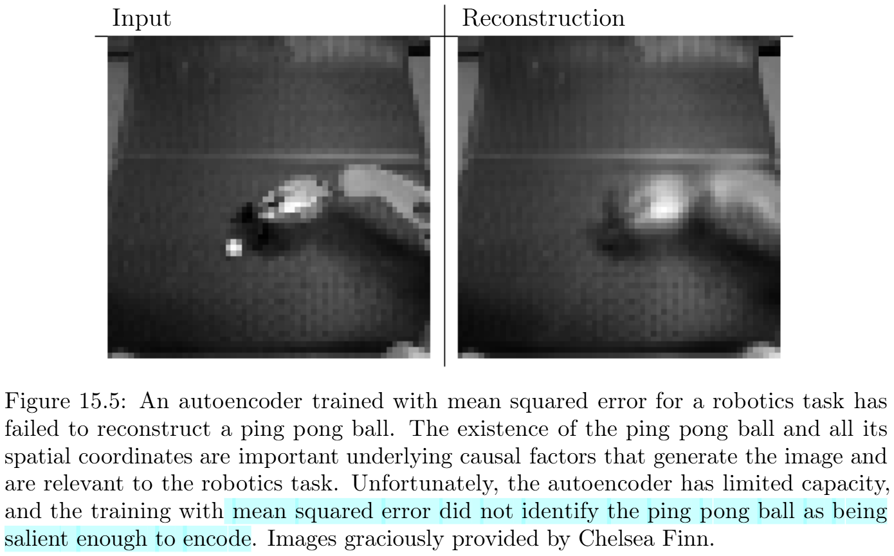{fig-align="center" width="50%"}](https://www.deeplearningbook.org/contents/representation.html)

::: {.notes}
Minimizing mean squared error in pixel space is similar to PCA, it mainly captures the directions of most variation (in pixel space). This does not necessarily mean it captures the semantically meaningful features. Is there some other way we can learn representations without manual labelling?
:::


## Self-supervised examples - predict in context {.smaller}

::: {#fig-ssl-predictive layout-ncol=3 style="font-size: 10%;"}

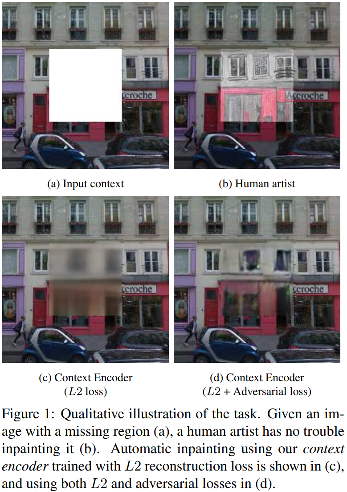{width="80%"}

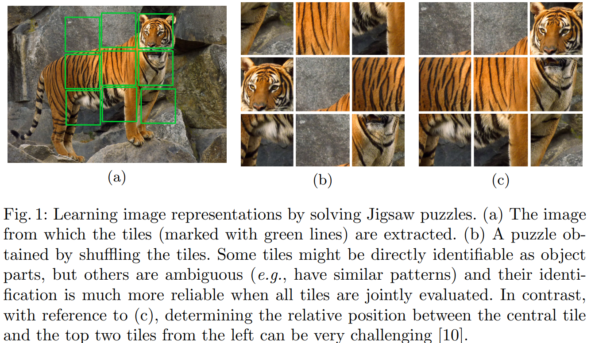

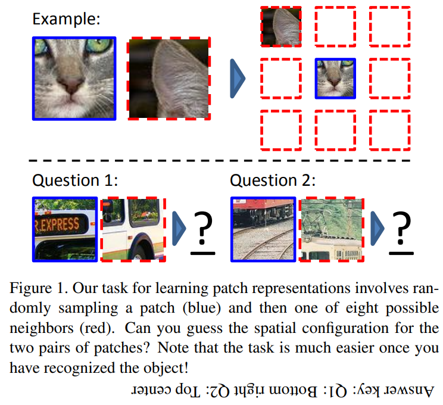{width="80%"}

:::


 

## Constrastive self-supervised learning {.smaller}

:::: {.columns}

::: {.column width="50%" }

- Instead of relying on existing positive pairs, we can create them
- As long as the pairs we create have a semantic association, there is something to learn
- SimCLR is a very successful example of this

:::

::: {.column width="50%"}
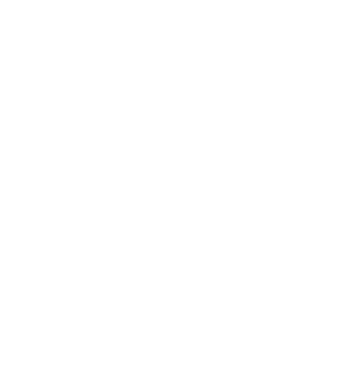{width="80%"}
:::
::::

## Beyond contrastive learning

:::: {.columns}

::: {.column width="50%" }

- The central part of contrastive learning is to bring associated examples close together
- Why do we need negative examples?
  - To avoid representational collapse

:::

::: {.column width="50%"}


```{python}
#| echo: false
#| eval: true
from viz import show_representational_collapse
show_representational_collapse()
```
:::

::::


<!--
## Are negative samples enough?

::: {.incremental}
- Negative samples forces our model to predict different things for different inputs
- However, randomly sampling negative samples are likely to lead to ones which were already well discriminated
  - How do we learn subtle semantic differences?
  - Advanced schemes of "negative sample mining" - use intermediate phase to "group" samples based on closeness, sample negative samples proportional to their closeness to the positive
  - Encourages better discrimination in representation space
- This makes the learning algorithm more difficult to train, the negative sampling scheme becomes an additional part to tweak
:::
--> 

## BYOL - Bootstrap your own latents {.smaller}

- Instead of avoiding representation collapse by using negative contrastive examples, what if we have two different models?
  - The main network we try to train -- the online network
  - Another network we use to create the representations -- the target network

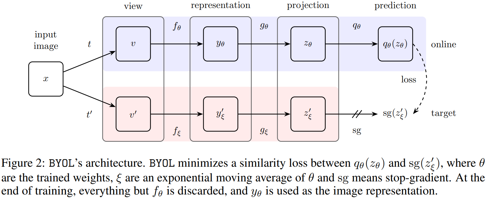{width="100%"}

## DINO = BYOL + Vision Transformers

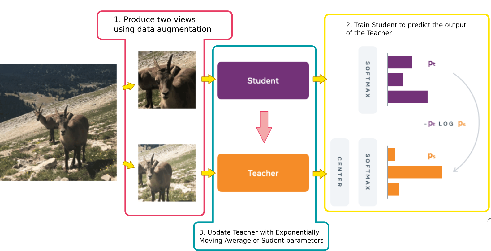{width="100%"}

## DINO v3 {.smaller}

- Development of DINO v2 to increase model scale 
  - Large data with auto curation
  - Regularized patch representations with Gram matching


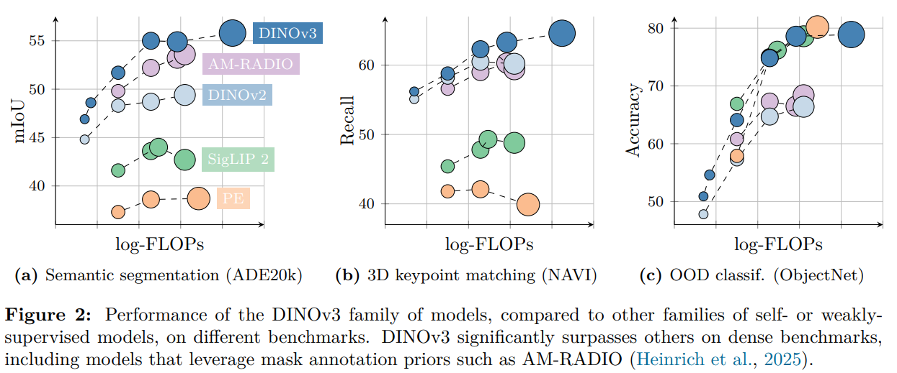{width="100%"}


::: {.notes}
 for images have been hard
  - Models are unstable in terms of performance
  - Coherence of attention maps degrade over training time
- DINO v3 introduces a series of tricks to improve this
  - Automated data curation - train on larger sets of data with higher average quality 
    - Starts from a pool of 17B images from Instagram, clusters and chooses balanced coverage to 1689 million images
  - Tweaks to architecture (positional embeddings)
  - Regularizing the attention  maps (Gram matching)
    - Match matrix of pairwise dot products of all patches to a example from early on in training (regularizing the feature structure, keeping it spread oout) 
- Scaling up SSL methods like DINO (in terms of model size) for images have been hard
  - Models are unstable in terms of performance
  - Coherence of attention maps degrade over training time
- DINO v3 introduces a series of tricks to improve this
:::


## DINO v3 - Gram matching {.smaller} 


::: {#fig-dinov3 layout-ncol=2}
  
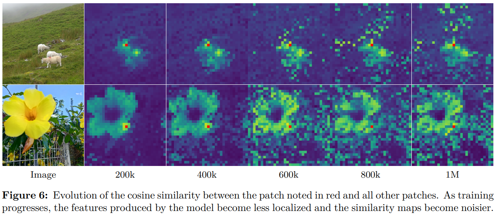{width="100%"}

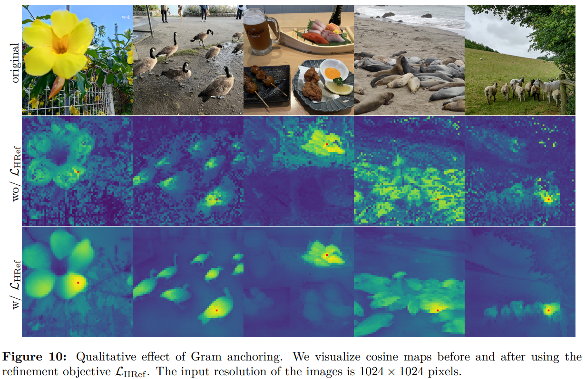{width="100%"}

Siméoni, Oriane, et al. "Dinov3." arXiv preprint arXiv:2508.10104 (2025).

:::

$$ \mathcal{L}_\text{Gram} = \lVert \mathbf{X}_S \cdot \mathbf{X}_S^\top - \mathbf{X}_G \cdot \mathbf{X}_G^\top \rVert_\text{F}^2 $$

Constrain all the pairs of inner products to be similar to an earlier version of the model

::: {.notes}
 for images have been hard
  - Models are unstable in terms of performance
  - Coherence of attention maps degrade over training time
- DINO v3 introduces a series of tricks to improve this
  - Automated data curation - train on larger sets of data with higher average quality 
    - Starts from a pool of 17B images from Instagram, clusters and chooses balanced coverage to 1689 million images
  - Tweaks to architecture (positional embeddings)
  - Regularizing the attention  maps (Gram matching)
    - Match matrix of pairwise dot products of all patches to a example from early on in training (regularizing the feature structure, keeping it spread oout) 
- Scaling up SSL methods like DINO (in terms of model size) for images have been hard
  - Models are unstable in terms of performance
  - Coherence of attention maps degrade over training time
- DINO v3 introduces a series of tricks to improve this
:::


# Multimodal Learning {.smaller}

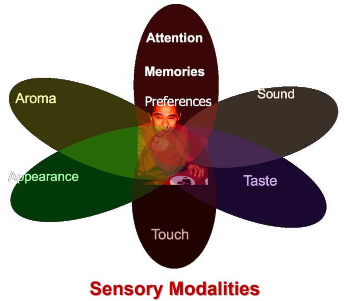


## Use modalities to label each other {.smaller}

:::: {.columns}

::: {.column width="40%"}

{width="60%"}

:::

::: {.column width="60%"}

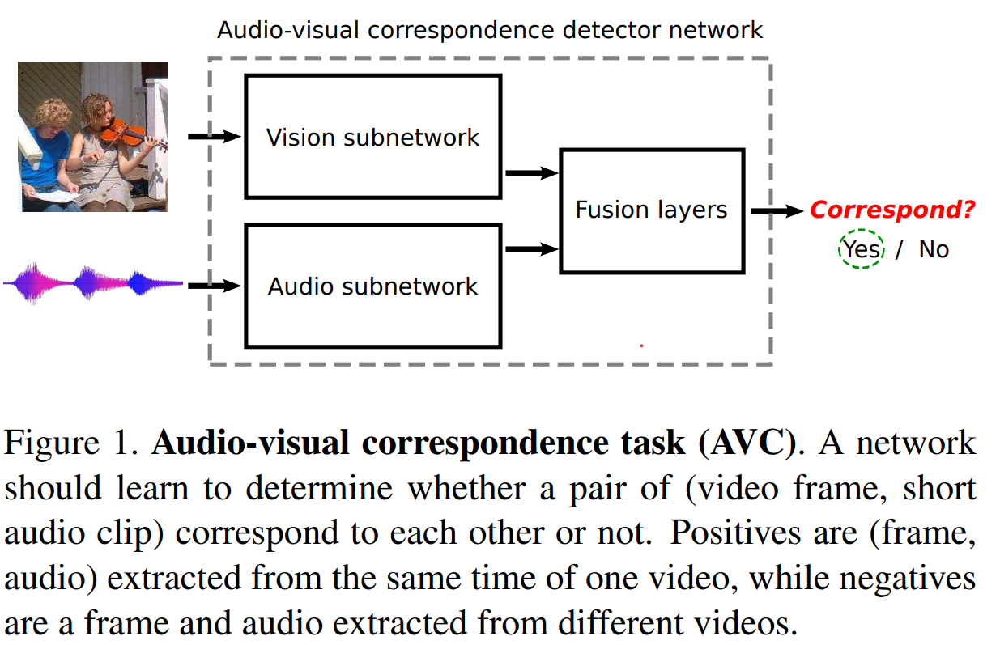{width="100%"}

:::


::::

With multimodal data we have "natural" associations in the separate modalities.  


## Use modalities to label each other {.smaller}

::: {#fig-dinov3 layout-ncol=2}
  
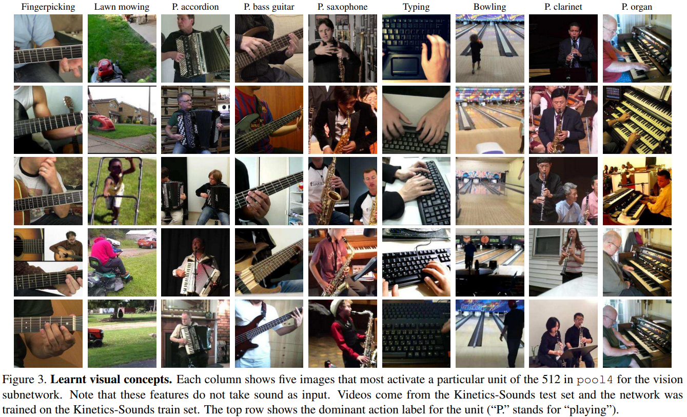{width="100%"}

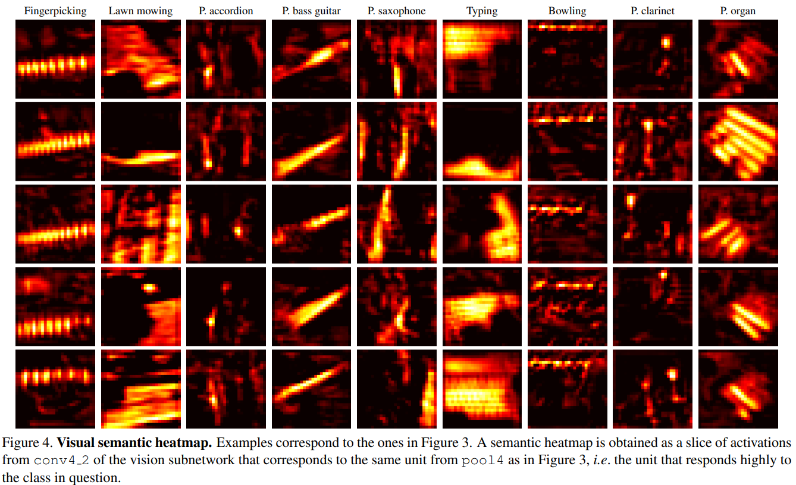{width="100%"}

Arandjelovic, Relja, and Andrew Zisserman. "Look, listen and learn." Proceedings of the IEEE International Conference on Computer Vision. 2017.
za
:::

## Use modalities to label each other {.smaller}


## CLIP {.smaller}

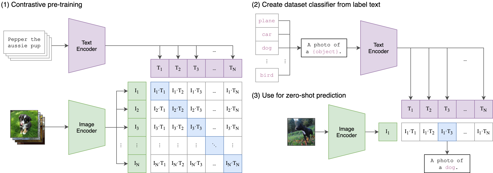


## CLIP {.smaller}

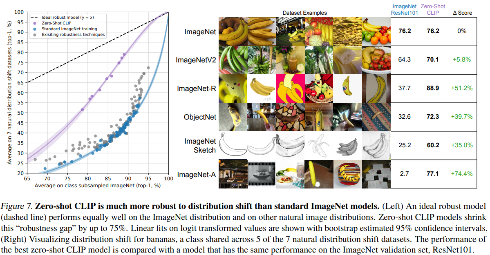


## Summary

- Contrastive learning is a general technique for learning representations
- Self-supervised learning is about crafting ways of learning from unlabeled data
- Clever augmentations technique can use contrastive learning without labled data
- Multimodal data is perfect for contrastive learning, the modalities "label each other"

